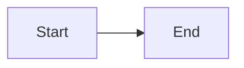

# AndMoney Documentation - Copilot Instructions

This repository contains the public documentation for AndMoney products built with Jekyll and the Just the Docs theme.

## Build and Development Commands

### Local Development
```bash
bundle install                    # Install dependencies
bundle exec jekyll serve          # Start local server at http://localhost:4000/docs/
bundle exec jekyll build          # Build site to _site/
```

### Deployment
The site auto-deploys to GitHub Pages on push to `main` via `.github/workflows/jekyll.yml`.

## Architecture

### Jekyll Collections Structure
The site uses Jekyll collections for product documentation, each with its own namespace:

- `_bookme/` - BookMe (scheduling platform)
- `_present/` - Present (presentation generation)
- `_insights/` - Insights (analytics platform)
- `_meet/` - Meet documentation
- `_api/` - Public API documentation
- `_embeddable-ui/` - Embeddable UI components
- `_general/` - General/cross-product content

Collections are configured in `_config.yml` with permalink pattern `/:collection/:path/`.

### Navigation Hierarchy
Just the Docs supports three-level navigation via frontmatter:

```yaml
---
layout: default
title: Page Title
parent: Product Name        # Second level
grand_parent: Category      # Third level (optional)
nav_order: 1
collection: bookme          # Required for collection pages
has_children: true          # For parent pages
---
```

**Important**: Use `has_children: true` for parent pages and ensure child pages reference the exact parent title.

### Asset Organization
- Images: `assets/images/` (use relative paths: `../../assets/images/filename.png`)
- Product-specific images can use subdirectories: `assets/images/present/`, `assets/images/bookme/`

## Key Conventions

### Frontmatter Requirements
Every markdown file must have frontmatter with:
- `layout:` (typically `default` or `home`)
- `title:` (exact match required for parent/child relationships)
- `nav_order:` (controls sidebar ordering)
- `collection:` (required for files in collection directories)

### Internal Links
- Use relative paths **without** `.md` extension: `[Link text](../path/to/page)`
- Links resolve to the permalink structure defined in `_config.yml`
- Example: Link from `/bookme/microsoft-365-integration/` to `/bookme/app-registration-installation/`:
  ```markdown
  [Installation Guide](../app-registration-installation)
  ```

### Image References
Two acceptable formats:

**Markdown:**
```markdown

```

**HTML (when sizing needed):**
```html

```

### Callouts
Just the Docs callouts using attribute list syntax:

```markdown
{: .note}
> Note content here

{: .warning}
> Warning content here

{: .tip}
> Tip content here

{: .important}
> Important information here
```

Configured callout types in `_config.yml`: `note`, `warning`, `tip`, `important`.

### Mermaid Diagrams
Mermaid is enabled for diagrams. Use fenced code blocks:

````markdown

````

Theme is set to `forest` in `_config.yml`.

## Product-Specific Notes

### BookMe
- Focus on financial sector scheduling and booking
- Heavy integration with Microsoft 365 and CRM systems
- "Playbooks" = automation workflows (visual block-based configuration)
- SCIM provisioning for user management

### Present
- Presentation template management and generation
- Uses Azure Blob Storage and Kubernetes
- Architecture diagrams in `_present/Present-Architecture.md`

### API Documentation
- Public APIs for BookMe and Present
- Located in `_api/` collection

## Search and Navigation

- Search is enabled via Just the Docs (`search_enabled: true`)
- Navigation uses case-sensitive sorting (`nav_sort: case_sensitive`)
- Sidebar structure defined by frontmatter `nav_order` and hierarchy
- External link to main site: `aux_links` in `_config.yml`

## Files to Exclude from Edits

These files are auto-generated or managed externally:
- `vendor/` - Bundler dependencies
- `.jekyll-cache/`, `.sass-cache/` - Build artifacts
- `_site/` - Generated site output
- `Gemfile.lock` - Lock file (update via `bundle install`)
