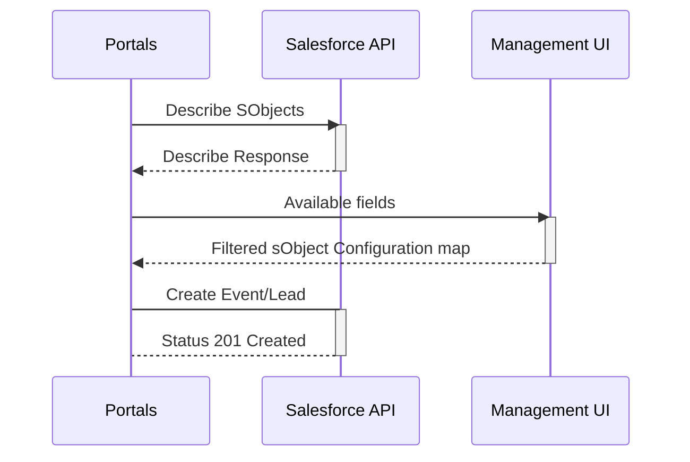

# Portals CRM Integration Security
With the release of Portals CRM Integration, it is important to ensure that the integration is secure and the data is protected.
This document outlines the security measures in place in the application to ensure that the integration is secure and that you as the customer can trust that your data is protected.

The Portals integration model is designed to rely on the standard Salesforce tiered security model, which ensures that only users with the correct permissions can access the data.
Using the standard Salesforce security model, the integration performs Create, Read, Update, and Delete (CRUD) operations to perform the necessary modifications in the CRM system.

| Security level        | Controls                                    |
|-----------------------|---------------------------------------------|
| Org Level security    | IP-level login restrictions                 |
| Object Level Security | CRUD level access to sales pipeline objects |
| Field Level Security  | CRUD level access to fields on objects      |
| Record Level Security | Sharing control                             |

All data that is transferred between the Portals platform and the CRM system is encrypted using SSL.

For the BookMe CRM Integration to work with an organization's CRM platform, it must be given the required access to   
necessary entities in the CRM platform through their API.

## Supported Workflows

The Portals integration implements the following workflows in the initial release:
- Read the SObject-Describe data from the CRM platform to populate the configuration options in the Management UI.
- When a meeting is booked through the Partner portal, the integration will create a new event in the CRM platform and the related sales pipeline object (Sales Lead) together with event relations and internal Bookme records.

## Salesforce access requirements (Org level security)

For the integration to work, the integration must have access via the org-level security layer. This access does not deviate from the standard Bookme integration model.

| Requirement      | Description                                                                                                                                                                                 |
|------------------|---------------------------------------------------------------------------------------------------------------------------------------------------------------------------------------------|
| IP restrictions  | The integration must be able to access the CRM platform via the API. This means that the IP addresses of the BookMe platform must be whitelisted in the CRM platform.                       |
| Integration User | The integration uses an integration user to authenticate with the CRM platform. This user must have the necessary permissions to access the data that the integration needs to access. |
| Connected app    | The Integration uses a connected app with an integration user that we keep the credentials for. This user/app is used to authenticate the integration with the CRM platform. |

The access to Salesforce objects is done via the Salesforce API. The integration user must have the Salesforce API enabled to work.

## Salesforce data model requirements (Object level security and Field level security)

The Portals CRM integration is customer-driven and configured. As such we must have access to reading the Describe data from the CRM platform to populate the configuration options in the Management UI.
You as the customer then use the Management UI to map the data from the BookMe platform to the CRM platform and describe which sObjects to create and relate.

| Requirement     | Description                                                                                                                |
|-----------------|----------------------------------------------------------------------------------------------------------------------------|
| Permission Sets | The integration user must have the standard BookMe Integration User permission set installed in the CRM platform.|
| Object CRUD     | The integration user must have the necessary permissions to at least create the necessary objects in the CRM platform. |
| FLS             | The integration user must have the necessary permissions to at least read the necessary fields in the CRM platform.    |

We provide a default permission set that provides the appropriate permissions for object level and field level security on the Bookme custom objects, but it is up to you as the customer to ensure that the integration user has the correct permissions to access the necessary entities and fields in the CRM platform for your specific use case.
If you wish to have the Portals feature to create Sales Cloud Lead objects, the integration user must be able to describe the Lead object and the relevant fields, as well as permission to create the Lead object and the relevant fields.

The Standard permission set ensures that the Integration User has the necessary permissions to create the standard BookMe custom objects in the CRM platform and custom customer relations.
Any additional access to entities and fields will increase the amount of options that are available in the field mapping configuration in the management UI.

CRM integration will be configurable through the Management UI.
It will be fully configurable what entities should be created in the CRM platform when a meeting is booked.
Data from booked meetings can be configured to be mapped to any field on the CRM entities.

The entities and fields that are configurable from the Management UI are fully populated with the integration user's permission,
meaning that the integration user will ask the CRM platform which data fields that accessible, and populate the options for the configuration through that.

