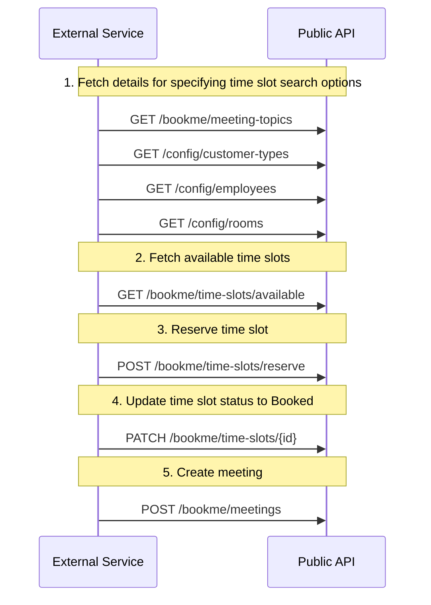

# Customer Meeting Booking in Public API

This guide explains how to book a meeting through the Public API, allowing customers to search for available time slots, reserve a slot, update the slot status to booked, and create a meeting.



Link to Postman-collection: [&money Public API](https://trifork-aalborg.postman.co/workspace/%26Bookme~d45e345c-7669-4d2c-bb90-7523fa8cd866/collection/22545708-52b2c6cb-d1bd-4ceb-9f30-60cbd5af1b53?action=share&creator=22545708&active-environment=37701968-0a0bd7e6-0852-48cd-a587-2586a1bf6f43)

## 1. Fetching Configuration Details

Before customers can book a meeting, you need to retrieve relevant configuration details:

### Fetch Meeting Themes

```http
GET /bookme/meeting-topics
```

**Parameters:**

- `customerCategoryId` - Optional filter for customer category ID
- `isCustomer` - Flag indicating if the request is for a customer (required)

**Response:** Returns a list of available meeting topics.

### Fetch Customer Types

```http
GET /config/customer-types
```

**Response:** Returns available customer types.

### Fetch Employees

```http
GET /config/employees
```

**Response:** Returns a list of employees who can be booked.

### Fetch Rooms

```http
GET /config/rooms
```

**Response:** Returns available rooms for meetings.

## 2. Fetching Available Time Slots

Once the customer has selected a theme, category, employee, and room, retrieve the available time slots:

```http
GET /bookme/time-slots/available
```

**Key Query Parameters:**

- `explicitEmployeeIds` - Optional filter for specific employees
- `startDate` - Optional filter for specific start date/time
- `theme` - Optional filter for specific meeting theme
- `customerCategoryId` - Optional filter by customer category
- `meetingTypes` - Optional filter for meeting types (physical, online, etc.)
- `requireRoom` - Optional filter to require a room
- `specificRooms` - Optional filter for specific room IDs
- `meetingDuration` - Optional filter for meeting duration
- `requireEmployeeParticipation` - Whether employee participation is required (required)

**Response:** Returns a list of available time slots based on the search filters.

## 3. Reserving a Time Slot

After choosing an available time slot, the customer must reserve it:

```http
POST /bookme/time-slots/reserve
Content-Type: application/json
Authorization: Bearer <access_token>
```

**Request Body:**

```json
{
  "timeSlot": {
    "startDate": "2025-03-15T10:00:00Z",
    "endDate": "2025-03-15T11:00:00Z",
    "status": "Reserved",
    "employeeId": "67890"
  },
  "token": "reservation-token"
}
```

**Response:** Confirms the reservation of the selected time slot.

## 4. Updating Time Slot Status to Booked

After reserving a time slot, you must update its status from "Reserved" to "Booked" before creating the meeting:

```http
PATCH /bookme/time-slots/{timeSlotId}
Content-Type: application/json
Authorization: Bearer <access_token>
```

**Request Body:**

```json
[
  {
    "op": "replace",
    "path": "/status",
    "value": "Booked"
  }
]
```

**Response:** Confirms the time slot status has been updated to "Booked".

{: .important }
> The time slot must have "Booked" status before a meeting can be created. The MeetingService will reject meeting creation requests if the associated time slot is not in "Booked" status.

## 5. Creating a Meeting

Once the time slot is reserved, finalize the meeting by creating a meeting record:

```http
POST /bookme/meetings
Content-Type: application/json
Authorization: Bearer <access_token>
```

**Request Body:**

```json
{
  "bookedBy": "customer",
  "customerCategoryId": "123",
  "timeSlotId": "12345",
  "type": "physical",
  "themeId": "111",
  "roomId": "222",
  "employeeId": "333",
  "customerId": "67890",
  "description": "Meeting description"
}
```

**Response:** Returns confirmation of the created meeting.

## 6. Downloading an ICS File

To download the meeting details in iCal format, use the following endpoint:

```http
POST /bookme/meetings/{meetingId}/ical
Accept: text/calendar
Authorization: Bearer <access_token>
```

**Request Body:**
All properties are optional in the request body. If a property is not provided, the default value will be used.

```json
{
  "title": "Meeting title",
  "description": "Meeting description"
}
```

**Response:** Returns the meeting details in iCal format.

## Security and Authentication

- All API requests require **OAuth2 authentication**
- Include a valid **Bearer token** in the `Authorization` header

## Error Handling

| Status Code               | Description                                        |
| ------------------------- | -------------------------------------------------- |
| 401 Unauthorized          | Missing or invalid authentication token            |
| 403 Forbidden             | Access is forbidden                                |
| 404 Not Found             | Invalid resource (theme, employee, room, etc.)     |
| 409 Conflict              | Resource conflict (e.g., time slot already booked) |
| 500 Internal Server Error | Server-side error                                  |