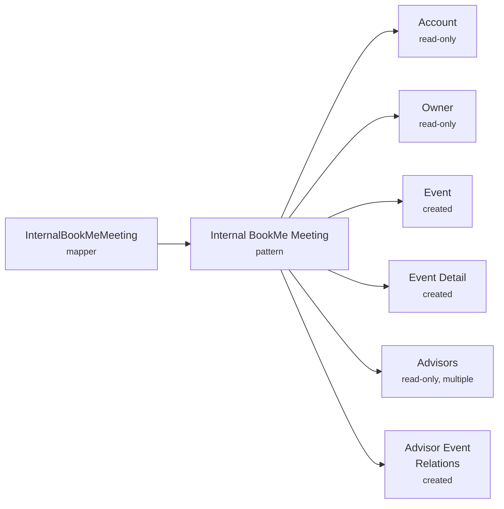
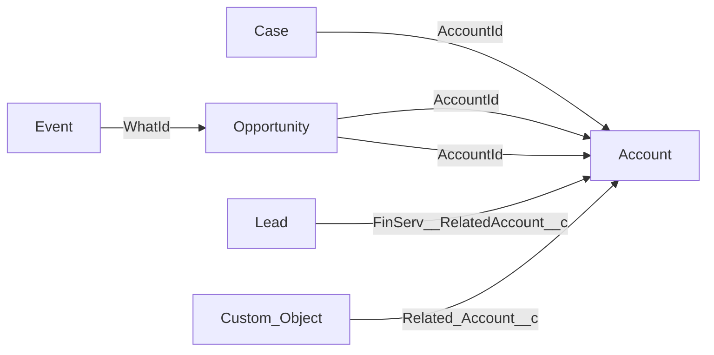

# Internal Meetings — Deployment Guide

This guide walks you through every configuration step needed to deploy the internal meetings feature to a new bank.

It covers:
1. [**Overview**](#1-overview) — what internal meetings are and how they differ from customer bookings
2. [**Prerequisites**](#2-prerequisites) — what must be in place before you start
3. [**Backend Configuration**](#3-backend-configuration-management-ui) — bank options, locations, schedules, themes, and service groups
4. [**Meeting Creation**](#4-configuring-meeting-creation-in-salesforce) — entity definitions and patterns that write meetings to Salesforce
5. [**Non-Account Record Pages**](#5-placing-the-booking-component-on-non-account-record-pages) — enabling booking from Case, Opportunity, or custom objects
6. [**Managing Entity Configurations**](#6-managing-entity-configurations-across-environments) — exporting, source-tracking, and distributing configurations across banks
7. [**Salesforce Data**](#7-salesforce-data-requirements) — Account fields, email matching, and custom metadata
8. [**LWC Component Variants**](#8-lwc-component-variants-and-configoverride) — managed package vs standalone, and which configOverride properties affect internal meetings
9. [**How It Works**](#9-how-internal-meeting-booking-works) — the end-to-end booking flow
10. [**UI Behavior**](#10-ui-behavior-reference) — what the employee sees based on configuration and data
11. [**Validation Checklist**](#11-post-deployment-validation-checklist) — verify your deployment
12. [**Troubleshooting**](#12-troubleshooting) — diagnosing common issues

Follow the sections in order — each step depends on the ones before it.

---

## 1. Overview

### What are internal meetings?

Internal meetings are **employee-initiated** meetings for case processing and internal coordination. In the Salesforce UI, these appear as the **"Internal Meeting"** button on the embeddable landing page.

### How they differ from customer bookings

| Aspect | Customer Booking | Internal Meeting |
|--------|-----------------|------------------|
| Initiated by | Customer or employee on behalf of customer | Employee |
| Entry point | "Book Meeting" button | "Internal Meeting" button |
| Theme required | Yes | No (optional) |
| Customer category required | Yes | No |
| Daily meeting time limit | Enforced (`MaxMeetingTimePerDay`) | **Not enforced** — employees can book unlimited internal meetings per day |
| Default duration | Configurable per theme | 30 minutes |
| Additional employees | No | Yes |
| Room selection | Optional | Yes |
| Mark as busy | N/A | Toggle (forced on if room or additional employees selected) |

### The "3-click booking" concept

The internal meeting flow is designed for fast booking:

1. **Landing page** → Click "Internal Meeting"
2. **Select meeting type and time** → Choose available slot or custom time
3. **Confirm and book** → Meeting created in backend and synced to Salesforce

### User experience

When the BookMe component is placed on a Salesforce record page, the employee sees a landing page with two buttons:
- **"Internal Meeting"** — opens the internal meeting booking form
- **"Book Meeting"** — opens the customer booking flow

---

## 2. Prerequisites

Before configuring internal meetings, ensure these are in place:

- [ ] BookMe package **v1.14+** installed in Salesforce
- [ ] [Salesforce connection established]({{ site.baseurl }}/bookme/salesforce-connection-setup/) (External Client App configured, Named Credential provisioned and authenticated)
- [ ] [SCIM provisioning active]({{ site.baseurl }}/bookme/scim-provisioning-setup/) — employees and rooms synced from Entra ID
- [ ] [Embeddable UI deployed]({{ site.baseurl }}/bookme/salesforce-iframe-lwc-deployment/) — Portal component pushed to Salesforce via Management UI
- [ ] [Trusted URLs configured]({{ site.baseurl }}/embeddable-ui/setup-in-salesforce/#configuring-trusted-urls) in Salesforce (frame-src and img-src for embeddable domain)
- [ ] Users assigned the **Employee** role in the BookingPlatform Management API enterprise application ([Entra integration guide]({{ site.baseurl }}/bookme/entra-integration/#user-access-configuration))

---

## 3. Backend Configuration (Management UI)

This section covers the Management UI settings that must be in place for internal meetings to work:
- [Bank Options](#3a-bank-options) — business hours, timezone, meeting type labels
- [Location Configuration](#3b-location-configuration) — how locations are provisioned and matched
- [Employee Schedules](#3c-employee-schedules) — availability, meeting types, and locations per employee
- [Themes](#3d-themes-optional) — optional meeting categorization
- [Competence & Service Groups](#3e-competence-groups--service-groups) — scaling availability beyond individual employees

### 3a. Bank Options

Bank-wide defaults must be configured before booking works. See [Bank Options]({{ site.baseurl }}/bookme/bank-options/) for the full reference.

For internal meetings, the key settings are:
- **openingTime / closingTime** — defines the time window for custom timeslot selection
- **timeZoneId** — must be set for correct time display
- **meetingTypeLabels** — if not configured, the meeting type selector will be empty
- **closingDays** — prevents booking on bank holidays

{: .note }
> The `maxMeetingTimePerDay` limit is **not enforced** for internal meetings. Employees can book unlimited internal meetings per day regardless of this setting.

### 3b. Location Configuration

Navigate to **BookMe → Settings → Locations** in the Management UI.

Locations are automatically created from SCIM provisioning entries. Verify that the locations visible in the Management UI match your branch/office structure and that employee and room SCIM entries use consistent location strings.

**How location works in internal meetings**: The default location is derived from the **logged-in employee's SCIM location** (from Entra ID), not from the Account record. The employee can also manually select a different location from the dropdown in the booking form. Available rooms and employees are then filtered based on the selected location.

{: .warning }
> **Location matching is case-sensitive and exact.** If employee and room SCIM entries use different casing or spelling for the same branch, they will not match. See [Location matching between Entra and Salesforce]({{ site.baseurl }}/bookme/implementation-guide/phase3-adaptation/#location-matching-between-entra-and-salesforce) for detailed matching rules and examples.

### 3c. Employee Schedules

Each employee who should be bookable must have a schedule configured. See [Employee Schedules]({{ site.baseurl }}/bookme/employee-schedules/) for the full configuration reference.

For internal meetings, the key requirements are:
- `CanBeBooked` must be `true`
- Workdays must have the correct **meeting types** and **location** configured
- The **Manage Availability** page in the Management UI should show no red crosses for relevant employees

### 3d. Themes (Optional)

Navigate to **BookMe → Meeting Setup → Themes** in the Management UI.

Internal meetings do not strictly require themes. However:

- If the Salesforce LWC wrapper passes a `subthemeid` in its configuration, that theme **must exist** in the backend. If it doesn't, the booking component will show a constant spinner.
- The internal meeting form includes an optional theme selector. If you want employees to categorize their internal meetings, create appropriate themes.

### 3e. Competence Groups & Service Groups

Navigate to **BookMe → Advisors → Competence Groups** and **Service Groups** in the Management UI.

These are required if employees need to find times for colleagues beyond explicitly selected employees.

For details on setting up competence and service groups, see [Service & Competence Groups]({{ site.baseurl }}/bookme/service-competence-groups/).

Key points for internal meetings:
- Service group **activation rules** (location + customer category + theme) must match the booking context
- Service group members must include employees at the customer's location with the right meeting types enabled
- Competence groups should be linked to service groups for scaling employee pools

At this point, bank options, locations, schedules, and (optionally) themes and service groups are configured. Next, you'll set up the entity configuration that tells the platform how to write meetings to Salesforce.

---

## 4. Configuring Meeting Creation in Salesforce

When an employee books an internal meeting, the platform creates a Salesforce Event record and links it to the correct Account. This section covers the entity configuration that makes this possible:
- [Entity Definitions](#4a-entity-definitions) — the six Salesforce objects and their field mappings
- [Entity Pattern and Mapper](#4b-entity-pattern-and-mapper) — importing the pattern and linking it to the internal meeting use case

Entity definitions, patterns, and mappers are the abstraction layer between the booking platform and Salesforce. They tell the platform how to read and write Salesforce data without being tied to specific field names. For a conceptual overview, see [Entities and Entity Patterns]({{ site.baseurl }}/bookme/entities-and-entity-patterns/).



The **Internal BookMe Meeting** entity pattern tells the platform which Salesforce objects to create (Event, Event Detail, Advisor Event Relations), which to read (Account, Owner, Advisors), and how they relate to each other. The **InternalBookMeMeeting** mapper links this pattern to the internal meeting use case — when a meeting is booked, the platform looks up this mapper to know which pattern to execute.

### 4a. Entity Definitions

Create the following entity definitions under **Admin → Entities → Entity Definitions**. Each maps abstract field names (used by the platform) to Salesforce API field names (used by your CRM). The pattern uses six entity parts, each with its own definition.

#### Account (reference ID: `account`)

Read-only — used to identify which Account the meeting belongs to.

| Name | Mapped Name | Type | Required | Read-Only |
|------|------------|------|----------|-----------|
| Id | Id | String | Yes | Yes |

#### Owner (reference ID: `owner`)

Read-only — the employee who owns the meeting, resolved by email lookup.

| Name | Mapped Name | Type | Required | Read-Only |
|------|------------|------|----------|-----------|
| Id | Id | String | Yes | Yes |

#### Event (reference ID: `event`)

The standard Salesforce Event record created for the meeting.

| Name | Mapped Name | Type | Required | Read-Only |
|------|------------|------|----------|-----------|
| Subject | Subject | String | Yes | No |
| StartDateTime | StartDateTime | DateTime | Yes | No |
| EndDateTime | EndDateTime | DateTime | Yes | No |
| ShowAs | ShowAs | String | No | No |
| RecordTypeId | RecordTypeId | String | No | No |
| IsChild | IsChild | Boolean | No | Yes |

`ShowAs` is set to "Free" when a meeting is cancelled. `RecordTypeId` is only used if a specific Event record type is configured for your organization. `IsChild` is used for querying parent events.

#### Event Detail (reference ID: `eventDetail`)

A custom object (`AMB_Event_Detail__c`) that stores additional booking metadata linked to the Event.

| Name | Mapped Name | Type | Required | Read-Only |
|------|------------|------|----------|-----------|
| BookingFlowId | BookingFlowId__c | String | No | No |
| Comment | Comment__c | String | No | No |
| MeetingTaxonomy | MeetingTaxonomy__c | String | No | No |
| AdvisorEmail | AdvisorEmail__c | String | No | No |
| AdvisorName | AdvisorName__c | String | No | No |
| MeetingType | MeetingType__c | String | No | No |
| Location | Location__c | String | No | No |
| RoomId | RoomId__c | String | No | No |
| RoomName | RoomName__c | String | No | No |
| MeetingTypeLabel | MeetingTypeLabel__c | String | No | No |
| SendMeetingInvite | SendMeetingInvite__c | Boolean | No | No |
| CancellationReason | CancellationReason__c | String | No | No |
| CancelledBy | CancelledBy__c | String | No | No |

#### Advisors (reference ID: `advisors`)

Additional employees invited to the meeting. This part allows multiple instances — one per additional advisor.

| Name | Mapped Name | Type | Required | Read-Only |
|------|------------|------|----------|-----------|
| Id | Id | String | Yes | Yes |

#### Advisor Event Relations (reference ID: `advisorEventRelations`)

Junction records linking additional advisors to the Event.

| Name | Mapped Name | Type | Required | Read-Only |
|------|------------|------|----------|-----------|
| IsInvitee | IsInvitee | Boolean | No | No |
| IsParent | IsParent | Boolean | No | No |

{: .hint }
> Entity definitions are portable across environments. Use the **Export** button to copy a definition from an existing bank, then **Import** it into the new bank. Each definition has a semantic ID that maintains its identity across environments.

### 4b. Entity Pattern and Mapper

Import the **Internal BookMe Meeting** entity pattern and create the **InternalBookMeMeeting** mapper. Follow the step-by-step import and mapper creation instructions in [Setup Entity Pattern Mappers]({{ site.baseurl }}/embeddable-ui/setup-entity-pattern-mappers/).

{: .note }
> The setup guide also covers additional patterns used by other flows (Bookme meeting, Salesforce meeting id resolver). It is recommended to import all patterns at once.

With meeting creation configured, the platform can write internal meetings to Salesforce from Account record pages. If you also need to book from other record pages (Case, Opportunity, etc.), continue to Section 5. Otherwise, skip to [Section 7](#7-salesforce-data-requirements).

---

## 5. Placing the Booking Component on Non-Account Record Pages

By default, internal meetings can only be booked from **Account** record pages, because the booking component needs an Account ID to associate the meeting with. This section covers how to extend booking to other record pages:
- [Entity Definitions](#5a-entity-definitions-for-each-sobject) — mapping each sObject's Account lookup field
- [Entity Pattern and Mapper](#5b-entity-pattern-and-mapper) — the AccountId Resolver configuration
- [Place the Component](#5c-place-the-component) — adding the LWC to the record page

If you want employees to book internal meetings from other record pages (e.g., Case, Opportunity, Lead, or a custom object), you need to configure **account resolution** — telling the platform how to find the Account from that sObject.


<small>Each box is an entity definition. The arrows represent field mappings that the resolver follows to reach the Account. You only need to configure the sObjects you actually want to book from. The Lead example uses the Financial Services Cloud field — standard Salesforce Leads do not have a direct Account lookup.</small>

The **AccountId Resolver** pattern reads the record's Account lookup field and returns the Account ID. The **CustomerOverviewAccountIdResolver** mapper links this pattern to the booking component — when the component opens on a non-Account page, it looks up this mapper to know how to find the Account.

### 5a. Entity Definitions for Each sObject

For each sObject you want to support, create an entity definition under **Admin → Entities → Entity Definitions**. The definition must include at minimum:

| Name | Mapped Name | Type | Required | Read-Only | Purpose |
|------|------------|------|----------|-----------|---------|
| Id | Id | String | Yes | Yes | Identifies the source record |
| AccountId | *your sObject's Account lookup field* | String | Yes | No | The field the platform reads to find the associated Account |

The **Name** column must be `AccountId` — this is the abstract name the AccountId Resolver looks for. The **Mapped Name** is the actual Salesforce API field name on your sObject, which may differ depending on the object.

You also need an **Account** entity definition for the resolver (with at least the `Id` field). This is separate from the Account definition used for meeting creation.

**Example — enabling booking from Case:**

The standard Case object has a field called `AccountId` that links to the Account. The mapped name matches the abstract name:

| Name | Mapped Name | Type | Required | Read-Only |
|------|------------|------|----------|-----------|
| Id | Id | String | Yes | Yes |
| AccountId | AccountId | String | Yes | No |

**Example — enabling booking from Lead (Financial Services Cloud):**

In FSC, the Lead object has a managed lookup field `FinServ__RelatedAccount__c` that links to the Account. Standard Salesforce Leads do not have a direct Account lookup — this example applies only to FSC orgs:

| Name | Mapped Name | Type | Required | Read-Only |
|------|------------|------|----------|-----------|
| Id | Id | String | Yes | Yes |
| AccountId | FinServ__RelatedAccount__c | String | Yes | No |

**Example — enabling booking from a custom object:**

A custom object might store the Account reference in a field called `Related_Account__c`. The abstract name stays `AccountId`, but the mapped name points to the custom field:

| Name | Mapped Name | Type | Required | Read-Only |
|------|------------|------|----------|-----------|
| Id | Id | String | Yes | Yes |
| AccountId | Related_Account__c | String | Yes | No |

### 5b. Entity Pattern and Mapper

Import the **AccountId Resolver** entity pattern and create the **CustomerOverviewAccountIdResolver** mapper. Follow the step-by-step instructions in [Setup Entity Pattern Mappers]({{ site.baseurl }}/embeddable-ui/setup-entity-pattern-mappers/).

{: .warning }
> The `CustomerOverviewAccountIdResolver` mapper is essential when booking from non-Account record pages. If it is missing, the booking component cannot determine which Account the record belongs to, and booking will fail.

### 5c. Place the Component

After creating the entity definition, place the `bookmeEmployeeFlow` component on that sObject's record page. The booking component will automatically use the mapper to resolve the Account.

For instructions on adding the component to a record page, see [Deploying Iframe LWC to Salesforce]({{ site.baseurl }}/bookme/salesforce-iframe-lwc-deployment/).

With account resolution configured, employees can book internal meetings from any record page that has an entity definition and the component placed. Next, we'll cover how to manage these entity configurations across environments.

---

## 6. Managing Entity Configurations Across Environments

Entity definitions and patterns need to be consistent across all banks that use internal meetings. Rather than manually recreating them in each bank, you should maintain a **single source of truth** and distribute configurations from there.

This section covers:
- [Source of truth](#source-of-truth) — where to maintain the master configuration
- [Exporting configurations](#exporting-configurations) — how to extract JSON from the source bank
- [Source tracking](#source-tracking-the-json) — storing exports in version control
- [Importing to target banks](#importing-to-target-banks) — distributing configurations as part of onboarding

### Source of truth

Designate one bank as the master for entity configurations — typically your **test environment**. All entity definitions and patterns should be created and validated in this bank first. Changes are made here, exported, and then distributed to customer banks.

### Exporting configurations

Entity patterns and definitions are exported as JSON from the Management UI:

1. Navigate to **Admin → Entities → Entity Patterns** in the source bank
2. Find the pattern you want to export (e.g., **Internal BookMe Meeting**)
3. Click the **export icon** on the pattern row
4. In the modal that opens, click **Copy** to copy the JSON to your clipboard

{: .hint }
> Entity pattern exports **automatically include all referenced entity definitions**. When you export the Internal BookMe Meeting pattern, the JSON will contain the Account, Owner, Event, Event Detail, Advisors, and Advisor Event Relations definitions. You do not need to export them separately.

Each exported entity has a **semantic ID** — a stable identifier that persists across environments. When the same JSON is imported into a different bank, the platform uses the semantic ID to determine whether to create a new entity or update an existing one.

You can also export individual entity definitions from **Admin → Entities → Entity Definitions** if needed (e.g., for account resolution sObject definitions like Case or Lead that are not part of a pattern).

### Source tracking the JSON

Store the exported JSON files in version control alongside your deployment scripts or onboarding documentation. A recommended structure:

```
entity-configurations/
├── patterns/
│   ├── internal-bookme-meeting.json
│   └── accountid-resolver.json
└── definitions/
    ├── case.json
    ├── lead-fsc.json
    └── custom-object.json
```

This gives you:
- A versioned history of configuration changes
- A reviewable diff when entity definitions are modified
- A reliable source for automated or manual onboarding

### Importing to target banks

When onboarding a new bank:

1. Navigate to **Admin → Entities → Entity Patterns** in the target bank
2. Click **Import** in the top right corner
3. Paste the JSON from your source-tracked file into the textarea
4. Confirm the import

The import is **atomic** — if any part fails (e.g., a field type mismatch), the entire import is rolled back. Referenced entity definitions are imported automatically as part of the pattern import.

For sObject-specific definitions (e.g., Case, Lead) that are not part of a pattern, import them individually via **Admin → Entities → Entity Definitions → Import**.

After importing, create the required **entity pattern mappers** as described in [Section 4b](#4b-entity-pattern-and-mapper) and [Section 5b](#5b-entity-pattern-and-mapper). Mappers are not included in the export — they must be created per bank because they link a pattern to a use case within that bank's context.

{: .warning }
> **Mappers are bank-specific and cannot be exported.** After importing patterns into a new bank, you must manually create the `InternalBookMeMeeting` and `CustomerOverviewAccountIdResolver` mappers. See [Setup Entity Pattern Mappers]({{ site.baseurl }}/embeddable-ui/setup-entity-pattern-mappers/) for step-by-step instructions.

With entity configurations managed, next we'll cover the remaining Salesforce data requirements.

---

## 7. Salesforce Data Requirements

This section covers the Salesforce data and metadata that internal meetings depend on:
- [Account Data](#6a-account-data) — which Account fields are (and aren't) needed
- [Employee Email Matching](#6b-employee-email-matching) — how the component identifies the logged-in employee
- [Custom Metadata](#6c-custom-metadata) — default field mappings and how to customize them

Notably, internal meetings have fewer Salesforce data requirements than customer bookings.

### 6a. Account Data

Internal meetings do **not** use Account-level fields for location or customer category. The only requirement is that the Account record exists so the meeting can be associated with it.

| Field | Required for Internal Meetings? | Notes |
|-------|--------------------------------|-------|
| `AMB_Location__c` | **No** | Internal meetings derive the location from the **employee's SCIM profile** (their Entra ID location), not from the Account. The employee can also manually select a different location in the booking form. |
| `AMB_Customer_Category__c` | **No** | Customer categories are not used in internal meetings. Themes are loaded without category filtering. |

{: .note }
> `AMB_Location__c` and `AMB_Customer_Category__c` **are** required for the customer booking flow ("Book Meeting"). See [Salesforce BookMe Integration Setup]({{ site.baseurl }}/bookme/salesforce-setup/) for customer booking data requirements.

### 6b. Employee Email Matching

| Requirement | Why |
|-------------|-----|
| Employee's **Entra ID UPN must match their SCIM-synced email** | The booking component pre-selects the logged-in employee by matching their Entra ID UPN (User Principal Name) against the `email` field on SCIM-provisioned employees. The match is case-insensitive. If no match is found, it falls back to the `externalId` field. If neither matches, the employee must manually select themselves. |

### 6c. Custom Metadata

The BookMe package includes default field mapping configurations for Event and Opportunity sObjects. Internal meetings use these defaults automatically to create Event records in Salesforce.

For custom field mappings or additional sObject configurations, see [Salesforce BookMe Integration Setup]({{ site.baseurl }}/bookme/salesforce-setup/).

---

## 8. LWC Component Variants and configOverride

The &money Portal component exists in two variants. The variant deployed to a Salesforce org is selected in the Management UI under **Admin → CRM → Configuration** when deploying the component. The choice affects how internal meetings and customer bookings interact.

### Choosing a variant

| Variant | When to use | How internal meetings work |
|---------|-------------|---------------------------|
| **With managed package** | The bank has the BookMe managed package installed. The managed package handles customer bookings via its own LWC components. | The Portal iframe handles internal meetings and the meeting overview. Customer bookings are handled by the managed package. The "Book Meeting" button switches from the iframe to the managed package's LWC. |
| **Standalone** | The bank does **not** have the managed package. All booking is done through the Portal iframe. | The Portal iframe handles both internal meetings and customer bookings. The landing page shows both buttons, and employees stay within the iframe for both flows. |

{: .note }
> In the **managed package variant**, `disablecustomermeetings` is always forced to `true` — this is hardcoded in the component and cannot be overridden via `configOverride`. In the **standalone variant**, `disablecustomermeetings` is configurable and defaults to `false`.

### configOverride properties

The `configOverride` object allows you to customize the behavior of the booking component from your LWC wrapper. The existing [Salesforce Iframe LWC Configuration]({{ site.baseurl }}/bookme/salesforce-iframe-lwc/) documents all available properties. This section clarifies which properties apply to the internal meeting flow.

#### Properties that affect the Internal Meeting Flow

| Property | Type | Effect | Standalone only? |
|----------|------|--------|-----------------|
| `meetingtitle` | String | Pre-fills the meeting title field. Falls back to user-entered title if not set. | No — works in both variants |
| `disablecustomermeetings` | Boolean | Controls landing page behavior. When `true`, the "Book Meeting" button redirects to the LWC instead of showing the embedded booking flow. | Yes — only configurable in the standalone variant. Hardcoded to `true` in the managed package variant. |

#### Properties consumed by the Booking Flow only

All other properties documented in the [Salesforce Iframe LWC Configuration]({{ site.baseurl }}/bookme/salesforce-iframe-lwc/) (`subthemeid`, `customflow`, `disableheaders`, `disableprogressbar`, `advisortypewhitelist`, `configid`, etc.) have **no effect** on the internal meeting flow — they only apply to the customer booking flow. In the standalone variant, these properties control the embedded customer booking experience.

#### Properties consumed by both flows (shared context)

| Property | Type | Effect |
|----------|------|--------|
| `recordid` | String | Salesforce record ID — used for account resolution |
| `accountId` | String | Account ID — used if already resolved by the wrapper |
| `recordname` | String | sObject type name |
| `objectApiName` | String | Salesforce object API name |

#### Example: Custom LWC Wrapper

If you need to customize behavior beyond what the deployed Portal component provides, create a wrapper component:

```javascript
// internalMeetingWrapper.js
import { LightningElement, api } from 'lwc';

export default class InternalMeetingWrapper extends LightningElement {
    @api recordId;
    @api objectApiName;

    get portalConfig() {
        return {
            recordid: this.recordId,
            objectApiName: this.objectApiName,
            meetingtitle: 'Internal Meeting',  // Pre-fill title
        };
    }
}
```

```html
<!-- internalMeetingWrapper.html -->
<template>
    <c-portal
        src="https://embeddable.booking.andmoney.dk"
        record-id={recordId}
        object-api-name={objectApiName}
        config-override={portalConfig}>
    </c-portal>
</template>
```

For the full property reference, see [Salesforce Iframe LWC Configuration]({{ site.baseurl }}/bookme/salesforce-iframe-lwc/).

In short, only `meetingtitle` affects internal meetings in both variants. All other configOverride properties are for the customer booking flow.

---

## 9. How Internal Meeting Booking Works

With all configuration in place, here is the end-to-end flow when an employee books an internal meeting. Understanding this helps with troubleshooting when something doesn't work as expected.

1. **Employee clicks "Internal Meeting"** on the BookMe component in Salesforce
2. **The booking form loads** with the logged-in employee pre-selected, their SCIM location as the default location, and default meeting duration of 30 minutes
3. **Available timeslots are fetched** based on the selected employee(s), location, and meeting type. If multiple employees are selected, only times where **all** employees are available are shown
4. **Employee selects a timeslot** (or toggles to custom time selection to manually pick a date/time within business hours)
5. **Meeting is created** and automatically synced to Salesforce as an Event record via the `InternalBookMeMeeting` entity pattern

Key behaviors:
- The `MaxMeetingTimePerDay` limit does **not** apply to internal meetings — employees can book unlimited internal meetings per day
- When multiple employees are selected, availability is calculated as the **intersection** of all selected employees' schedules. If any one employee has no availability for a given meeting type, that type won't show times for anyone
- The **"Mark as busy"** toggle controls whether the employee is shown as busy during the meeting. It is automatically forced on when a room or additional employees are added

That covers the happy path. The next two sections help you verify and diagnose issues with the deployed configuration.

---

## 10. UI Behavior Reference

This section documents how the booking component behaves based on configuration and data. If the UI doesn't show what you expect — empty dropdowns, disabled buttons, missing timeslots — check the conditions below. Behaviors are grouped by screen:
- [Landing Page](#landing-page) — button visibility and error states
- [Internal Meeting Form](#internal-meeting-form) — form field behavior based on configuration and data

### Landing Page

| Behavior | Condition | What the employee sees |
|----------|-----------|----------------------|
| Both buttons shown | Employee is authenticated via Entra ID | "Internal Meeting" and "Book Meeting" buttons |
| Not signed in | Employee not authenticated | Welcome message with "not signed in" text; no buttons |
| "Book Meeting" disabled | Component placed on unsupported sObject (only Account, Event, Opportunity are supported) | Button grayed out and not clickable |
| Auto-redirect to LWC | `disableCustomerMeetings` set to `true` in configOverride | Landing page is skipped entirely; employee is redirected to the Salesforce LWC booking flow |
| Error banner | Account resolution fails (missing entity definition, missing mapper, or empty Account lookup) | Sticky error banner at top of page with error code. Buttons remain visible below. |

### Internal Meeting Form

| Behavior | Condition | What the employee sees |
|----------|-----------|----------------------|
| Meeting type selector empty | `meetingTypeLabels` not configured in [Bank Options]({{ site.baseurl }}/bookme/bank-options/) | No meeting type radio buttons — timeslots cannot load |
| No available timeslots shown | No meeting type selected yet | Timeslot query does not fire until a meeting type is selected |
| Room dropdown empty | No rooms provisioned via SCIM at the selected location | Only a "no room chosen" option appears |
| Mark as busy locked to "Yes" | A room is selected **or** additional employees are added | Radio buttons are disabled with a tooltip explaining the lock |
| Custom time picker constrained | Always | Time input bounded by `openingTime` and `closingTime` from [Bank Options]({{ site.baseurl }}/bookme/bank-options/); times outside this range cannot be selected |
| Advisor dropdown filtered | Always | The meeting owner cannot be selected as an additional employee, and vice versa |

If the behavior you're seeing isn't listed here, check the [Troubleshooting](#12-troubleshooting) section for specific error scenarios.

---

## 11. Post-Deployment Validation Checklist

Work through each group in order. Each checkbox corresponds to a configuration step from the sections above.

### Infrastructure
- [ ] SCIM provisioning shows employees with correct emails and locations
- [ ] SCIM provisioning shows rooms with correct locations
- [ ] Named Credential authenticated successfully in Salesforce

### Backend Configuration
- [ ] Bank Options configured: opening/closing times, timezone, meeting type labels
- [ ] Locations created with strings matching SCIM employee/room locations exactly (case-sensitive)
- [ ] Employee schedules configured: `CanBeBooked=true`, workdays with correct meeting types and locations
- [ ] **Manage Availability** page in Management UI shows **no red crosses**

### Meeting Creation ([Section 4](#4-configuring-meeting-creation-in-salesforce))
- [ ] Entity definitions created for Account, Contact, and Event
- [ ] Internal BookMe Meeting pattern imported
- [ ] `InternalBookMeMeeting` mapper created

### Non-Account Record Pages ([Section 5](#5-placing-the-booking-component-on-non-account-record-pages), if applicable)
- [ ] Entity definition created for each sObject you want to book from (with AccountId field mapped)
- [ ] AccountId Resolver pattern imported
- [ ] `CustomerOverviewAccountIdResolver` mapper created
- [ ] `bookmeEmployeeFlow` placed on each sObject's record page
- [ ] Source records have an associated Account (Account lookup populated)

### Salesforce Data ([Section 7](#7-salesforce-data-requirements))
- [ ] Employee emails in Salesforce match their Entra/SCIM emails
- [ ] `bookmeEmployeeFlow` placed on Account record page
- [ ] Trusted URLs configured for embeddable domain

### Functional Testing
- [ ] **Test from Account**: Open Account → "Internal Meeting" button appears → available times load → book successfully
- [ ] **Test from non-Account page** (if configured): Open record → "Internal Meeting" button appears → Account resolved → available times load → book successfully
- [ ] **Test multi-employee**: Select self + another employee → verify overlapping times appear
- [ ] **Test custom time**: Toggle to custom time selection → pick a time within business hours → book successfully
- [ ] **Verify in Salesforce**: Booked meeting appears as Event with correct field mappings

---

## 12. Troubleshooting

This section covers the most common issues encountered during and after deployment, with step-by-step diagnosis for each.

### Constant spinner when booking (400 Bad Request)

**Symptom**: The booking component shows a permanent loading spinner after clicking "Internal Meeting".

**Check these in order**:

1. **Invalid theme reference**: If the LWC wrapper passes a `subthemeid` that doesn't exist in the backend, the component cannot load available times. **Fix**: Remove the invalid `subthemeid` from the wrapper config, or create the theme in the Management UI.

2. **Employee not provisioned**: If the selected employee isn't synced via SCIM, the system cannot find them. **Fix**: Verify SCIM provisioning for the employee in Entra ID.

3. **Missing meeting configuration**: If a theme is configured but has no meeting configuration, timeslot calculation fails. **Fix**: Navigate to Meeting Setup → Meeting Configuration and ensure configurations exist for all themes.

### Can't book internal meeting from a non-Account record page

**Symptom**: The "Internal Meeting" button doesn't work or shows errors when clicked from a record page such as Case or Opportunity.

**Check these in order**:

1. **Missing `CustomerOverviewAccountIdResolver` mapper**: This mapper is required to resolve the Account ID from the record's Account lookup field. Without it, the booking component shows an error. **Fix**: Create the mapper by following [Setup Entity Pattern Mappers]({{ site.baseurl }}/embeddable-ui/setup-entity-pattern-mappers/).

2. **Missing entity definition for the sObject**: The sObject must have an entity definition with an `AccountId` field mapped to the correct Salesforce API field name. Without it, the resolver can't navigate to the Account. **Fix**: Create the entity definition as described in [Section 5 — Placing the Booking Component on Non-Account Record Pages](#5-placing-the-booking-component-on-non-account-record-pages).

3. **Component not on record page**: The `bookmeEmployeeFlow` component must be placed on the sObject's record page layout. **Fix**: Add it via Lightning App Builder.

4. **Record has no Account**: If the record's Account lookup field is empty, there's no Account to resolve. **Fix**: Ensure the record is associated with an Account.

### Employee not pre-selected when opening internal meeting form

**Symptom**: The internal meeting form opens but the employee (meeting owner) field is empty instead of pre-selecting the logged-in employee. The employee has to manually search for themselves.

**Check these in order**:

1. **UPN / email mismatch**: The booking component takes the logged-in employee's **UPN** (User Principal Name) from the Entra ID token and matches it against the `email` field on SCIM-provisioned employees. The comparison is case-insensitive, but the values must otherwise match exactly. **Fix**: Verify the employee's UPN in Entra ID matches the email synced via SCIM. Check the employee record in **BookMe → Advisors → Manage Availability** in the Management UI to confirm the SCIM-synced email.

2. **Employee not provisioned via SCIM**: If the logged-in employee doesn't exist in the booking platform's employee list, there's nothing to match against. **Fix**: Verify SCIM provisioning has synced the employee from Entra ID.

3. **ExternalId fallback**: If email matching fails, the component falls back to matching the UPN against the employee's `externalId` field. If neither matches, the field stays empty. **Fix**: Check that the employee's `externalId` in the booking platform matches their Entra ID UPN.

### No available times unless selecting self

**Symptom**: Available timeslots appear when the employee searches for their own times, but disappear when other employees are included or when "local employees" is selected.

**Check these in order**:

1. **Location mismatch**: The selected location (defaulting to the logged-in employee's SCIM location) must exactly match other employees' SCIM locations for them to appear. If other employees have a different location string, they won't be found. **Fix**: Verify location strings are consistent across employees and rooms in Entra ID SCIM provisioning.

2. **Employee schedules not configured**: Other employees at the location may not have workdays configured with the right meeting types. **Fix**: Check Manage Availability in the Management UI — look for red crosses on the relevant employees.

3. **Availability intersection**: When multiple employees are selected, available times are calculated as the overlap of **all** selected employees' schedules for each meeting type. If one employee has no "Physical" availability at that location, Physical timeslots disappear for everyone. **Fix**: Ensure all employees at the location have consistent meeting type availability in their schedules.

4. **Missing service group configuration**: If the employee selection uses "local employees" or "all employees" mode, service groups must be configured with matching activation rules (location + customer category + theme). **Fix**: Create service groups and set activation rules as described in [Service & Competence Groups]({{ site.baseurl }}/bookme/service-competence-groups/).

---

## Summary

To deploy internal meetings, you need:

1. **Backend configuration** — Bank Options (timezone, meeting type labels, business hours), locations matching SCIM entries, employee schedules with correct meeting types and locations
2. **Meeting creation entities** — six entity definitions (Account, Owner, Event, Event Detail, Advisors, Advisor Event Relations), the Internal BookMe Meeting pattern, and the InternalBookMeMeeting mapper
3. **Account resolution** (if booking from non-Account pages) — an entity definition per sObject mapping its Account lookup field, the AccountId Resolver pattern, and the CustomerOverviewAccountIdResolver mapper
4. **Salesforce data** — employee emails matching Entra/SCIM, the booking component placed on record pages, and trusted URLs configured

Internal meetings do **not** require `AMB_Location__c` or `AMB_Customer_Category__c` on the Account — location comes from the employee's SCIM profile, and customer categories are not used.

Use the [validation checklist](#11-post-deployment-validation-checklist) to verify your deployment, and the [troubleshooting section](#12-troubleshooting) if issues arise.

---

## Related Documentation

- [Entities and Entity Patterns]({{ site.baseurl }}/bookme/entities-and-entity-patterns/) — conceptual overview of the entity abstraction layer
- [Setup Entity Pattern Mappers]({{ site.baseurl }}/embeddable-ui/setup-entity-pattern-mappers/) — step-by-step mapper setup guide
- [Bank Options]({{ site.baseurl }}/bookme/bank-options/) — organization-wide booking defaults
- [Employee Schedules]({{ site.baseurl }}/bookme/employee-schedules/) — availability, workdays, meeting types, and location configuration
- [Service & Competence Groups]({{ site.baseurl }}/bookme/service-competence-groups/) — employee grouping and service level configuration
- [Salesforce Connection Setup]({{ site.baseurl }}/bookme/salesforce-connection-setup/) — establishing the BookMe-Salesforce connection
- [Salesforce Iframe LWC Configuration]({{ site.baseurl }}/bookme/salesforce-iframe-lwc/) — full configOverride property reference
- [Deploying Iframe LWC to Salesforce]({{ site.baseurl }}/bookme/salesforce-iframe-lwc-deployment/) — component deployment guide
- [Setup in Salesforce]({{ site.baseurl }}/embeddable-ui/setup-in-salesforce/) — Trusted URLs, quick actions, portal component placement
- [Microsoft Entra Integration]({{ site.baseurl }}/bookme/entra-integration/) — user access and role configuration
