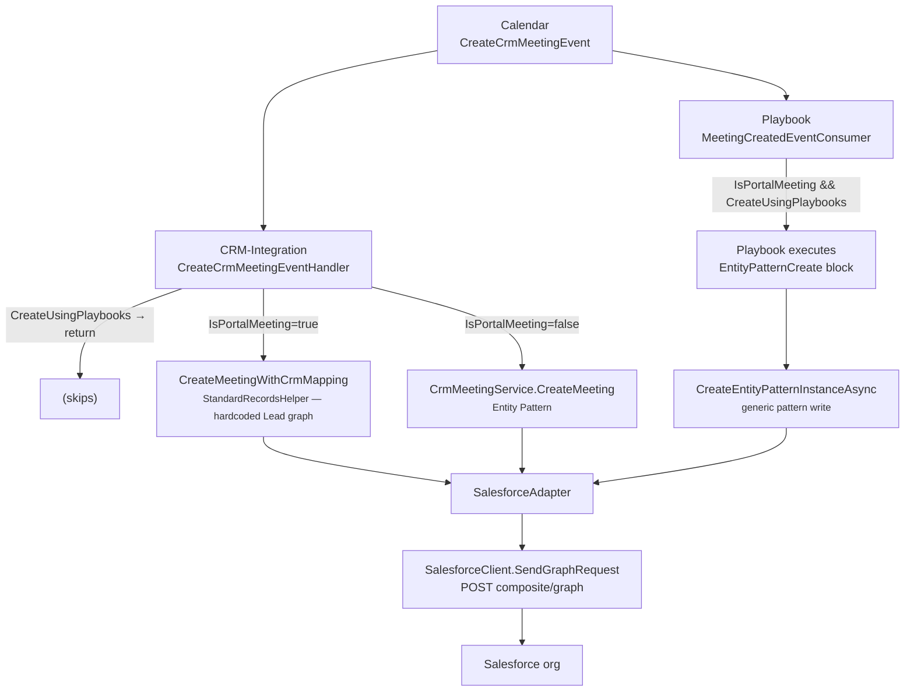

# Backend Meeting Core
{: .no_toc }

This page describes **Architecture B**: the shared .NET backend that every non-package front-end funnels through. If you have read the [section overview]({{ site.baseurl }}/bookme/meeting-creation/), this is the "single sink" that CRM Configuration, Entity Patterns, and Playbooks all feed.

<details open markdown="block">
  <summary>On this page</summary>
  {: .text-delta }
- TOC
{:toc}
</details>

---

## The write is not done in the front-end

When a portal, the embeddable widget, or the UWC books a meeting, **the front-end does not write Salesforce.** The Calendar service is the single origin of the CRM write:

```text
Front-end books a meeting
  → Calendar: MeetingService persists the Meeting row
  → Calendar: CrmMeetingEventService builds a MeetingMappingDto
       and publishes ONE MassTransit event: CreateCrmMeetingEvent
```

The event carries two routing flags that decide everything downstream:

| Flag | Set when |
|---|---|
| `IsPortalMeeting` | `meeting.PortalId` has a value |
| `CreateUsingPlaybooks` | the portal's `CrmCreationStrategy == Playbook` |

---

## Three consumers, one sink

Two services subscribe to `CreateCrmMeetingEvent` and branch on those flags, but **all writes happen in one place** — CRM-Integration's `SalesforceAdapter`, which turns a logical graph into a `POST composite/graph` (`SalesforceClient.SendGraphRequest`).



There are **two write shapes** into that sink:

1. **Entity-Pattern path** (`CreateEntityPatternInstanceAsync`) — driven by a customer-configurable pattern definition. Used by **internal BookMe meetings** and by **Playbooks**.
2. **CRM-Mapping path** (`CompositeRequestHelper` + `StandardRecordsHelper`) — a **hardcoded** `Lead` + `AMB_Event_Detail__c` + `Event` + `EventRelation` graph, augmented by a portal field-map config. Used by **portal, non-playbook** meetings.

---

## The canonical record set

| Object | Written | By which path |
|---|---|---|
| `Event` (standard) | Every meeting | Both |
| `{ns}AMB_Event_Detail__c` | Every meeting | Both — carries all &money metadata; joined by `BookingFlowId__c` (= backend meeting id) |
| `EventRelation` | One per **additional advisor** (not the owner) whose email resolves to a `User` | Both |
| `Lead` | **CRM-Mapping path only** (portal, non-playbook) | `StandardRecordsHelper` |
| `Account`, `Owner`, `Advisors` | **Read-only** reference nodes (GET, not created) — used to wire lookups | Entity-Pattern path |
| Additional dynamic entities | From CRM Mapping Configuration or from the portal playbook's create blocks | CRM-Mapping / Playbook |

{: .important }
> The `Lead` is created **only** on the legacy CRM-Mapping path. The Entity-Pattern and Playbook paths do **not** create a `Lead`; they reference an existing `Account`.

---

## What bypasses the sink

Two writers do **not** go through `composite/graph`:

- **The Salesforce managed package**, which writes **in-org via Apex** ([Architecture A]({{ site.baseurl }}/bookme/meeting-creation/salesforce-package/)). Its in-org Apex is also what fires when `AMB_Event_Detail__c.SendMeetingInvite__c = true` — that invite dispatch happens in-org regardless of which architecture created the record.
- **`engageme-service-salesforce-integration`** (`SalesforceConnectedAppService`), which reconciles attendee `EventRelation` / `AMB_Meeting_Contact__c` rows on an **already-existing** `Event` via Apex REST. This is a **post-creation sync**, gated by `bankSettings.SyncAttendees` — it does not create the meeting.

---

## Reconciliation and update limits

- On reschedule, **only additional-advisor (`User`, `005`-prefix) `EventRelation` rows are reconciled.** `Account` / `Contact` / `Lead` invitee relations are deliberately **never deleted** (`EventRelationReconcileScoping`).
- **Cancellation does not update additional-advisor `EventRelation` rows** (a documented limitation).
- **Portal meetings currently cannot be updated** — only internal meetings can.
- The `MeetingFormat` field is silently dropped for orgs whose `Event` definition doesn't declare it.
- If multiple entity patterns exist for a use case, the **first** is used with a warning.

---

## Related pages

- [CRM Configuration (Legacy Portals)]({{ site.baseurl }}/bookme/meeting-creation/crm-configuration/) — the CRM-Mapping write shape
- [Entity Patterns (Internal Meetings)]({{ site.baseurl }}/bookme/meeting-creation/entity-patterns/) — the Entity-Pattern write shape
- [Playbooks (New Portals & UWC)]({{ site.baseurl }}/bookme/meeting-creation/playbooks/) — the newest consumer
- [Entities and Entity Patterns]({{ site.baseurl }}/bookme/entities-and-entity-patterns/) — the abstraction model
