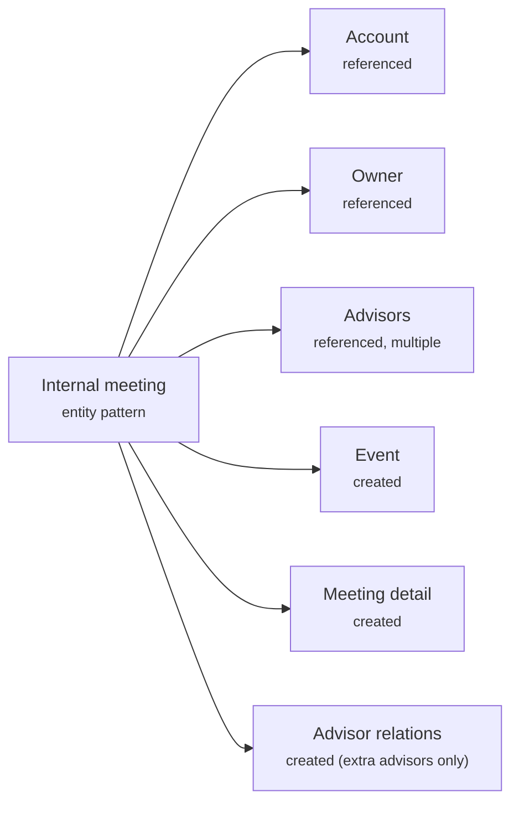

# Entity Patterns (Internal Meetings)
{: .no_toc }

The embeddable widget's **internal meetings** (an advisor booking a meeting from a Salesforce record) create the meeting through **Entity Patterns** — a CRM-agnostic mapping from abstract fields to your CRM's real objects and fields.

  
On this page

  {: .text-delta }
- TOC
{:toc}

{: .note }
> This page focuses on **how a meeting is created** via Entity Patterns. For the concepts of entities, definitions, patterns, and mappers, see [Entities and Entity Patterns]({{ site.baseurl }}/bookme/entities-and-entity-patterns/). For step-by-step setup, see the [Internal Meetings Deployment Guide]({{ site.baseurl }}/bookme/internal-meetings-deployment-guide/).

---

## When it applies

An advisor opens the embeddable internal-meeting flow from a Salesforce record and books a meeting. The record the widget opens on is used to identify **which Account the meeting belongs to**; no portal is involved. The &money platform then creates the meeting using the **internal meeting** entity pattern.

---

## What gets created

The internal-meeting pattern has this shape:

| Part | Role |
|---|---|
| `Event` | **Created** — the meeting |
| Meeting detail | **Created** — the BookMe detail record |
| Advisor relations | **Created only when additional advisors are chosen** |
| Account | **Referenced** — the meeting is linked to an existing Account |
| Owner, advisors | **Referenced** users, used to set ownership and relations |

{: .important }
> **No `Lead` and no `Opportunity`.** Internal meetings link to an **existing Account** and never create a person record. This is the sharpest contrast with the [CRM Configuration]({{ site.baseurl }}/bookme/meeting-creation/crm-configuration/) path.

### Fields written

The field **names** shown are the abstract names; each is written to whatever your entity definition maps it to. A field is **silently skipped if your entity definition doesn't declare it** (or marks it read-only), and pattern defaults fill in only where the booking supplies no value.

**`Event`:**

| Field | Value |
|---|---|
| `Subject` | The meeting title |
| `StartDateTime` / `EndDateTime` | The chosen time slot |
| `MeetingFormat` | The meeting format — **only if** your `Event` definition declares this field |
| `RecordTypeId` | **Only if** a record type is configured for your org |
| Account link (`WhoId`/`AccountId`) | Set via the pattern relationship to the referenced Account |
| Owner link (`OwnerId`) | Set via the pattern relationship to the referenced owner |

**Meeting detail:**

| Field | Value |
|---|---|
| `BookingId` (`BookingFlowId__c`) | The booking's unique id |
| `Comment` | The booking description |
| `MeetingTaxonomy` | The booking theme, translated to your CRM's taxonomy value |
| `AdvisorEmail` / `AdvisorName` | The meeting owner |
| `MeetingType` / `MeetingTypeLabel` | The meeting type |
| `Location` / `RoomId` / `RoomName` | The selected room |
| `SendMeetingInvite` | Constant `true` |

**Advisor relations** (only when additional advisors are chosen): the advisor link, `IsInvitee = true`, `IsParent = false`.

{: .note }
> **Not set on create:** availability status (`ShowAs`) and cancellation fields are written only on the cancel path, not when the meeting is created.

---

## How field values are resolved

Entity patterns work with **abstract field names** (like `Subject`, `StartDateTime`, `BookingId`). Each org's **entity definitions** translate those to the real field names in your CRM. When the meeting is created, the platform:

1. Translates each abstract field to your CRM's field name.
2. **Silently skips** any field your entity definition doesn't declare, or that is marked read-only.
3. Applies **default values** only where the booking supplies none.
4. Wires up the relationships (which record links to which) from the pattern's configuration, in the correct order.

---

## How you configure it

You configure the **targets and values**, not code, through **Admin → Entities** in the Management UI:

| Configuration | What it controls |
|---|---|
| **Entity Definitions** | Map each abstract field to a real CRM field, and mark fields required or read-only. Omit a field simply by not declaring it. |
| **Entity Patterns** | Compose the parts (which records are created vs referenced), the relationships between them, whether a part is optional or allows multiple, and default values. |
| **Pattern mapper** | Binds a specific pattern to the internal-meeting use case. |
| Event record type | Whether the `Event` gets a specific record type, and which one. |
| Meeting-format mapping *(optional)* | If your CRM records the meeting format (physical, phone, video, …) in its own field with its own values, this maps BookMe's meeting type to that value so it can be written to the `Event`. Skipped if you don't use such a field. |
| Account resolution | How the widget determines which Account the meeting belongs to. |

Definitions and patterns are **portable across environments** via import/export.

---

## Constraints

- **Internal meetings only.** A pattern mapper for the internal-meeting use case must exist; if none does, meeting creation fails. If more than one exists, the first is used (with a warning).
- You can remap, omit, or default fields, but you **cannot add brand-new fields** the booking never provides.
- **This is the internal-meeting flow specifically.** Portal (customer self-service) bookings are not created by this flow — they go through either the legacy [CRM Configuration]({{ site.baseurl }}/bookme/meeting-creation/crm-configuration/) approach or the [Playbook]({{ site.baseurl }}/bookme/meeting-creation/playbooks/) approach. Playbooks themselves write **through entity patterns**, so entity patterns still underpin any portal booking on the Playbook strategy; only the legacy CRM Configuration path does not use them.
- Removing additional-advisor relations on cancellation is a known limitation.
- Confirmation of the created meeting is **eventually consistent** — the widget retries briefly until the record is visible.

---

## Related pages

- [Entities and Entity Patterns]({{ site.baseurl }}/bookme/entities-and-entity-patterns/)
- [Internal Meetings Deployment Guide]({{ site.baseurl }}/bookme/internal-meetings-deployment-guide/)
- [Entity Configuration Management]({{ site.baseurl }}/bookme/entity-configuration-management/)
- [Platform-Hosted Booking]({{ site.baseurl }}/bookme/meeting-creation/platform-booking/)
