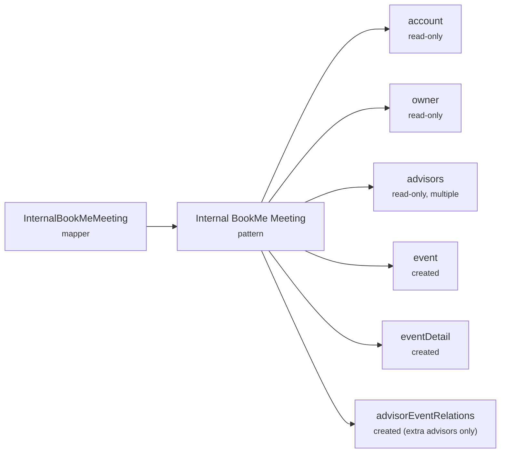

# Entity Patterns (Internal Meetings)
{: .no_toc }

The embeddable widget's **internal meetings** (an advisor booking a meeting from a Salesforce record) create the CRM meeting through **Entity Patterns** — a CRM-agnostic blueprint that maps abstract parts and fields to real Salesforce objects and fields. This is the middle generation of [Architecture B]({{ site.baseurl }}/bookme/meeting-creation/backend-core/).

<details open markdown="block">
  <summary>On this page</summary>
  {: .text-delta }
- TOC
{:toc}
</details>

{: .note }
> This page focuses on **how a meeting is created** via Entity Patterns. For the conceptual model of entities, definitions, patterns, and mappers, see [Entities and Entity Patterns]({{ site.baseurl }}/bookme/entities-and-entity-patterns/). For a step-by-step org setup, see the [Internal Meetings Deployment Guide]({{ site.baseurl }}/bookme/internal-meetings-deployment-guide/).

---

## When it runs

An advisor opens the embeddable internal-meeting flow from a Salesforce record and books a meeting. There is **no `PortalId`**; the record the iframe opens on is used only to resolve an `AccountId`.

```text
Embeddable internal meeting booked (salesforceId = resolved AccountId, no PortalId)
  → Calendar publishes CreateCrmMeetingEvent (IsPortalMeeting=false)
  → CRM-Integration: CrmMeetingService.CreateMeeting
       → resolve the InternalBookMeMeeting entity-pattern mapper
       → build an EntityPatternMutateDto
       → CreateCompositeGraphStrategy → SalesforceAdapter → POST composite/graph
```

---

## What gets created

The internal meeting pattern (`UseCase.InternalBookMeMeeting`) has this shape:



| Part | Role |
|---|---|
| `event` | **Created** — the standard `Event` (`Subject`, `StartDateTime`, `EndDateTime`, `MeetingFormat`, `RecordTypeId`, plus FKs) |
| `eventDetail` | **Created** — the custom detail object (`BookingFlowId`, `Location`/`RoomId`/`RoomName` from the selected `Room`, etc.) |
| `advisorEventRelations` | **Created only when additional advisors are chosen** (`IsInvitee = true`, `IsParent = false`) |
| `account` | **Read-only** — references an existing Account (from `MeetingMappingDto.SalesforceId`) as the customer |
| `owner`, `advisors` | **Read-only** `User` GET nodes, used to wire lookups |

{: .important }
> **No `Lead` and no `Opportunity`.** Internal meetings reference an existing `Account` and never create a person record. This is the sharpest contrast with the [CRM Configuration]({{ site.baseurl }}/bookme/meeting-creation/crm-configuration/) path.

---

## How field values are resolved

The abstract field names in the DTO (`Subject`, `StartDateTime`, `BookingFlowId`, …) are resolved to **real Salesforce field API names** by each org's **Entity Definitions** (`FieldDefinition.Name → MappedName`). The write engine (`CreateCompositeGraphStrategy`):

1. Translates each abstract field to its `MappedName`.
2. **Silently drops** any field the Entity Definition doesn't declare, or that is flagged `ReadOnly`.
3. Applies pattern **default values** (`PatternPartDefaultValue`) **only where the DTO supplies no value**.
4. Wires FK/reference fields (`AccountId`, `OwnerId`, `EventDetail → Event`, `EventRelation` links) via `PatternPartFieldRequirement` edges, not literal field values.

{: .note }
> **Corrected fact — abstract write, hardcoded read-back.** The write is fully abstract via `MappedName`, but the embeddable **reads its confirmation back with hardcoded `andmoney` managed-package field names** (`andmoney__amb_event_detail__r.andmoney__BookingFlowId__c`) via a direct CRM-record search that retries up to 15× with backoff. That confirmation search bypasses Entity Patterns.

---

## How you configure it

You do **not** edit code or the DTO. The set of objects and abstract fields is fixed in `CrmMeetingService.ConstructInternalMeetingCreateDto` + `BookMeMeetingEntityConstants`. You control the **targets and values** through **Admin → Entities** in engageme-web-management:

| Config surface | What it controls |
|---|---|
| **Entity Definitions** | Abstract `Name → MappedName`, `Required` / `ReadOnly`, and the CRM object `Type`. Point `event` at `Event`, `eventDetail` at your custom object, `Subject` at any CRM field. Omit a field by not declaring it. |
| **Entity Patterns** | Compose the parts; set `PatternPartFieldRequirement` (relationships/FKs and execution order), `IsOptional` / `AllowsMultiple` / `IsReadOnly`, and `PatternPartDefaultValue`. |
| **EntityPatternMapper** | Binds a specific pattern to `UseCase.InternalBookMeMeeting` (authored via the `EntityPatternMapperController` API / the *Admin → Entities → Entity Pattern Mapper* page). |
| `CrmEventRecordType` (per org) | Whether `Event.RecordTypeId` is set, and to which record type. |
| **MeetingFormatResolver** (optional) | A read pattern translating `MeetingTypeLabel` → the CRM meeting-format value written to `Event.MeetingFormat`. |
| **CustomerOverviewAccountIdResolver** | How the embeddable resolves the `AccountId` (from `record_id` / `object_api_name`) that becomes `Event.AccountId`. |

Definitions and patterns are **portable across orgs** via `SemanticId` (import/export).

---

## Constraints

- **Internal meetings only.** If **no** `InternalBookMeMeeting` mapper exists, the write **throws** (no fallback). If more than one exists, it **warns and uses the first**.
- You can remap, omit, or default fields, but you **cannot add brand-new fields** the DTO never populates.
- **Portal (`booking-flow`) meetings do not yet use Entity Patterns** for the CRM write — a documented TODO. They still go through `PortalId` → [CRM Configuration]({{ site.baseurl }}/bookme/meeting-creation/crm-configuration/) or [Playbooks]({{ site.baseurl }}/bookme/meeting-creation/playbooks/).
- Cancellation of additional-advisor `EventRelation` rows is a known unimplemented limitation.
- Confirmation relies on **eventual consistency** (the read-back retries up to 15×).

---

## CRM-agnostic

Because the write is fully abstracted through Entity Definitions, this path supports **both Salesforce and Dynamics 365** adapters — the same pattern maps to different CRMs per org.

---

## Related pages

- [Entities and Entity Patterns]({{ site.baseurl }}/bookme/entities-and-entity-patterns/)
- [Internal Meetings Deployment Guide]({{ site.baseurl }}/bookme/internal-meetings-deployment-guide/)
- [Entity Configuration Management]({{ site.baseurl }}/bookme/entity-configuration-management/)
- [Backend Meeting Core]({{ site.baseurl }}/bookme/meeting-creation/backend-core/)
