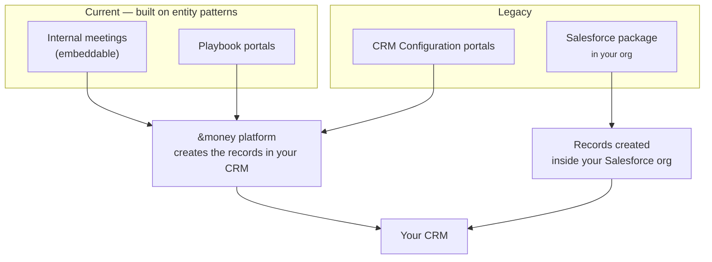

# Meeting Creation in Salesforce
{: .no_toc }

This section is the authoritative reference for **how each BookMe implementation creates a meeting in your CRM** — which records and fields it writes, and what options you have for configuring those values.

  
On this page

  {: .text-delta }
- TOC
{:toc}

---

## Why this section exists

BookMe has grown to support several ways of booking a meeting, built up over time. Some are our **current** approach for new implementations; others are **legacy** — still fully supported, but not where new work should start. This section explains, for each one, **what gets created in your CRM and how you configure it**, and the [Technology & Feature Matrix]({{ site.baseurl }}/bookme/meeting-creation/technology-and-feature-matrix/) puts them side by side.

{: .note }
> **Terminology.** This product is called **BookMe** in the documentation and was historically referred to as *scheduler*, *&bookMe*, or *bookme*. "Schedule", "BookMe", and "scheduler" all refer to the same product family.

---

## Current implementations

Use these for new implementations. Both are built on **entity patterns** — a mapping from abstract fields to your CRM's real objects and fields — so they share the same, configurable record-creation engine.

| Implementation | What it's for | Configured with |
|---|---|---|
| [**Internal Meetings (Embeddable)**]({{ site.baseurl }}/bookme/meeting-creation/internal-meetings/) | Advisor-to-advisor meetings booked from the embeddable widget on a record | Entity Patterns |
| [**Playbook Portals**]({{ site.baseurl }}/bookme/meeting-creation/playbooks/) | Customer self-service booking on a portal | A visual Playbook, over entity patterns |

Both are **platform-hosted**: booking happens in the &money platform, which creates the records in your CRM on your behalf (Salesforce or Dynamics 365). See [Platform-Hosted Booking]({{ site.baseurl }}/bookme/meeting-creation/platform-booking/) for the behaviour they share.

---

## Legacy implementations

Still supported, but superseded by the current approaches. Prefer the current implementations for anything new.

| Implementation | What it is | Configured with |
|---|---|---|
| [**Salesforce Package (AppExchange)**]({{ site.baseurl }}/bookme/meeting-creation/salesforce-package/) | A managed package installed in your org; creates records **in-org** via Apex | Custom-metadata field mappings + Apex hooks |
| [**CRM Configuration Portals**]({{ site.baseurl }}/bookme/meeting-creation/crm-configuration/) | Older portals that create a fixed, Lead-based record set | A simple per-portal field map |

---

## At a glance

| Implementation | Status | Where booking runs | How you configure fields |
|---|---|---|---|
| Internal meetings (embeddable) | **Current** | &money platform | Entity Patterns |
| Playbook portals | **Current** | &money platform | Playbook editor + Entity Patterns |
| Salesforce package | Legacy | Your Salesforce org | Custom-metadata field mappings + Apex hooks |
| CRM Configuration portals | Legacy | &money platform | CRM Configuration field map |

---

## Two things that are always true

No matter which implementation books the meeting, two things hold:

1. **Every meeting leaves an `Event` and a BookMe meeting detail record (`AMB_Event_Detail__c`) in your CRM.** The meeting detail record holds all the BookMe-specific information, and its `BookingFlowId__c` field always carries the booking's unique id. That id is the key BookMe uses to find, update, and cancel the meeting later.

2. **The calendar invitation is sent when the meeting detail record is flagged to send one** (`SendMeetingInvite__c = true`). This happens through the BookMe package installed in your org, so the invite is dispatched the same way regardless of which implementation created the meeting.

{: .important }
> Because these two records are common to every implementation, reporting and reconciliation key off the meeting detail record's `BookingFlowId__c` rather than the `Event` id.

---

## Where to go next

| You want to understand… | Read |
|---|---|
| **Current:** advisor internal meetings | [Internal Meetings (Embeddable)]({{ site.baseurl }}/bookme/meeting-creation/internal-meetings/) |
| **Current:** customer self-service portals | [Playbook Portals]({{ site.baseurl }}/bookme/meeting-creation/playbooks/) |
| What the platform-hosted implementations share | [Platform-Hosted Booking]({{ site.baseurl }}/bookme/meeting-creation/platform-booking/) |
| **Legacy:** the in-org AppExchange package | [Salesforce Package (AppExchange)]({{ site.baseurl }}/bookme/meeting-creation/salesforce-package/) |
| **Legacy:** the older Leads-only portals | [CRM Configuration Portals]({{ site.baseurl }}/bookme/meeting-creation/crm-configuration/) |
| A side-by-side comparison and where each field value comes from | [Technology & Feature Matrix]({{ site.baseurl }}/bookme/meeting-creation/technology-and-feature-matrix/) |
