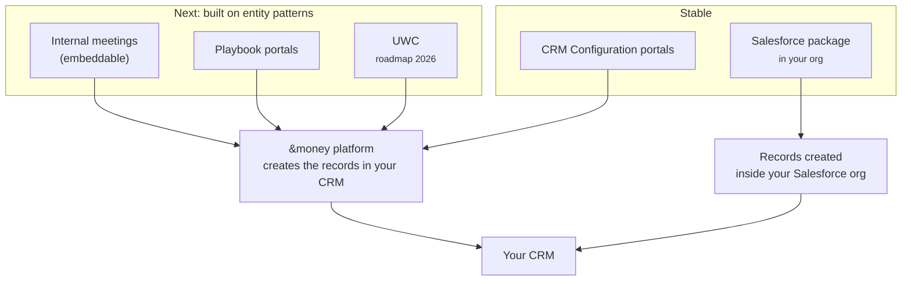

# Meeting Creation in Salesforce
{: .no_toc }

This section is the authoritative reference for **how each Schedule implementation creates a meeting in your CRM**: which records and fields it writes, and what options you have for configuring those values.

  
On this page

  {: .text-delta }
- TOC
{:toc}

---

## Why this section exists

Schedule has grown to support several ways of booking a meeting, built up over time. Some belong to our **Next** platform, where new work should start; others are **Stable**, mature and fully supported. This section explains, for each one, **what gets created in your CRM and how you configure it**, and the [Comparison Matrix]({{ site.baseurl }}/bookme/meeting-creation/technology-and-feature-matrix/) puts them side by side.

{: .note }
> **Terminology.** This product is now called **Schedule**, part of the &money suite alongside **Present**. It was previously called **BookMe** (and earlier *&bookme – Scheduler* or *scheduler*). Some documentation, URLs (`/bookme/…`), and in-product identifiers still use *BookMe*; all of these names refer to the same product.

---

## Next platform

Our forward direction, and where new implementations should start. **Internal Meetings** and **Playbook Portals** are available today; **UWC** is on the [2026 roadmap](#roadmap-2026). All are built on **entity patterns**, a mapping from abstract fields to your CRM's real objects and fields, so they share the same, configurable record-creation engine.

| Implementation | What it's for | Configured with |
|---|---|---|
| [**Internal Meetings (Embeddable)**]({{ site.baseurl }}/bookme/meeting-creation/internal-meetings/) | Advisor-to-advisor meetings booked from the embeddable widget on a record | Entity Patterns |
| [**Playbook Portals**]({{ site.baseurl }}/bookme/meeting-creation/playbooks/) | Customer self-service booking on a portal | A visual Playbook, over entity patterns |
| [**UWC**](#roadmap-2026) | One configurable, CRM-agnostic platform for customer, employee, and partner journeys | **Roadmap 2026** (in active development) |

The implementations available today are **platform-hosted**: booking happens in the &money platform, which creates the records in your CRM on your behalf (Salesforce or Dynamics 365). See [Platform-Hosted Booking]({{ site.baseurl }}/bookme/meeting-creation/platform-booking/) for the behaviour they share.

### Roadmap 2026: UWC
{: #roadmap-2026 }

**UWC** is the platform &money is building as the foundation for Schedule's web experiences. It is driven by **playbooks** over the same **entity-pattern** engine as the rest of the Next platform, so booking journeys are **configured** rather than purpose-built for each case. The aim is a **single, configurable platform** for **end customers, employees, and partners**, with **CRM-agnostic** access and **no opinionated, hardcoded patterns**: the journey and its CRM mapping are shaped to fit your model, not the other way round. Some journeys already run on UWC today (advisor booking and customer self-service), and it is being extended over 2026.

On the **2026 roadmap**:

- **CRM-agnostic booking:** extend full booking journeys beyond Salesforce to Microsoft Dynamics (the renderer is already decoupled from any single CRM).
- **More audiences:** a dedicated partner experience alongside the existing customer and employee flows.
- **Deeper configurability:** richer per-implementation configuration of flows on top of playbooks and entity patterns.

{: .note }
> UWC is under active development. This entry describes the platform's direction; capabilities are delivered incrementally, and specifics will be updated as they firm up.

---

## Stable implementations

Mature, proven, and fully supported. New implementations typically use the Next platform, but these remain solid, supported options.

| Implementation | What it is | Configured with |
|---|---|---|
| [**Salesforce Package (AppExchange)**]({{ site.baseurl }}/bookme/meeting-creation/salesforce-package/) | A managed package installed in your org; creates records **in-org** via Apex | Custom-metadata field mappings + Apex hooks |
| [**CRM Configuration Portals**]({{ site.baseurl }}/bookme/meeting-creation/crm-configuration/) | Older portals that create a fixed, Lead-based record set | A simple per-portal field map |

---

## At a glance

| Implementation | Where booking runs | How you configure fields |
|---|---|---|
| **Next wave** | | |
| Internal meetings (embeddable) | &money platform | Entity Patterns |
| Playbook portals | &money platform | Playbook editor + Entity Patterns |
| UWC (roadmap 2026) | &money platform | Entity Patterns + Playbooks |
| **Stable** | | |
| Salesforce package | Your Salesforce org | Custom-metadata field mappings + Apex hooks |
| CRM Configuration portals | &money platform | CRM Configuration field map |

---

## Two things that are always true

No matter which implementation books the meeting, two things hold:

1. **Every meeting leaves an `Event` and a Schedule meeting detail record (`AMB_Event_Detail__c`) in your CRM.** The meeting detail record holds all the Schedule-specific information, and its `BookingFlowId__c` field always carries the booking's unique id. That id is the key Schedule uses to find, update, and cancel the meeting later.

2. **Booking reserves the advisor's time: it does not send the customer an invitation.** A Microsoft 365 calendar appointment is created in the **advisor's** calendar (and a meeting room is reserved if the timeslot has one); the customer is never added to it. The meeting detail record's `SendMeetingInvite__c` field is set to `true` by default, but this is a **passive flag**: Schedule sends nothing based on it. It records that participants *should* be notified so you can drive your own follow-up (for example, a Salesforce Marketing Cloud journey). The only customer-facing calendar option is an optional **iCal download** on the portal confirmation screen, which the customer imports themselves.

{: .important }
> Because these two records are common to every implementation, reporting and reconciliation key off the meeting detail record's `BookingFlowId__c` rather than the `Event` id.

---

## Where to go next

| You want to understand… | Read |
|---|---|
| **Next:** advisor internal meetings | [Internal Meetings (Embeddable)]({{ site.baseurl }}/bookme/meeting-creation/internal-meetings/) |
| **Next:** customer self-service portals | [Playbook Portals]({{ site.baseurl }}/bookme/meeting-creation/playbooks/) |
| **Next:** the 2026 web platform | [Roadmap 2026: UWC](#roadmap-2026) |
| What the platform-hosted implementations share | [Platform-Hosted Booking]({{ site.baseurl }}/bookme/meeting-creation/platform-booking/) |
| **Stable:** the in-org AppExchange package | [Salesforce Package (AppExchange)]({{ site.baseurl }}/bookme/meeting-creation/salesforce-package/) |
| **Stable:** the older Leads-only portals | [CRM Configuration Portals]({{ site.baseurl }}/bookme/meeting-creation/crm-configuration/) |
| A side-by-side comparison and where each field value comes from | [Comparison Matrix]({{ site.baseurl }}/bookme/meeting-creation/technology-and-feature-matrix/) |
