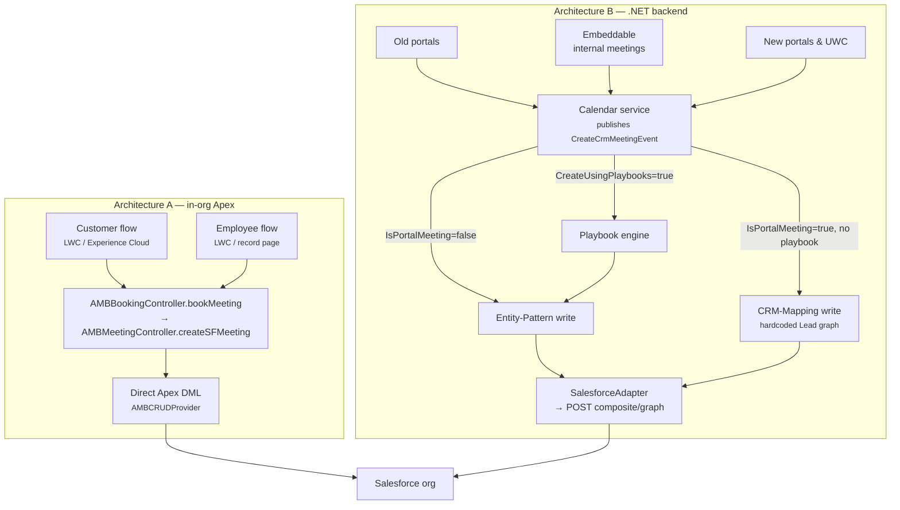

# Meeting Creation in Salesforce
{: .no_toc }

This section is the authoritative reference for **how every &money scheduling implementation creates a meeting in Salesforce** — which objects and fields each one writes, and how you (as a customer) can influence those values.

  
On this page

  {: .text-delta }
- TOC
{:toc}

---

## Why this section exists

There is **no single way** &money creates a meeting in Salesforce. The product has evolved through several generations, and different front-ends (the Salesforce package, the old portals, the embeddable widget, the new portals, and the Universal Web Client) each reach Salesforce differently. This makes it hard to answer a seemingly simple question — *"when a meeting is booked, what happens in my org, and where do the field values come from?"*

This section answers that question for each mechanism, and the [Technology & Feature Matrix]({{ site.baseurl }}/bookme/meeting-creation/technology-and-feature-matrix/) puts them side by side.

{: .note }
> **Terminology.** This product is called **BookMe** in the documentation and was historically referred to as *scheduler*, *&bookMe*, or *bookme* in the code. "Schedule", "BookMe", and "scheduler" all refer to the same product family.

---

## The two write architectures

Every mechanism falls into one of two fundamentally different architectures. Getting this distinction right is the key to the whole picture.

### Architecture A — Salesforce-native, in-org Apex

The **BookMe AppExchange managed package** (namespace `andmoney`) writes Salesforce records **inside the org, in Apex**. The customer-facing and employee-facing flows are Lightning Web Components that call one shared Apex entry point (`AMBBookingController.bookMeeting`), which reserves the slot in the &money booking engine and then performs Salesforce DML directly. Nothing in the &money .NET backend writes these records.

Configuration lives entirely in Salesforce: a **Custom Metadata field-mapping engine** plus an **Apex dependency-injection layer** of swappable providers.

→ [Salesforce Package (AppExchange)]({{ site.baseurl }}/bookme/meeting-creation/salesforce-package/)

### Architecture B — .NET backend via the Salesforce Composite Graph API

Every **non-package** front-end (old portals, embeddable internal meetings, new portals, and the UWC) does **not** write Salesforce itself. It creates a **Calendar-service Meeting**; the Calendar service publishes a single `CreateCrmMeetingEvent` message, and downstream consumers converge on **one sink** — CRM-Integration's `SalesforceAdapter`, which turns a logical graph into a `POST composite/graph` request.

Within Architecture B there are **three generations** of configuration layered over that one backend sink:

| Generation | Config surface | Page |
|---|---|---|
| Oldest | **CRM Configuration** — a flat per-portal field map over a hardcoded Lead graph | [CRM Configuration]({{ site.baseurl }}/bookme/meeting-creation/crm-configuration/) |
| Middle | **Entity Patterns** — a CRM-agnostic blueprint mapping abstract parts to real objects/fields | [Entity Patterns]({{ site.baseurl }}/bookme/meeting-creation/entity-patterns/) |
| Newest | **Playbooks** — a forkable visual automation that writes *through* the Entity-Pattern engine | [Playbooks]({{ site.baseurl }}/bookme/meeting-creation/playbooks/) |

→ [Backend Meeting Core]({{ site.baseurl }}/bookme/meeting-creation/backend-core/) explains the shared sink that all three feed.

---

## Which front-end uses which write path

| Front-end | Architecture | Write path | Config surface |
|---|---|---|---|
| Salesforce package — customer flow (Experience Cloud) | **A** | In-org Apex DML | Custom Metadata + Apex Callables |
| Salesforce package — employee flow (Lightning record page) | **A** | In-org Apex DML | Custom Metadata + Apex Callables |
| Old portals | **B** (gen 1) | `composite/graph`, hardcoded Lead graph | CRM Configuration field map |
| Embeddable — internal meetings | **B** (gen 2) | `composite/graph`, Entity-Pattern graph | Entity Patterns |
| New portals & UWC | **B** (gen 3) | `composite/graph`, Entity-Pattern graph | Playbook editor + Entity Patterns |

---

## How the paths converge

---

## Two invariants that hold across every path

No matter which mechanism writes the meeting, two things are always true:

1. **Every path leaves behind an `Event` and a namespaced `AMB_Event_Detail__c`.** The custom `AMB_Event_Detail__c` companion record carries all the &money meeting metadata, and its `BookingFlowId__c` field is always set to the backend/Calendar meeting id. This is the **correlation key** used for every later lookup, update, and cancellation.

2. **`AMB_Event_Detail__c.SendMeetingInvite__c = true` fires the managed package's own in-org Apex** to send the calendar invite. This side effect runs **inside the org regardless of which architecture wrote the record** — so even a meeting created by the .NET backend hands off to the managed package to actually dispatch the invite.

{: .important }
> Because these two records are the common denominator, tooling that reconciles or reports on meetings keys off `AMB_Event_Detail__c.BookingFlowId__c` rather than the `Event` id.

---

## Where to go next

| You want to understand… | Read |
|---|---|
| The AppExchange package (customer + employee flows, config/DI engine) | [Salesforce Package (AppExchange)]({{ site.baseurl }}/bookme/meeting-creation/salesforce-package/) |
| The shared .NET write sink all portals feed | [Backend Meeting Core]({{ site.baseurl }}/bookme/meeting-creation/backend-core/) |
| The legacy Leads-only portal path | [CRM Configuration (Legacy Portals)]({{ site.baseurl }}/bookme/meeting-creation/crm-configuration/) |
| The CRM-agnostic Entity Pattern path | [Entity Patterns (Internal Meetings)]({{ site.baseurl }}/bookme/meeting-creation/entity-patterns/) |
| The newest Playbook path | [Playbooks (New Portals & UWC)]({{ site.baseurl }}/bookme/meeting-creation/playbooks/) |
| A side-by-side comparison and field-value sources | [Technology & Feature Matrix]({{ site.baseurl }}/bookme/meeting-creation/technology-and-feature-matrix/) |
