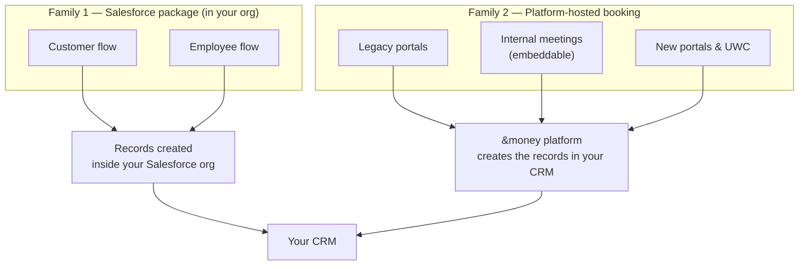

# Meeting Creation in Salesforce
{: .no_toc }

This section is the authoritative reference for **how each BookMe implementation creates a meeting in your CRM** — which records and fields it writes, and what options you have for configuring those values.

  
On this page

  {: .text-delta }
- TOC
{:toc}

---

## Why this section exists

BookMe has grown to support several ways of booking a meeting — the Salesforce package, the older portals, internal meetings in the embeddable widget, the newer portals, and the Universal Web Client (UWC). Each one creates a meeting in your CRM slightly differently and gives you a different way to control the field values.

This section explains, for each implementation, **what gets created in your CRM and how you customize it**, and the [Technology & Feature Matrix]({{ site.baseurl }}/bookme/meeting-creation/technology-and-feature-matrix/) puts them side by side.

{: .note }
> **Terminology.** This product is called **BookMe** in the documentation and was historically referred to as *scheduler*, *&bookMe*, or *bookme*. "Schedule", "BookMe", and "scheduler" all refer to the same product family.

---

## Two families of implementation

Every implementation falls into one of two families. The difference is **where the booking runs and what creates the records in your CRM**.

### Family 1 — The Salesforce package (runs in your org)

The **BookMe managed package** is installed directly in your Salesforce org. When someone books, the meeting is created **inside your org**. Because it runs in your org, it is configured with **Salesforce-native tools**: custom-metadata field mappings and optional Apex hooks.

It offers two booking experiences that share the same record-creation logic:

- a **customer flow** — a public, self-service booking component; and
- an **employee flow** — an advisor booking on a Salesforce record page.

→ [Salesforce Package (AppExchange)]({{ site.baseurl }}/bookme/meeting-creation/salesforce-package/)

### Family 2 — Platform-hosted booking (the &money platform writes to your CRM)

The portals, the embeddable internal-meeting widget, and the UWC do **not** run inside your org. Booking happens in the **&money platform**, which then creates the records in your CRM on your behalf (Salesforce **or** Dynamics 365). These implementations share the same underlying record-creation behaviour and differ only in **how you configure the field values**:

| Generation | Configuration approach | Page |
|---|---|---|
| Oldest | **CRM Configuration** — a simple per-portal field map | [CRM Configuration]({{ site.baseurl }}/bookme/meeting-creation/crm-configuration/) |
| Middle | **Entity Patterns** — a CRM-agnostic mapping of abstract fields to your CRM's objects and fields | [Entity Patterns]({{ site.baseurl }}/bookme/meeting-creation/entity-patterns/) |
| Newest | **Playbooks** — a visual, forkable automation that writes through the Entity-Pattern mapping | [Playbooks]({{ site.baseurl }}/bookme/meeting-creation/playbooks/) |

→ [Platform-Hosted Booking]({{ site.baseurl }}/bookme/meeting-creation/platform-booking/) explains the behaviour all three share.

---

## Which implementation uses which approach

| Implementation | Family | Where booking runs | How you configure fields |
|---|---|---|---|
| Salesforce package — customer flow | 1 | Your Salesforce org | Custom-metadata field mappings + Apex hooks |
| Salesforce package — employee flow | 1 | Your Salesforce org | Custom-metadata field mappings + Apex hooks |
| Legacy portals | 2 | &money platform | CRM Configuration field map |
| Internal meetings (embeddable) | 2 | &money platform | Entity Patterns |
| New portals & UWC | 2 | &money platform | Playbook editor + Entity Patterns |

---

## How the families relate

---

## Two things that are always true

No matter which implementation books the meeting, two things hold:

1. **Every meeting leaves an `Event` and a BookMe meeting detail record (`AMB_Event_Detail__c`) in your CRM.** The meeting detail record holds all the BookMe-specific information, and its `BookingFlowId__c` field always carries the booking's unique id. That id is the key BookMe uses to find, update, and cancel the meeting later.

2. **The calendar invitation is sent when the meeting detail record is flagged to send one** (`SendMeetingInvite__c = true`). This happens through the package installed in your org, so the invite is dispatched the same way regardless of which implementation created the meeting.

{: .important }
> Because these two records are common to every implementation, reporting and reconciliation key off the meeting detail record's `BookingFlowId__c` rather than the `Event` id.

---

## Where to go next

| You want to understand… | Read |
|---|---|
| The Salesforce package (customer + employee flows, field-mapping options) | [Salesforce Package (AppExchange)]({{ site.baseurl }}/bookme/meeting-creation/salesforce-package/) |
| What all platform-hosted implementations have in common | [Platform-Hosted Booking]({{ site.baseurl }}/bookme/meeting-creation/platform-booking/) |
| The legacy Leads-only portal path | [CRM Configuration (Legacy Portals)]({{ site.baseurl }}/bookme/meeting-creation/crm-configuration/) |
| The CRM-agnostic Entity Pattern approach | [Entity Patterns (Internal Meetings)]({{ site.baseurl }}/bookme/meeting-creation/entity-patterns/) |
| The newest Playbook approach | [Playbooks (New Portals & UWC)]({{ site.baseurl }}/bookme/meeting-creation/playbooks/) |
| A side-by-side comparison and where each field value comes from | [Technology & Feature Matrix]({{ site.baseurl }}/bookme/meeting-creation/technology-and-feature-matrix/) |
