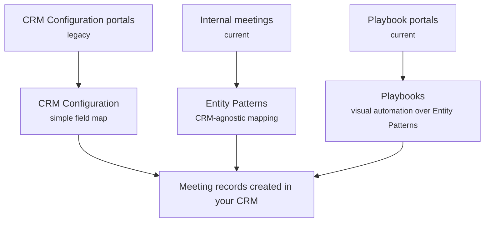

# Platform-Hosted Booking
{: .no_toc }

The embeddable internal-meeting widget and the portals all book through the **&money platform**, which then creates the meeting in your CRM. This page describes the behaviour those implementations **share** — the records they create and the rules around updating them. They differ only in how you configure the field values: the current [Internal Meetings]({{ site.baseurl }}/bookme/meeting-creation/internal-meetings/) and [Playbook Portals]({{ site.baseurl }}/bookme/meeting-creation/playbooks/) paths, and the legacy [CRM Configuration Portals]({{ site.baseurl }}/bookme/meeting-creation/crm-configuration/) path.

{: .note }
> The **legacy** [Salesforce package]({{ site.baseurl }}/bookme/meeting-creation/salesforce-package/) is the one implementation that does **not** work this way — it creates records in your org directly, not through the platform.

  
On this page

  {: .text-delta }
- TOC
{:toc}

---

## The platform creates the records for you

With these implementations, booking happens **in the &money platform** rather than inside your CRM. When a meeting is booked, the platform records it and then creates the corresponding records in your CRM — whether that CRM is **Salesforce or Dynamics 365**.

Because the write is done by the platform on your behalf, you don't install anything in your org for these paths; you configure them through the &money **Management UI** and **Admin → Entities**.

---

## The records every platform-hosted meeting creates

| Record | Created |
|---|---|
| `Event` | Every meeting |
| BookMe meeting detail (`AMB_Event_Detail__c`) | Every meeting — holds all BookMe information; its `BookingFlowId__c` carries the booking id used for later lookups |
| `EventRelation` | One per **additional advisor** whose email resolves to a user (not the meeting owner) |
| `Lead` | **Legacy CRM Configuration path only** — see below |
| Account / owner / advisors | **Referenced, not created** — existing records are linked to the meeting |

{: .important }
> A **`Lead` is created only on the legacy [CRM Configuration]({{ site.baseurl }}/bookme/meeting-creation/crm-configuration/) path.** The [Entity Pattern]({{ site.baseurl }}/bookme/meeting-creation/internal-meetings/) and [Playbook]({{ site.baseurl }}/bookme/meeting-creation/playbooks/) paths do **not** create a `Lead`; they link the meeting to an **existing Account**.

---

## Sending the calendar invite

The BookMe meeting detail record carries a **send-invite** flag (`SendMeetingInvite__c`). When it's set, the calendar invitation is sent to the attendees. This step runs through the BookMe package installed in your org, so the invite is dispatched the same way whether the meeting was created by the package or by the platform.

---

## Updating, rescheduling and cancelling

A few behaviours are important to know when planning your process:

- **Only additional-advisor relations are reconciled** on reschedule. Relations to an Account, Contact, or Lead are deliberately **left in place** and never removed automatically.
- **Cancelling a meeting does not remove additional-advisor relations** — this is a known limitation.
- **Portal meetings currently cannot be edited** after creation; only internal meetings can be updated.
- Attendee-status synchronisation (keeping attendee responses in step) runs **after** the meeting exists and is controlled by a per-bank setting. It updates an existing meeting; it does not create one.

---

## How the three approaches relate

All platform-hosted implementations produce the same core records; they only differ in **how you shape the field values**:

{: .note }
> **Entity Patterns are the shared foundation** for internal meetings and for playbooks. A playbook ultimately writes through the same Entity-Pattern mapping — the playbook just adds a visual, configurable layer on top.

---

## Related pages

- [Internal Meetings (Embeddable)]({{ site.baseurl }}/bookme/meeting-creation/internal-meetings/) — current
- [Playbook Portals]({{ site.baseurl }}/bookme/meeting-creation/playbooks/) — current
- [CRM Configuration Portals]({{ site.baseurl }}/bookme/meeting-creation/crm-configuration/) — legacy
- [Entities and Entity Patterns]({{ site.baseurl }}/bookme/entities-and-entity-patterns/) — the abstraction model
