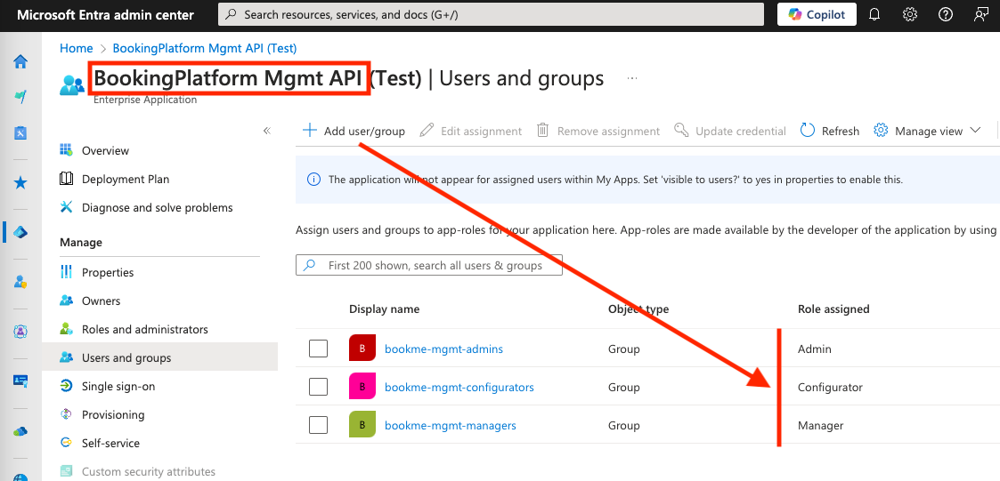

# Ensuring access to the &money Financial Platform Management UI

To give administrative users the required access to login to the solution, the following steps need to be taken.
Please note accessing these URLs will give consent and create the Enterprise Applications for you in your AAD.
After clicking 'Accept', you might see the following Error: "Sorry, but we're having trouble signing you in.",
however, the Enterprise Applications will still be created.

Replace the placeholder **TENANT_ID_FOR_BANK** in the URLs. Access the URLs to create the Enterprise Applications in your AAD:

## Environment – Test:

**API app registration**

- https://login.microsoftonline.com/TENANT_ID_FOR_BANK/adminconsent?client_id=f100d6c7-bbee-405b-9231-7e1c05c4b944

**UI app registration**

- https://login.microsoftonline.com/TENANT_ID_FOR_BANK/adminconsent?client_id=8d9cb59c-e0cd-4630-9e6e-efeb3f7aea6b

## Environment - Production:

**API app registration**

- https://login.microsoftonline.com/TENANT_ID_FOR_BANK/adminconsent?client_id=642f0f04-31f9-4641-a1cb-793f31496bd3

**UI app registration**

- https://login.microsoftonline.com/TENANT_ID_FOR_BANK/adminconsent?client_id=261ae34b-4de9-4c4a-9d70-1df1c024c91e

> **Important Security Note**: Client secrets for system integrations expire after 2 years and must be renewed before expiration. Plan rotation in advance and communicate new secrets to customers securely.

## Role Assignment for the Management UI

For the new Entra Enterprise Application named **BookingPlatform Mgmt API**, the users who need to be able to use the
new Booking Platform Management system must be assigned to one or more of the following roles (the list is sorted with
permissions in ascending order):

- **Customer** - Not relevant for the Management UI
- **Employee/System** - Not relevant for the Management UI
- **Manager** - A manager can access the Management UI and configure service groups and competence groups
- **Configurator** - All permissions that the Manager role has, and can in addition perform Meeting configuration and Portal configuration
- **Admin** - All permissions that the Configurator role has, and can in addition access the Logs (Insights)

### Example of Role Assignments

After mapping users- or groups to the Booking Platform application roles, the Entra Admin center for the **BookingPlatform Mgmt API**
enterprise application should look similar to the screenshot below:

{: .note}

> **Repeat for each environment**
>
> Make sure to map users- and groups to the _BookingPlatform Mgmt API_ roles in both the Test and the Production
> enterprise applications.

{: .tip}

> **Multiple Roles**
>
> Note: It is possible to assign users to multiple roles, however there is no benefit to this since it will effectively
> grant the user the role with the highest level of permissions.

### Access the &money Financial Meeting Platform Management UI

Once the enterprise application and its permission has been approved for the tenant and a user has been assigned one of
the roles mentioned above you can try logging in using this url:

Test: [Management UI Test](https://self.test-env.booking.andmoney.dk/)

Production: [Management UI Production](https://self.booking.andmoney.dk/)
