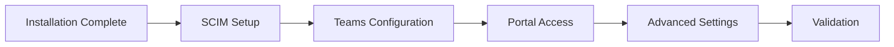

# Configuration Guides

Post-installation configuration for platform features and integrations.

## Configuration Steps

After installation, configure these components in order:

### 1. [SCIM User Provisioning](scim-provisioning)
Set up automated user synchronization between Microsoft Entra ID and the platform.

**Covers:**
- User provisioning setup
- Group synchronization
- Attribute mapping
- Provisioning monitoring

### 2. [Teams Integration](teams-integration)
Enable Microsoft Teams capabilities for online meetings and transcription.

**Covers:**
- Teams access policy
- Online meeting creation
- Transcription services
- Recording capabilities

### 3. [Management Portal Access](management-portal)
Configure administrative access to the management interface.

**Covers:**
- Role assignments
- Permission levels
- Multi-tenant management
- Audit configuration

### 4. [Microsoft Entra Integration](entra-integration)
Advanced identity and access management configuration.

**Covers:**
- Conditional access
- Multi-factor authentication
- Single sign-on
- Security policies

## Configuration Order

## Configuration Complexity

| Configuration | Complexity |
|--------------|------------|
| SCIM Provisioning | Medium |
| Teams Integration | Low |
| Portal Access | Low |
| Entra Integration | High |

## Common Configuration Scenarios

### Basic Setup
Just need meeting scheduling:
1. SCIM Provisioning
2. Portal Access

### Full Platform
All features including Teams:
1. SCIM Provisioning
2. Teams Integration
3. Portal Access
4. Entra Integration

### Multi-Tenant
Managing multiple customers:
1. Per-customer SCIM setup
2. Centralized portal access
3. Customer-specific Teams policies

## Validation Checklist

After configuration:
- [ ] Users appear in management portal
- [ ] Test user can log in
- [ ] Meeting creation works
- [ ] Teams meetings can be scheduled
- [ ] Transcription is functional (if enabled)
- [ ] Audit logs are recording

## Troubleshooting

Common issues during configuration:

| Issue | Solution |
|-------|----------|
| Users not syncing | Check SCIM token and provisioning status |
| Teams errors | Verify Teams admin permissions |
| Portal access denied | Review role assignments |
| SSO not working | Check Entra app registration |

## Next Steps

After configuration:
- Perform [validation tests](../reference/validation-guide)
- Review [security best practices](../reference/security)
- Set up [monitoring](../reference/monitoring)
- Schedule user training