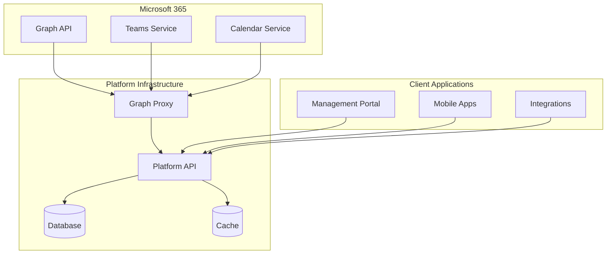

# Technical Reference

In-depth technical documentation for platform architecture, automation, and advanced configurations.

## Reference Documentation

### [Graph Proxy Architecture](graph-proxy)

Technical details of the Graph Proxy component that enables Microsoft 365 integration.

**Covers:**

- Architecture overview
- Security model
- Configuration options
- Scaling considerations

### [PowerShell Automation](powershell-scripts)

Complete reference for deployment and configuration automation scripts.

**Covers:**

- Script parameters
- Usage examples
- Automation scenarios
- Troubleshooting

### [API Integration](api-integration)

Platform API documentation for custom integrations.

**Covers:**

- REST API endpoints
- Authentication methods
- Webhook configuration
- Rate limiting

### [Security Guidelines](security)

Security best practices and compliance information.

**Covers:**

- Security architecture
- Compliance standards
- Audit requirements
- Incident response

### [Monitoring & Operations](monitoring)

Operational guidance for platform monitoring and maintenance.

**Covers:**

- Health monitoring
- Performance metrics
- Alert configuration
- Maintenance procedures

### [Troubleshooting Guide](troubleshooting)

Common issues and their resolutions.

**Covers:**

- Deployment issues
- Configuration problems
- Integration errors
- Performance troubleshooting

## Architecture Overview

## Key Technologies

| Component    | Technology           | Purpose                        |
| ------------ | -------------------- | ------------------------------ |
| Identity     | Microsoft Entra ID   | Authentication & authorization |
| API Gateway  | Azure Container Apps | Service hosting                |
| Storage      | Azure Key Vault      | Secrets management             |
| Integration  | Microsoft Graph      | M365 connectivity              |
| Provisioning | SCIM 2.0             | User synchronization           |
