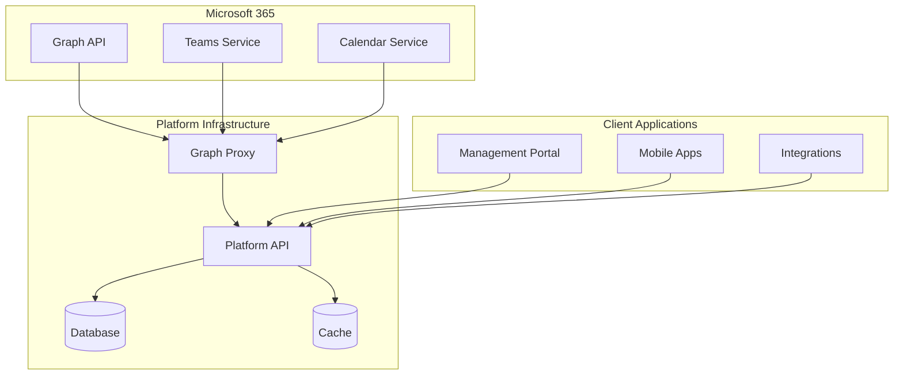

# Technical Reference

In-depth technical documentation for platform architecture, automation, and advanced configurations.

## Reference Documentation

### [Graph Proxy Architecture](graph-proxy)
Technical details of the Graph Proxy component that enables Microsoft 365 integration.

**Covers:**
- Architecture overview
- Security model
- Configuration options
- Scaling considerations

### [PowerShell Automation](powershell-scripts)
Complete reference for deployment and configuration automation scripts.

**Covers:**
- Script parameters
- Usage examples
- Automation scenarios
- Troubleshooting

### [API Integration](api-integration)
Platform API documentation for custom integrations.

**Covers:**
- REST API endpoints
- Authentication methods
- Webhook configuration
- Rate limiting

### [Security Guidelines](security)
Security best practices and compliance information.

**Covers:**
- Security architecture
- Compliance standards
- Audit requirements
- Incident response

### [Monitoring & Operations](monitoring)
Operational guidance for platform monitoring and maintenance.

**Covers:**
- Health monitoring
- Performance metrics
- Alert configuration
- Maintenance procedures

### [Troubleshooting Guide](troubleshooting)
Common issues and their resolutions.

**Covers:**
- Deployment issues
- Configuration problems
- Integration errors
- Performance troubleshooting

## Architecture Overview

## Key Technologies

| Component | Technology | Purpose |
|-----------|------------|---------|
| Identity | Microsoft Entra ID | Authentication & authorization |
| API Gateway | Azure Container Apps | Service hosting |
| Storage | Azure Key Vault | Secrets management |
| Integration | Microsoft Graph | M365 connectivity |
| Provisioning | SCIM 2.0 | User synchronization |

## Performance Considerations

### Scalability
The platform is designed to scale based on your Azure infrastructure and licensing.

### Availability
Availability depends on your Azure deployment configuration and selected service tiers.

## Compliance & Security

The platform leverages Azure's security and compliance features. Consult your Azure subscription's compliance certifications and your organization's security requirements.

## Development Resources

### Integration Options
The platform provides REST APIs for integration. Contact the Service Desk for available SDKs and sample code.

## Advanced Topics

### Multi-Region Deployment
Deploying across multiple Azure regions for global reach.

### High Availability Setup
Configuring active-active deployments for zero downtime.

### Custom Integrations
Building custom connectors and integrations.

### Data Migration
Migrating from legacy systems to the platform.

## Getting Support

### Technical Support
- **Documentation**: This guide
- **Support**: Contact the Service Desk

### Community Resources
- **Partner Forum**: Share experiences
- **Knowledge Base**: Common solutions
- **Release Notes**: Latest updates

## Contributing

For documentation improvements:
1. Submit feedback via portal
2. Contact technical writing team
3. Participate in partner advisory board

## Documentation Information

- **Last Updated**: September 2025