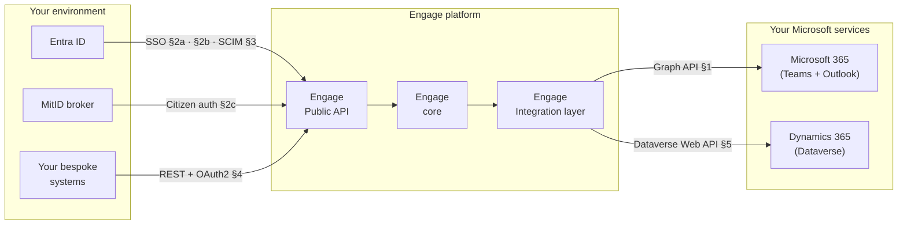

# Engage Platform Integration Onboarding

---

## Purpose

This document is the customer-facing reference for integrating a new tenant with the Engage platform. It describes the complete set of interfaces between your tenant and the Engage platform backend so that each area of responsibility on your side can be prepared in parallel.

The document is structured as a reference with per-responsibility checklists, not a linear runbook. Each section identifies the responsibilities involved and separates **what your tenant provisions** from **what the Engage platform provides**.

## How to use this document

- The Azure / Entra admin, CRM admin, and Public API consumer responsibilities are independent and can be worked in parallel once the [Starting inputs](#starting-inputs) are in place. Depending on your organisation, these may map to dedicated teams or be combined under a single person or function.

## Integration surface overview

The Engage platform integrates with your environment across five surfaces. Each surface maps to a specific area of responsibility on your side (typically a role; not necessarily a separate team), serves a specific purpose, and is detailed in its own section of this document. The diagram below shows the integration architecture from left to right: inbound traffic from your environment enters Engage through the Public API surface, flows through the Engage core, and reaches outbound to your Microsoft 365 and Dynamics 365 estates via the Engage Integration layer.

**Entra plays two roles in the architecture:** as the inbound identity provider for Management Portal SSO, Customer Portal SSO (where used), and SCIM provisioning — and, separately, as the OAuth token authority that the Engage Integration layer calls back into before reaching M365 or Dataverse on outbound flows. The diagram below shows the primary data flows only; the outbound token acquisition against Entra is described in §1 and §5.



### Integration points

| # | Surface | Direction | Customer-side responsibility | Purpose | Section |
|---|---|---|---|---|---|
| 1 | **Microsoft 365 (Graph API — Teams + Outlook)** | Outbound — Engage Integration layer → your M365 tenant. Two access modes: direct Graph API access, or via a Graph-Proxy container installed in your Azure perimeter. OAuth tokens acquired from your Entra tenant in both modes. | Azure / Entra admin | Read employee calendar free/busy data, create and update Teams meetings tied to booked appointments, and manage calendar events for the meetings Engage schedules on behalf of your employees. | 1 |
| 2a | **Microsoft Entra ID — Management Portal** | Inbound — your Entra tenant → Engage Public API. Customer grants admin consent on the Engage-owned `BookingPlatform Mgmt UI` + `BookingPlatform Mgmt API` multi-tenant apps and maps users to app roles | Azure / Entra admin | Authenticate your staff signing into the Management Portal using their existing credentials, MFA, and conditional access policies. App roles (`Admin`, `Configurator`, `Manager`, `Employee`, `Customer`) determine what each user can do. | 2a |
| 2b | **Microsoft Entra ID — Customer Portal** | Inbound — your Entra tenant → Engage Public API. Customer grants admin consent on a separate Engage-owned Customer Portal app; Engage generates and stores per-customer credentials | Azure / Entra admin | Authenticate users from your enterprise customers (e.g. partner organisations operating under their own Entra tenants) signing into the Customer Portal. | 2b |
| 2c | **MitID — Customer Portal** | Inbound — your MitID broker → Engage Public API (Engage consumes the broker's OpenID Connect configuration) | MitID / customer portal | Authenticate individual Danish citizens signing into the Customer Portal. Engage does not participate in your MitID broker contract; it consumes the discovery and authorization-code flow only. (Danish-market customers only.) | 2c |
| 3 | **Directory data — SCIM provisioning** | Inbound — your Entra tenant → Engage Public API, on a ~40-minute cycle | Azure / Entra admin | Continuously synchronise employee and meeting-room records from your directory into Engage. Engage always reflects the current state of your directory — joiners, movers, leavers, room additions — without manual reconciliation. | 3 |
| 4 | **Engage Public API** | Inbound — your bespoke systems → Engage Public API, over REST. Two OAuth2 flows supported: client credentials (token issued by Engage's external Entra tenant — the System Integration app registration lives there, not in your tenant) and authorization code (user-delegated via your Entra tenant against the Mgmt API app's `access_as_user` scope). | Public API consumer | Programmatic access for any system on your side that needs to read or write Engage-managed records — custom dashboards, integrations with your internal business or CRM systems, data extracts, and bespoke automation. | 4 |
| 5 | **Dynamics 365 (Dataverse Web API)** | Outbound — Engage Integration layer → your Dataverse environment. OAuth tokens acquired from your Entra tenant (client credentials for system flows; OBO for user-attributed flows). | Dynamics 365 admin | Read your customer, contact, and employee records as the system of record, and (where in scope) create/update appointment and annotation records reflecting meeting activity. Operated through your declared Entity Patterns, so the platform reads/writes only the Dataverse columns you have mapped. | 5 |

## Roles and responsibilities

The integration involves several distinct areas of responsibility on your side. In a larger organisation these may map to dedicated teams; in a smaller one — or where an MSP or integration partner covers part of the scope — a single team or individual may carry several roles. The table below lists each role and the sections it owns, so that the right people can be identified regardless of how your organisation is structured.

| Role / responsibility | Owns sections |
|---|---|
| Azure / Entra administration | 1 (Microsoft 365 integration), 2a (Management Portal Entra), 2b (Customer Portal Entra), 3 (SCIM provisioning) |
| MitID / customer portal | 2c (MitID) — Danish-market customers only |
| CRM administration (Dynamics 365) | 5 (Dynamics 365 CRM integration) |
| Public API consumer | 4 (Engage Public API) |

If your CRM is Salesforce rather than Dynamics 365, refer to the existing Engage platform customer-facing Salesforce setup documentation; section 5 of this document covers the Dynamics path only.

## Conventions

- "The Engage platform" refers to the &Money customer-engagement platform suite (BookMe scheduling, Present, Insights, and supporting services).
- "Engage platform team" refers to the &Money-side technical contacts who deliver and operate the platform on your behalf.
- "You" / "your tenant" / "the customer" refers to the integrating entity being onboarded to the Engage platform. Where the Entra or Azure technical concept of a tenant is meant, it is explicitly called an "Entra tenant" or "Azure tenant".
- "Employee" refers to a user from the integrating tenant's directory (typically what other systems may call an advisor, agent, or staff user).
- Identifiers shown as `{Placeholder}` are filled in during the implementation phase.

## Table of contents

1. [Integration surface overview](#integration-surface-overview)
2. [Starting inputs](#starting-inputs)
3. [Microsoft 365 integration](#1-microsoft-365-integration)
4. [Identity and portal authentication](#2-identity-and-portal-authentication)
    - [2a. Management Portal authentication (Microsoft Entra ID)](#2a-management-portal-authentication-microsoft-entra-id)
    - [2b. Customer Portal authentication via Microsoft Entra ID](#2b-customer-portal-authentication-via-microsoft-entra-id)
    - [2c. Customer Portal authentication via MitID](#2c-customer-portal-authentication-via-mitid)
5. [Entra SCIM provisioning](#3-entra-scim-provisioning)
6. [Engage Public API](#4-engage-public-api)
7. [Dynamics 365 CRM integration](#5-dynamics-365-crm-integration)

---

## Starting inputs

A few decisions and items apply across multiple sections of this document. They are resolved before per-section work begins and are referenced by the [Prerequisites](#prerequisites) tables in each section.

### Cross-cutting decisions

| Decision | Owner |
|---|---|
| Production and sandbox environment scope (which Engage environments your tenant will be onboarded to) | Engage platform team |
| M365 integration access mode — direct Graph API or Graph-Proxy mediated (and, in proxy mode, single- or multi-tenant) | Customer + Engage platform team — see section 1 |
| Portal authentication scope — Entra External ID, MitID, or both | Customer + Engage platform team |
| Public API consumer scope — which API versions and surfaces | Customer + Engage platform team |

### Items the Engage platform team provides early

These items are referenced by multiple section prerequisites and are delivered before per-section work begins:

- Egress IP ranges per environment (Engage backend → your services) for firewall allow-listing.
- Starter Entity Definition exports for the Dynamics integration (section 5), if your CRM is Dynamics 365.
- The Engage API Application ID URI and scope name needed for the Public API and OBO flow (sections 4 and 5).
- Environment-specific URLs and identifiers needed by sections 1, 3, and 4.

---

## 1. Microsoft 365 integration

**Customer-side responsibility:** Azure / Entra administration

### Architecture overview and reasoning

The Engage platform integrates with your Microsoft 365 estate — Teams meetings, Outlook calendar free/busy, employee provisioning — through Microsoft Graph. **Two access modes are supported**; the choice depends on whether your audit and control requirements are met by Microsoft's native logging at the Graph API / M365 endpoint level, or whether you need an additional customer-controlled control point inside your Azure perimeter.

#### Access modes

| Mode | Where Graph calls originate from | Customer-side infrastructure |
|---|---|---|
| **Direct Graph API access** | Engage Integration layer calls Microsoft Graph directly using OAuth tokens from your Entra tenant | None — only Entra resources |
| **Graph-Proxy mediated access** | Engage Integration layer calls a Graph-Proxy container in your Azure perimeter, which forwards the call to Microsoft Graph | Container App + Key Vault in your Azure subscription |

**Direct mode** is suitable when your existing audit and monitoring at the Graph API / M365 endpoint level (Azure activity logs, Microsoft 365 unified audit log, Graph API audit signals) already meet your control requirements. There is no Engage-provided infrastructure to maintain inside your Azure perimeter.

**Graph-Proxy mode** is suitable when your audit framework specifies that integrations must transit infrastructure you operate, or when you need an additional control point inside your perimeter — for example a centralised egress log, request-level approvals, or local enforcement of access patterns beyond what Microsoft's native logs provide.

Both modes use the same Entra app registration model for token acquisition, the same SCIM provisioning surface (section 3), and the same Management Portal authentication (section 2a). The choice affects only whether outbound Graph traffic transits a customer-hosted proxy.

#### Common to both modes — Entra resources

In both modes you provision the same Entra-side resources in your tenant:

| Resource | Purpose |
|---|---|
| App Registration (Calendar + Teams permissions) | Authenticates Engage to Microsoft Graph |
| Service Principal for SCIM | Backs the SCIM provisioning enterprise applications (section 3) |
| Teams access policy + scoped security group | Authorises Engage to act on Teams meetings on behalf of the scoped employees |

In **Direct mode** you provision these resources directly (or via your own scripts).
In **Graph-Proxy mode** the Engage Marketplace App Offer provisions them alongside the Graph-Proxy infrastructure.

#### Graph-Proxy components (proxy mode only)

The Graph-Proxy and its supporting resources are delivered as a single Azure Managed Application Offer ("App Offer") in the Azure Marketplace:

| Component | Purpose |
|---|---|
| Container App ([Graph-Proxy]({{ site.baseurl }}/bookme/graph-proxy/)) | Runtime that intercepts and forwards Graph calls |
| Key Vault | Stores the app registration's client secret inside your Azure perimeter, so the secret never leaves your environment |
| Managed Identity (single-tenant deployments only) | Gives the Graph-Proxy the application-mode Graph permissions and Teams role it needs |

The reasoning for the App Offer delivery model: you install, update, and own the lifecycle of the M365 integration the same way you would any other Azure-managed application; all resources land in your subscription and resource group; the Engage platform team publishes new versions through Marketplace and you accept updates on your schedule.

#### Proxy-mode deployment topologies

In Graph-Proxy mode, two topologies are supported. The runtime behaviour is the same in either; the choice is driven by your operational model.

- **Single-tenant** — Azure resources and Entra ID resources live in the same tenant. Simplest path, suitable when one tenant operates the entire integration for itself.
- **Multi-tenant** — Azure resources live in one administrator tenant; Entra ID resources are created in each downstream tenant by PowerShell scripts. Used when one central administrator operates the App Offer on behalf of multiple tenants, or when some downstream tenants cannot install from Marketplace.

### Deployment prerequisites

| Prerequisite | Source |
|---|---|
| An active Entra tenant | Customer |
| Permission to create app registrations in that tenant (Application Administrator or equivalent) | Customer |
| Tenant admin consent capability (Global Administrator or Privileged Role Administrator) | Customer |
| Permission to create or update Teams access policies (Teams Communications Administrator or Teams Administrator) | Customer |
| Security group Object ID for the Teams access policy (created before configuration) | Customer |
| **Proxy mode only** — Azure subscription with Marketplace access | Customer |
| **Proxy mode only** — Installer account holding `Owner` on the target Resource Group | Customer |
| **Proxy mode, single-tenant only** — Managed Identity with `Application.ReadWrite.All` + `Synchronization.ReadWrite.All` API permissions and `Teams Communications Administrator` or `Teams Administrator` role | Customer |
| **Proxy mode, multi-tenant only** — Admin account in each target tenant with `Global Administrator`, `Application Administrator`, or `Cloud Application Administrator` | Customer |
| **Proxy mode, multi-tenant only** — PowerShell modules `Microsoft.Graph.Applications`, `Microsoft.Graph.Authentication`, `MicrosoftTeams` (the provided scripts install/import as needed) | Customer |
| SCIM token | Engage platform team — provided early |
| Target environment identifier (`dev` / `test` / `prod`) | Engage platform team — provided early |

### Concrete implementation steps

The access mode decision is locked first (as part of the [Starting inputs](#starting-inputs)). Once locked, follow the relevant installation guide:

- **Proxy mode** — see [Marketplace Installation]({{ site.baseurl }}/bookme/marketplace-installation/) for the full single-tenant and multi-tenant install procedures, including the PowerShell scripts ([Enable-SCIM-Provisioning.ps1]({{ site.baseurl }}/bookme/enable-scim-provisioning/) and [Add-Teams-Access-Policy.ps1]({{ site.baseurl }}/bookme/add-teams-access-policy/)) that provision the Entra ID part.
- **Direct mode** — provision the equivalent Entra resources directly in your tenant (Entra app registration with Calendar + Teams permissions, client secret, security group, Teams access policy, SCIM service principal). The Engage platform team confirms the specific Graph scopes during onboarding.

#### Validation

- [ ] App Registration for Calendar and Teams Access exists with the expected permissions and admin consent granted.
- [ ] SCIM service principals for employees and rooms are present and enabled.
- [ ] Teams access policy is granted to the chosen security group.
- [ ] **Proxy mode only** — App Offer deployment completed without errors; Graph-Proxy Container App is running and reachable from the Engage backend egress IP ranges.

#### Handover artifacts

| Artifact | From | To | Channel |
|---|---|---|---|
| Access mode decision (direct or proxy) | Customer | Engage platform team | Provided early |
| **Proxy mode only** — deployment topology decision (single-tenant or multi-tenant) | Customer | Engage platform team | Provided early |
| Target Entra tenant ID(s) | Customer | Engage platform team | Email |
| App Registration Client ID (Calendar + Teams Access) | Customer | Engage platform team | Email |
| **Direct mode only** — App Registration client secret | Customer | Engage platform team | Secure secret channel |
| Configuration confirmation (App Offer deployed in proxy mode; App Registration + permissions in place in direct mode) | Customer | Engage platform team | Email |
| SCIM token | Engage platform team | Customer | Secure secret channel |
| Environment identifier (`dev`/`test`/`prod` mapping) | Engage platform team | Customer | Provided early |

---

## 2. Identity and portal authentication

**Customer-side responsibilities:** Azure / Entra administration (2a + 2b); MitID / customer portal (2c)

The Engage platform serves two distinct portal surfaces, with three identity paths between them:

| Portal | Identity provider | Users | Subsection |
|---|---|---|---|
| Management Portal | Microsoft Entra ID | Your staff (admins, configurators, managers, employees) | 2a |
| Customer Portal | Microsoft Entra ID | Customers from an enterprise tenant (e.g. partner organisations) | 2b |
| Customer Portal | MitID | Individual Danish citizens | 2c |

All three identity paths use **Engage-owned multi-tenant enterprise app registrations** in the Engage platform's Entra tenant; the customer's Entra side participates only by granting admin consent (and, for the Management Portal, mapping users to app roles). No app registration is created on the customer side.

### 2a. Management Portal authentication (Microsoft Entra ID)

**Customer-side responsibility:** Azure / Entra administration

#### Architecture overview and reasoning

The Management Portal is where your staff manages the Engage platform — configuring meeting topics, customer types, employees, rooms, entity definitions and playbooks, and the integration patterns described elsewhere in this document. Access is gated by Microsoft Entra ID using two multi-tenant enterprise app registrations Engage owns:

| Engage-owned enterprise app | Purpose |
|---|---|
| `BookingPlatform Mgmt UI` | Browser sign-in flow for Management Portal users |
| `BookingPlatform Mgmt API` | API permission scope the portal calls into; carries the Engage-defined app roles |

The reasoning for the two-app split: separating the **login surface** (Mgmt UI) from the **API permission scope** (Mgmt API) follows Microsoft's standard pattern for SPA-style applications — users authenticate first, then request an API access token for the specific scope.

The reasoning for using Engage-owned multi-tenant apps rather than per-customer app registrations:

- The app definitions (permissions, scopes, app roles) are versioned and managed in one place. You do not create or maintain app registrations on your side.
- Your Entra admin grants admin consent once per app; users from your tenant can then sign in without per-user consent prompts.
- Onboarding a new customer is one admin-consent click per app, not a multi-step Entra setup.

The Mgmt API app exposes the following **app roles**. Your Entra admin maps users (or, more commonly, security groups) to these roles in the BookingPlatform Mgmt API enterprise application within your tenant:

| App role | Typical assignee |
|---|---|
| `Admin` | Platform administrators on your side with full configuration rights |
| `Configurator` | Staff who configure entity definitions, playbooks, integration mappings |
| `Manager` | Operations managers with elevated visibility |
| `Employee` | Standard staff (typically employees who handle meetings) |
| `Customer` | Reserved role for end-customer scenarios on the management surface |

A user's app role determines what they can see and do in the Management Portal.

##### Tenant-to-customer mapping

Tokens issued by your Entra tenant carry your tenant ID as the issuer claim. Engage maps your tenant ID to your customer record so API access is scoped to your data only. A tenant can be mapped to multiple customer records if your organisation operates more than one — users are prompted to select the relevant context after sign-in.

#### Deployment prerequisites

| Prerequisite | Source |
|---|---|
| An Entra tenant | Customer |
| Tenant admin consent capability (Global Administrator, Application Administrator, or Cloud Application Administrator) | Customer |
| Permission to map users/groups to app roles (Application Administrator or User Administrator) | Customer |
| Identified user groups (or users) for each app role you intend to populate | Customer |
| Engage-provided admin-consent links for the Mgmt UI and Mgmt API apps (one of each per environment) | Engage platform team — provided early |
| Management Portal URLs per environment | Engage platform team — provided early |

#### Concrete implementation steps

##### Step 1 — Grant admin consent on both Engage-owned apps

Engage provides two admin-consent URLs per environment:

```
https://login.microsoftonline.com/{YourTenantId}/adminconsent?client_id={MgmtUiAppClientId}
https://login.microsoftonline.com/{YourTenantId}/adminconsent?client_id={MgmtApiAppClientId}
```

Open each link while signed in as a tenant admin with the required role. Once consent is granted, both apps appear in your tenant under **Enterprise Applications**, ready for role assignment.

##### Step 2 — Map users and groups to app roles

In the Entra Admin Center, open the **BookingPlatform Mgmt API** enterprise application, navigate to **Users and groups**, and assign your security groups (or users) to the relevant app roles:

- Platform admins → `Admin`
- Integration configurators / playbook authors → `Configurator`
- Operations managers → `Manager`
- Staff handling meetings → `Employee`

You can revisit assignments as your organisation evolves; role changes propagate at next sign-in.

##### Step 3 — Confirm your tenant ID with the Engage platform team

Engage registers your Entra tenant ID against your customer record so that tokens issued by your tenant resolve to your data scope.

##### Validation

- [ ] Both Mgmt UI and Mgmt API apps appear in your tenant's Enterprise Applications list with admin consent recorded.
- [ ] At least one user is assigned each of `Admin`, `Configurator`, `Manager`, and `Employee` roles.
- [ ] A test sign-in to the Management Portal succeeds for one user per role, and the visible features match each role.

##### Handover artifacts

| Artifact | From | To | Channel |
|---|---|---|---|
| Admin-consent links for Mgmt UI + Mgmt API (per environment) | Engage platform team | Customer | Provided early |
| Confirmation that admin consent has been granted on both apps | Customer | Engage platform team | Email |
| Your Entra tenant ID | Customer | Engage platform team | Email |
| Confirmation that role assignments are in place | Customer | Engage platform team | Email |
| Management Portal URLs per environment | Engage platform team | Customer | Provided early |

### 2b. Customer Portal authentication via Microsoft Entra ID

**Customer-side responsibility:** Azure / Entra administration

#### Architecture overview and reasoning

The Customer Portal is the external-facing surface where the people your business serves — for example, employees of partner organisations operating under their own Entra tenants — authenticate to book and manage meetings. When the portal user is an enterprise (a partner with their own Entra tenant), they authenticate via Microsoft Entra ID.

Engage provides a **separate enterprise app** for the Customer Portal, distinct from the Mgmt UI/API apps used for the Management Portal in §2a. The reasoning for keeping them separate:

- **Different audiences and trust boundaries.** Management Portal tokens scope to your own staff; Customer Portal tokens scope to external customers whose access is tightly controlled. Keeping the surfaces in separate app registrations keeps audience and scope claims clean.
- **Different credential lifecycle.** Customer Portal per-customer credentials are generated and rotated by Engage centrally (see step 2 below). The Management Portal pattern relies on consent + role assignment instead, with no per-customer secrets to rotate.

Engage provides a per-environment admin-consent link for the Customer Portal app during onboarding. After admin consent is granted, Engage generates a per-customer Client ID + Client Secret and stores them in its encrypted secret store. These are used during sign-in to authenticate the customer session against your tenant's identity issuer. The credentials never leave Engage's secret store; you do not handle them.

#### Deployment prerequisites

| Prerequisite | Source |
|---|---|
| An Entra tenant | Customer |
| Tenant admin consent capability (Global Administrator, Application Administrator, or Cloud Application Administrator) | Customer |
| Customer Portal admin-consent link (one per environment) | Engage platform team — provided early |
| Customer Portal URLs per environment | Engage platform team — provided early |

#### Concrete implementation steps

##### Step 1 — Grant admin consent on the Engage Customer Portal app

Engage provides the admin-consent URL for the Customer Portal app per environment:

```
https://login.microsoftonline.com/{YourTenantId}/adminconsent?client_id={CustomerPortalAppGuid}
```

Open the link while signed in as a tenant admin with the required role.

##### Step 2 — Engage generates per-customer credentials

Once admin consent is recorded, the Engage platform team generates a Client ID and Client Secret scoped to your customer record. The credentials are stored in Engage's encrypted secret store and registered against your tenant in the portal authentication configuration.

##### Step 3 — Identify which users at your customers may sign in

If you want to restrict which users at your enterprise customers can sign in via the Customer Portal, configure that on their side using your standard Entra controls (assignment policies, conditional access, etc.). Engage does not gate this further at the platform level.

##### Validation

- [ ] Customer Portal app appears in your tenant's Enterprise Applications list with admin consent granted.
- [ ] A test sign-in via the Customer Portal succeeds for a user in your tenant.
- [ ] The Engage platform team confirms that per-customer credentials have been generated and registered.

##### Handover artifacts

| Artifact | From | To | Channel |
|---|---|---|---|
| Customer Portal admin-consent link (per environment) | Engage platform team | Customer | Provided early |
| Confirmation that admin consent has been granted | Customer | Engage platform team | Email |
| Your Entra tenant ID | Customer | Engage platform team | Email (may already be supplied in 2a) |
| Customer Portal URLs per environment | Engage platform team | Customer | Provided early |

### 2c. Customer Portal authentication via MitID

**Customer-side responsibility:** MitID / customer portal

#### Architecture overview and reasoning

The Customer Portal also supports MitID for individual Danish citizens. MitID brokering is operated by you (or your nominated MitID broker); the Engage platform consumes the resulting OpenID Connect configuration without participating in your MitID broker contract.

The integration is configured **per portal instance** — each customer institution you serve has its own portal instance, identified by a portal ID, with its own MitID client registration at the broker. Engage stores the MitID client configuration (well-known URL, client ID, client secret) keyed by portal ID, so different portal instances can use different broker accounts or step-up policies without sharing identities.

A citizen session created via MitID carries **no tenant ID and no Engage backend bearer token**. Subsequent API calls are scoped to citizen-level data only — the citizen cannot use a MitID session to reach data outside their own scope.

##### Sign-in flow

1. The citizen opens the Engage customer portal URL (each portal instance is identified by a portal ID).
2. The portal fetches the MitID client configuration for that portal from the Engage configuration service.
3. The portal redirects the citizen to the MitID broker with a PKCE challenge.
4. The citizen authenticates with MitID and any required step-up.
5. MitID returns an authorization code; the portal exchanges it for an ID token directly with the broker.
6. The portal creates a citizen session and grants access to citizen-level data only.

#### Deployment prerequisites

| Prerequisite | Source |
|---|---|
| A MitID broker contract (Nets eID Broker or equivalent) | Customer (existing) |
| Defined portal instances on your side (one per institution served) | Customer |
| MitID client registration capability with your broker (one client per portal instance) | Customer |
| Customer portal URLs per environment (used as redirect URIs at the broker) | Engage platform team — provided early |

#### Concrete implementation steps

##### What you provision (or arrange with your MitID broker)

1. **MitID OpenID Connect client** configured for each portal instance you operate.
2. The standard MitID well-known URL (broker-specific).
3. **Client ID** and **client secret** issued by the broker for each portal instance.
4. **Allowed redirect URIs** matching the Engage customer portal URLs per environment.
5. MitID broker compliance approvals as required by your MitID broker contract.

##### Validation

- [ ] A test citizen can sign in via the customer portal URL for at least one portal instance.
- [ ] The portal-to-broker mapping resolves correctly (the right MitID client serves the right portal ID).
- [ ] Subsequent API calls are correctly scoped to citizen-level data only.

##### Handover artifacts

| Artifact | From | To | Channel |
|---|---|---|---|
| MitID well-known URL (per environment) | Customer | Engage platform team | Email |
| Client ID (per portal instance) | Customer | Engage platform team | Email |
| Client secret (per portal instance) | Customer | Engage platform team | Secure secret channel |
| Redirect URIs registered with the broker | Customer | Engage platform team | Email |
| Portal-to-broker mapping | Customer | Engage platform team | Email |
| Customer portal URLs per environment | Engage platform team | Customer | Provided early |

---

## 3. Entra SCIM provisioning

**Customer-side responsibility:** Azure / Entra administration

### Architecture overview and reasoning

SCIM provisioning keeps your employee and meeting-room records synchronised into the Engage platform automatically. Entra's built-in SCIM service runs on a ~40 minute cycle by default and pushes user and group changes to Engage's SCIM endpoint whenever your directory changes — joiners, movers, leavers, and room additions all propagate without manual reconciliation.

The reasoning for using SCIM (rather than a custom sync API or a periodic export):

- It is the standard provisioning protocol Entra exposes natively. No bespoke connector code on either side; the directory of record (your Entra tenant) drives the data without Engage ever needing read access to it.
- Provisioning is **push-from-the-source**: Engage receives writes from Entra. Engage holds no standing credentials in your directory, and no scheduled job on Engage's side reaches into your tenant.
- Per-resource scoping — employees and rooms have separate SCIM-enabled enterprise applications, with separate attribute mappings and separate user/group assignments. You can ramp them up independently and operate them at different cadences if you need.

##### Resource model

Two SCIM-enabled enterprise applications are created in your Entra tenant — one targeting Engage's `employees/scim` endpoint, one targeting `rooms/scim`. Each carries:

- **Tenant URL** — the Engage SCIM endpoint to push to, per resource type and per environment.
- **Secret token** — the shared SCIM token issued by Engage that authenticates pushes from your tenant.
- **Attribute mappings** — how Entra attributes translate into the customappsso schema Engage understands.
- **Users and groups** — the set of identities to provision (typically Entra security groups you maintain).

They are typically created by the PowerShell script [`Enable-SCIM-Provisioning.ps1`]({{ site.baseurl }}/bookme/enable-scim-provisioning/) covered in section 1's multi-tenant flow, but can be created manually if you prefer.

### Deployment prerequisites

| Prerequisite | Source |
|---|---|
| Entra app registration + SCIM service principals for employees and rooms (typically created by section 1's `Enable-SCIM-Provisioning.ps1`, or manually) | Customer |
| Permission to configure SCIM-enabled enterprise applications (Application Administrator or equivalent) | Customer |
| Mapping of employees and rooms to be provisioned (typically Entra security groups) | Customer |
| Schema knowledge needed for any attribute mapping deviations from the defaults | Customer |
| SCIM token | Engage platform team — provided early |
| Tenant URLs per environment | Engage platform team — provided early |

### Concrete implementation steps

See [SCIM Provisioning Setup]({{ site.baseurl }}/bookme/scim-provisioning-setup/) for the configuration procedure, including the environment-specific tenant URLs, attribute mappings for employee and room applications, user/group assignment, and how to configure monitoring of provisioning failures.

#### Validation

- [ ] Both enterprise applications (employees + rooms) exist and are configured against the correct environment tenant URL.
- [ ] Attribute mappings reflect your directory schema (with any deviations from the defaults in the linked setup guide documented).
- [ ] SCIM token has been entered and provisioning is enabled.
- [ ] At least one test employee and one test room provision successfully and appear in Engage with the expected attributes.
- [ ] Provisioning failure email recipient is configured for both applications.

#### Handover artifacts

| Artifact | From | To | Channel |
|---|---|---|---|
| Confirmation of assigned users/groups + initial provisioning success | Customer | Engage platform team | Email |
| SCIM token | Engage platform team | Customer | Secure secret channel (shared once; if rotation is needed, Engage reissues) |
| Tenant URLs per environment | Engage platform team | Customer | Provided early |

---

## 4. Engage Public API

**Customer-side responsibility:** Public API consumer

### Architecture overview and reasoning

The Engage Public API is a RESTful API exposing scheduling (BookMe), presentation generation (Present), and organisation configuration endpoints. It is suitable for any system on your side that needs to read or write Engage-managed records programmatically — custom dashboards, integrations with your internal business or CRM systems, data extracts, and bespoke automation.

Calls are authenticated using **OAuth2 bearer tokens issued by Microsoft Entra ID**. Tokens are validated by Engage at the API layer; tenant scoping is enforced from the token's claims (issuer for user-delegated flow, authorised party for client-credentials flow).

##### Two authentication flows are supported

The Public API supports two OAuth2 flows, each suited to a different consumption pattern:

| Flow | When to use | Token issuer | Token scope |
|---|---|---|---|
| **Client credentials** (system-to-system) | A backend or batch process on your side calls the Public API without a signed-in user. The primary flow for bespoke-system integration. | Engage's external Entra tenant — the per-customer System Integration app registration lives **in Engage's tenant**, not yours | `https://{engage-tenant-domain}/{engage-api-app-id}/.default` (concrete values provided by Engage) |
| **Authorization code** (user-delegated) | A user-facing application calls the Public API on behalf of a signed-in user; the same identity context as the Management Portal | Your Entra tenant (multi-tenant flow against `login.microsoftonline.com/organizations`) | `api://{mgmt-api-app-id}/access_as_user` (the BookingPlatform Mgmt API app from §2a) |

The two flows share the same API endpoints; the difference is only in how the bearer token is acquired.

Critically — in **both flows** the Entra app registration the token is issued against is owned by Engage, not by you. You do not create an app registration on your side. For client-credentials flow, Engage creates a per-customer System Integration app registration in its own tenant and provides you with the Client ID and Client Secret to put in your consuming system. For authorization-code flow, the BookingPlatform Mgmt API app is consented into your tenant once during §2a setup, and the same admin consent unlocks user-delegated calls from anywhere — including the Public API.

##### API version and base URL

The current Public API version is **v3**:

```
https://apim-public-api.azure-api.net/api/v3/
```

Versions are pinned in the base URL. When Engage publishes a future major version, it runs alongside v3 — clients opt in by changing the base URL. Inside a version, changes are additive and backward-compatible.

##### Endpoint surface (high level)

| API area | Examples |
|---|---|
| BookMe — meetings | `GET/POST/PATCH/DELETE /bookme/meetings`, `POST /bookme/meetings/{id}/ical` |
| BookMe — time slots | `GET /bookme/time-slots`, `GET /bookme/time-slots/available`, `POST /bookme/time-slots/reserve` |
| BookMe — supporting data | `GET /bookme/meeting-topics`, `GET /bookme/room-vacancies` |
| Organisation configuration | `GET/POST/PUT/DELETE /config/customer-types`, `GET /config/employees`, `GET /config/rooms` |
| Labels | Label Registry: `GET/POST/PUT/DELETE /labels`; label filtering on Employees, Rooms, Templates |
| Competence Groups, Service Groups, Portals | CRUD endpoints under `/config` |
| Present | `POST /present/slides`, `POST /present/slides/generate`, `POST /present/slides/pdf`, template CRUD endpoints |

The complete list, request/response schemas, and field semantics are in the Swagger document Engage shares as part of the [Starting inputs](#starting-inputs).

### Deployment prerequisites

| Prerequisite | Source |
|---|---|
| A consuming system on your side that can perform an OAuth2 client-credentials acquisition (for system-to-system flow) or use a user-delegated token (for authorization-code flow) | Customer |
| Engage System Integration app: Tenant ID, Client ID, Client Secret, Scope (`/.default` URI) | Engage platform team — provided early; rotated by Engage on a defined cadence |
| Swagger / OpenAPI document (v3) | Engage platform team — provided early |
| Per-environment base URLs and rate-limit details | Engage platform team — provided early |
| (Authorization-code flow only) Admin consent on the BookingPlatform Mgmt API app — granted as part of §2a | Customer (already in place if §2a complete) |

### Concrete implementation steps

##### Required request header

Every Public API request carries an OAuth2 bearer token:

```
Authorization: Bearer {access_token}
```

`{access_token}` is acquired against Entra using one of the two flows below.

##### Client-credentials flow (system-to-system)

For a backend process on your side calling the API without a user context:

1. Engage creates a `{CustomerName} System Integration` app registration in Engage's external Entra tenant.
2. Engage provides you with the following values:
   - **Tenant ID** — Engage's external tenant (value provided by Engage)
   - **Client ID** — the System Integration app registration's client ID
   - **Client Secret** — the corresponding secret
   - **Scope** — `https://{engage-tenant-domain}/{engage-api-app-id}/.default` (concrete values provided by Engage)
3. Configure your consuming system to acquire tokens against:

   ```
   https://login.microsoftonline.com/{TenantId}/oauth2/v2.0/token
   ```

   using `grant_type=client_credentials`, the Client ID and Secret, and the scope above.
4. Attach the acquired bearer token on every request to the Public API.

Engage monitors the client secret expiry (default lifetime is 2 years) and re-issues credentials a few months before expiry. Use the secret-handover channel agreed during onboarding to receive rotated values.

##### Authorization-code flow (user-delegated)

For a user-facing application calling the Public API on behalf of a signed-in user — typically the same identity context the Management Portal uses:

1. The user signs in against your Entra tenant via the multi-tenant `login.microsoftonline.com/organizations` endpoint.
2. The application requests an access token for the scope `api://{mgmt-api-app-id}/access_as_user` — the BookingPlatform Mgmt API app from §2a. (Engage provides the exact GUID.)
3. The user's Entra admin must have already granted admin consent on the BookingPlatform Mgmt API app as part of §2a setup. The same consent unlocks Public API access.
4. Attach the acquired bearer token on every request.

##### Validation

- [ ] (Client-credentials) Your consuming system acquires a token against `login.microsoftonline.com/{EngageTenantId}/oauth2/v2.0/token` with the provided Client ID + Secret and `/.default` scope.
- [ ] (Authorization-code) A user-facing application acquires a token via authorization code flow with the `access_as_user` scope.
- [ ] A simple read (e.g. `GET /config/employees`) returns a 200 response in the target environment with the bearer token attached.
- [ ] Rate-limit response headers from the API are understood by the consuming system; retry/backoff behaviour is in place.

##### Handover artifacts

| Artifact | From | To | Channel |
|---|---|---|---|
| System Integration credentials: Engage Tenant ID + Client ID + Client Secret + Scope | Engage platform team | Customer | Secure secret channel |
| Mgmt API app scope (`access_as_user`) GUID — for authorization-code flow | Engage platform team | Customer | Provided early |
| Swagger / OpenAPI document (v3) | Engage platform team | Customer | Provided early |
| Per-environment base URLs and rate-limit details | Engage platform team | Customer | Provided early |
| Confirmation that the consuming system is wired against the agreed flow | Customer | Engage platform team | Email |

---

## 5. Dynamics 365 CRM Integration

**Customer-side responsibility:** Dynamics 365 administration

> If your CRM is Salesforce rather than Dynamics 365, refer to the existing Engage platform customer-facing Salesforce setup documentation instead of this section.

### Architecture overview and reasoning

The Engage platform integrates with Dynamics 365 directly against the Dataverse Web API, without installing a vendor-shipped solution into your environment. The integration is built around a configurable abstraction layer (Entity Patterns + Playbooks) that lets your tenant decide which Dataverse entities and columns the platform touches, and how each platform-level scenario maps onto them. There is no Engage-provided solution package, no custom entities, no plugins, and no code shipped into your Dataverse environment.

The reasoning for this architecture:

- **No schema impositions.** Different tenants run different Dataverse schemas (standard vs. custom entities, standard vs. custom columns, varying business rules). A configurable abstraction layer means the same platform code works against any schema your tenant operates.
- **Tenant retains data control.** You decide which entities and columns are exposed, and the Application User's security role in Dataverse is the actual enforcement boundary. The platform cannot reach data your role does not permit, regardless of how the abstraction is configured.
- **Light-touch operationally.** Nothing inside your Dataverse environment needs to be patched or migrated when the platform releases new functionality. New scenarios are delivered as new playbooks on the platform side; the Dataverse-facing contract is unchanged unless you choose to extend it.

#### Two core concepts

- **Entity Definitions** declare *what exists*: a Dataverse entity (standard or custom, your choice), and for each abstract field the platform expects (e.g. `Email`), the Dataverse logical name you have chosen to store it in (e.g. `emailaddress1`, `emailaddress2`, or a custom column).
- **Entity Patterns** declare *how entities combine* for a specific operation (e.g. "Create meeting linked to account and contact"). Patterns compose entity definitions and define the field requirements that drive execution order.

Together they replace what other CRM integrations would solve with a vendor-shipped managed solution. The same model already powers the Salesforce integration; the abstraction is what makes Dynamics integration possible without schema impositions.

> For the full conceptual model, see [Entities and Entity Patterns]({{ site.baseurl }}/bookme/entities-and-entity-patterns/).

**Playbooks** are the workflow layer on top. Each platform scenario — booking a meeting, recording attendance, syncing employee data — is implemented as a playbook composed of blocks that read, create, and update through Entity Patterns. By the time your tenant onboards, every CRM-touching scenario on the Engage platform runs through this configurable layer; there is no hand-coded Dynamics path in the adapter.

#### Who decides what

| Decision | Owner |
|---|---|
| Which **abstract fields** the platform needs (e.g. `Email`, `Name`, `BookingId`) | Engage platform — driven by the playbooks in scope |
| Which **Dataverse entity** backs each platform concept (standard or custom) | Customer |
| Which **Dataverse column** stores each abstract field | Customer |
| The **Application User's security role** — the actual enforcement point in Dataverse | Customer |

You therefore have complete control over which Dataverse columns the platform reads or writes. The Engage platform never holds a hard-coded reference to a Dataverse logical name; everything goes through the mapping you declare.

#### Authentication architecture

The integration uses two authentication flows against Dynamics, each serving a distinct purpose:

| Flow | Used for | Caller identity in Dynamics |
|---|---|---|
| OAuth 2.0 client credentials | Unattended system operations — scheduled sync, playbook runs without a user context, metadata reads | A Dataverse **Application User** bound to the app registration |
| OAuth 2.0 On-Behalf-Of (OBO) | User-attributed operations — playbook actions that should be attributed to the signed-in employee when they reach Dynamics | The signed-in employee's Dynamics user, via token exchange |

The reasoning for two flows: some operations have no signed-in user (background sync, metadata reads) and must run as a system identity; others must appear in Dynamics as the acting employee for audit and downstream automation in your environment. A single flow could not serve both correctly.

The exact number and tenancy of Entra enterprise apps that back these flows — for example, whether a single multi-tenant Engage app is consented into your tenant, or whether a separate app registration is created in your tenant dedicated to OBO — is confirmed during the implementation design phase. The user-visible Dynamics behaviour is identical regardless of topology.

#### Entity surface — typical baseline

The Engage platform's playbooks operate on abstract concepts — Customer, Contact, Employee, Meeting, and so on. The table below shows a typical baseline most tenants adopt and tailor. The "Abstract fields" column lists the fields the platform asks for; you decide which Dataverse column stores each.

| Platform concept | Typical Dataverse entity (you may substitute) | Abstract fields the platform expects |
|---|---|---|
| Customer organisation | `account` | Name, PrimaryContact, Address fields |
| Customer (individual) | `contact` | FirstName, LastName, Email, Phone, ParentAccount |
| Employee | `systemuser` | Name, Email, BusinessUnit, UPN |
| Meeting (where in scope) | `appointment` | Subject, ScheduledStart, ScheduledEnd, Organiser, RequiredAttendees |
| Meeting note (where in scope) | `annotation` | Subject, NoteText, ObjectReference |

Custom Dataverse entities are equally supported; the Entity Definition layer is CRM-agnostic and treats them identically.

#### Data residency

The Engage platform's backend runs in Engage-controlled Azure regions. The Dataverse environment region is your existing infrastructure; confirm it during onboarding so the Engage runtime can authenticate against the correct endpoints. No replication of Dataverse records is performed — the platform reads and writes through the Web API on demand and caches only short-lived metadata.

#### Authoring playbooks vs. maintaining mappings

Authoring playbooks is typically not part of your Dynamics administration scope — they are built and maintained by the Engage platform team. The responsibility on your side is to keep the Entity Definitions accurate as the Dataverse schema evolves: if a Dataverse column is renamed or deprecated, you update the Entity Definition and the playbooks that reference it continue to work without change. For background on the playbook model, see [Introduction to Playbooks]({{ site.baseurl }}/bookme/playbooks/introduction-to-playbooks/).

### Deployment prerequisites

| Prerequisite | Source |
|---|---|
| Dynamics 365 / Dataverse environment (production + at least one sandbox), on Dataverse Web API v9.2 | Customer |
| Power Platform admin centre access | Customer |
| An Entra tenant (same as section 1) | Customer |
| Permission to create app registrations and grant tenant admin consent | Customer |
| Permission to create Application Users and assign security roles in Dataverse | Customer |
| Knowledge of the local Dataverse schema (entity names, column logical names) — required for Entity Definition mappings | Customer |
| Engage Management UI access for configuring Entity Definitions, Entity Patterns, and Playbooks | Engage platform team — provided early |
| Starter Entity Definition exports | Engage platform team — provided early |
| Engage API audience / scope (for OBO flow) | Engage platform team — at OBO design lock |

### Concrete implementation steps

#### Step 1 — Create the system-integration app registration

The system-integration app registration backs the client-credentials flow and is the first piece of the integration you provision.

1. Create an **Entra app registration** named e.g. `Engage-Dynamics-System-Integration`, in your Entra tenant.
2. Create a **client secret** with an expiration policy compatible with your rotation cadence. Recommended: 12 or 24 months, with a rotation process agreed with the Engage platform team in advance.
3. Grant the **API permission** `Dynamics CRM` → `user_impersonation` (**Application** permission). Tenant admin consent must be granted.
4. Create a **Dataverse Application User** in your target Dynamics environment, bound to this app registration's Application ID.
   - Power Platform admin centre → Environments → {your env} → Settings → Users + permissions → Application users → New app user.
5. Assign a **security role** to the Application User. The role is your enforcement point for column-level access. Recommended approach: start from a copy of a built-in role and narrow it down to exactly the entities and columns you have decided to expose via Entity Definitions. The role is reviewed and tightened further during implementation.

#### Step 2 — Configure Entity Definitions and Entity Patterns

In the Engage Management UI, import the starter Entity Definition exports the Engage platform team provides, then review and adjust each abstract-field-to-Dataverse-column mapping against your local schema. Define the Entity Patterns covering the integration scenarios in scope.

#### Step 3 — User-context (OBO) app registration

This step is performed once the OBO topology is locked during the implementation design phase. The choice does not affect what entities the platform accesses or how you operate the integration; it only affects how the OAuth token exchange is wired.

Once the topology is confirmed, the registration to create (in your Entra tenant or via consent to a multi-tenant Engage app), the required delegated `Dynamics CRM` / `user_impersonation` permission, admin consent steps, whether a client secret is required on your side, and the audience and scope values will be communicated. The handover artifacts table is amended at that point.

#### Validation

- [ ] Client-credentials token acquisition succeeds against `https://login.microsoftonline.com/{TenantId}/oauth2/v2.0/token` with scope `{EnvironmentUrl}/.default`.
- [ ] The Application User can call `WhoAmI` against `{EnvironmentUrl}/api/data/v9.2/WhoAmI` and receives a 200 with a `UserId` matching the Application User.
- [ ] OBO token exchange succeeds for a representative employee account (once the OBO topology is locked).
- [ ] At least one Entity Definition per exposed Dataverse entity is configured in the Management UI, with every abstract-field-to-Dataverse-column mapping reviewed against the local schema.
- [ ] At least one Entity Pattern referencing those definitions executes end-to-end against the Dataverse environment (read and, where in scope, create).
- [ ] The Application User's security role grants exactly the column-level access the Entity Definitions declare — no more, no less.

#### Handover artifacts

| Artifact | From | To | Channel |
|---|---|---|---|
| Entra tenant ID | Customer | Engage platform team | Email |
| Dataverse environment URL (production + sandbox) | Customer | Engage platform team | Email |
| System-integration app: Client ID + Client Secret | Customer | Engage platform team | Secure secret channel |
| Admin consent confirmation | Customer | Engage platform team | Email |
| Entity Definition decisions (entity choice + column mappings) | Customer | Engage platform team | Captured directly in the Management UI |
| OBO-flow app identifiers | Customer | Engage platform team | After OBO topology is confirmed |
| Starter Entity Definition exports | Engage platform team | Customer | Provided early |
| Engage API audience / scope (for OBO) | Engage platform team | Customer | At OBO design lock |

---
---

*End of document.*
