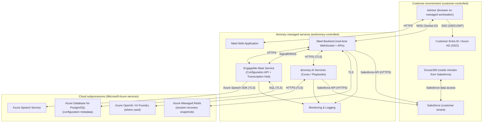

# Meet Security Documentation

## 0. Document metadata

| Field | Value |
|---|---|
| Document name | Meet Security Documentation |
| Audience | External customers / security assessors |
| Scope | Meet web app, transcription/AI services, and CRM (Salesforce) integration boundaries |
| Last updated | 2026-02-06 |
| Owner | &money |

## 1. Solution Technical Information (Solution Description)

### 1.1 Solution architecture

**Data flow (high level):**
1. Advisor runs Meet in a browser embedded in Salesforce (or accessed directly depending on deployment).
2. Browser streams audio to Meet backend over an encrypted WebSocket connection.
3. Meet backend forwards audio to the transcription hub, which uses Azure Speech to produce live transcript events (including diarization signals).
4. Transcript text is processed by &money AI services (Corax/Playbooks) to generate insights and meeting minutes.
5. Final minutes are written to a customer-configured Salesforce storage location (typically a field on a meeting-related record), where Scoutz360 can read them.

### 1.2 Integrations to existing systems and components

| From / To | Data exchanged | Protocol | AuthN method | AuthZ model | Encryption in transit | Notes |
|---|---|---|---|---|---|---|
| Advisor browser ↔ Meet Web Application | UI content, session initialization | HTTPS | SSO via Entra ID / Azure AD (OIDC/JWT) | User identity-based access | TLS | No customer end-user login is provided by default (see Users section). |
| Advisor browser ↔ Meet Backend | Audio chunks, real-time transcript/insight events, session control | WSS (Socket.IO) | SSO token and/or signed session | Session scoped to authenticated user | TLS | Designed for real-time streaming; audio is processed in-session. |
| Meet application ↔ Vendor configuration service | Feature/variant configuration (no meeting content) | HTTPS | JWT Bearer (vendor-managed) | Tenant/bank scoping (where applicable) | TLS | Configuration only (no transcript/audio payloads). |
| Meet application ↔ Vendor transcription service | PCM audio stream; transcription/diarization events | Encrypted WebSocket/HTTPS | Service-to-service authentication (vendor-managed) | Service-level authorization | TLS | Audio is streamed for transcription; no raw audio file storage by default. |
| Vendor transcription service ↔ Azure Speech | Audio stream; recognized text + diarization | Azure SDK | Azure-managed credentials | Azure resource access controls | TLS | Azure Speech performs speech-to-text and diarization. |
| Meet application ↔ Vendor AI services (Corax / Playbooks) | Transcript context; insights; minutes/summary | HTTPS | Service-to-service credentials | Tenant/bank scoping where applicable | TLS | AI output is written to CRM per configured integration. |
| Vendor AI services ↔ Azure OpenAI / AI Foundry (where used) | Prompted text/embeddings; model outputs | HTTPS | Azure-managed credentials | Azure resource access controls | TLS | Used for select AI capabilities (e.g., embeddings). |
| Meet Backend / AI Services ↔ Salesforce | Meeting metadata reads; minutes written to fields | HTTPS (Salesforce API) | Customer identity / OAuth as configured | Salesforce object/FLS/sharing model | TLS | Salesforce is the long-term system of record for minutes. |
| Meet services ↔ Redis | Session recovery snapshot read/write | TLS | Managed identity or service auth (deployment-dependent) | Service identity scoped to Redis instance | TLS | Short-lived snapshots used for session recovery only. |
| Meet services ↔ Monitoring/logging | Metrics, logs, traces | HTTPS | Azure-managed credentials | RBAC-controlled access | TLS | Log retention is configured in the monitoring stack. |

### 1.3 Users of the solution

**Primary users**
- **Advisors**: Run meetings, view transcript/insights, review and finalize minutes.

**Customer administrators**
- **Salesforce administrators**: Configure Trusted URLs/CSP/Permissions Policy and Salesforce access controls (object permissions, FLS, record sharing).
- **Identity administrators**: Configure Entra ID / Azure AD application access and conditional access (as applicable).

**&money operations (restricted)**
- Operations personnel with least-privilege access for incident response, monitoring, and platform maintenance.

**System/service identities**
- Service principals / managed identities for service-to-service access (e.g., monitoring, Redis, Azure services).

**End-customer access**
- **Not provided**: Meet is designed for internal advisor usage; customer end-users do not log in to Meet directly in the standard deployment model.

### 1.4 Data processing

**Data categories processed**
- **Audio stream (in-session)**: Captured from the advisor’s microphone and streamed for real-time transcription.
- **Transcript text (in-session)**: Derived from audio; may contain personal data depending on meeting content.
- **AI insights (derived)**: Derived from transcript context; may contain personal data depending on transcript.
- **Minutes / summary (stored)**: Final meeting minutes stored in a customer-configured Salesforce storage location (typically a field on a meeting-related record).
- **Technical telemetry**: Timestamps, correlation IDs, session state, error codes, performance metrics.

**PII boundaries**
- Meet **processes** audio and transcript text in real time to generate insights and minutes.
- The **long-term system of record** for minutes is **Salesforce** (customer-controlled access and retention).
- Meet does **not store raw audio recordings by default**; audio is streamed for transcription and handled in-session.
- Short-lived operational data (e.g., session recovery snapshots and troubleshooting logs) should be treated as **potentially containing personal data** and is governed by retention controls described below.

### 1.5 Storage locations (explicit field-based storage)

| Data type | Where stored | Default retention | Encryption at rest | Access control |
|---|---|---|---|---|
| Meeting minutes (AI summary) | **Salesforce field** on a meeting-related record (customer-configured) | Customer-controlled | Salesforce-managed encryption at rest | Salesforce object permissions + FLS + record sharing |
| Minutes classification/metadata (optional) | Salesforce field(s) used to label or classify the minutes (customer-configured) | Customer-controlled | Salesforce-managed encryption at rest | Salesforce object permissions + FLS + record sharing |
| Minutes format + limit | Customer-configured; often stored as **HTML**. Field size limits depend on Salesforce field type (a common long text area limit is ~131,000 characters; content may truncate if exceeding the configured limit). | Customer-controlled | Salesforce-managed encryption at rest | Salesforce object permissions + FLS + record sharing |
| Post-meeting file artifact (lite/full variants) | Salesforce **ContentDocument/ContentVersion** linked to the meeting/event (e.g., `CustomerEmail.json`) | Customer-controlled | Salesforce-managed encryption at rest | Salesforce object permissions + FLS + record sharing |
| Customer overview document (input) | Salesforce **ContentDocument/ContentVersion** linked to the customer account (e.g., `CustomerOverview.md`) | Customer-controlled | Salesforce-managed encryption at rest | Salesforce object permissions + FLS + record sharing |
| Session recovery snapshots | Redis (session snapshot keys) | Short-lived TTL (typically ~30 minutes; deployment-dependent) | Azure-managed encryption for managed services | Service identity only (no end-user access) |
| Configuration metadata | Configuration DB (PostgreSQL) | Platform-managed | Azure-managed encryption for managed services | Service identity + RBAC |
| Operational logs/metrics/traces | Azure monitoring/logging stack | Default **31 days** (environment-dependent) | Azure-managed encryption at rest | RBAC-restricted access |

### 1.6 Access control assumptions (who can see the field)

- Visibility of the Salesforce minutes field(s) (and any related metadata fields) is governed by the customer’s **Salesforce security model**:
  - Object permissions (CRUD)
  - Field-Level Security (FLS)
  - Record-level access (sharing rules, role hierarchy, teams)
  - Profiles / permission sets
- &money does not override customer CRM permissions; CRM writes occur under a configured integration model and are subject to Salesforce authorization checks.

### 1.7 Customer risk assessment inputs (BIA / impact for data subject)

Many enterprise customers perform a Business Impact Analysis (BIA) and/or assess impact for data subjects when a solution processes personal data. &money can describe how Meet works and what data is processed/stored, but the **final risk classification** depends on customer context and controls (e.g., Salesforce permission model, conditional access, and internal policies).

**Typical inputs for customer BIA**
- **Confidentiality**: Meeting content may include personal data; review who can access the minutes field in Salesforce and whether additional controls (DLP, conditional access, auditing) are required.
- **Integrity**: Minutes are drafts intended for advisor review before use; customers may require review/approval workflows before downstream sharing.
- **Availability**: Meet is designed for real-time operation and includes best-effort recovery mechanisms (e.g., short-lived session recovery snapshots) to reduce impact from transient connectivity issues. If transcription/AI is temporarily unavailable or an outage occurs, advisors can continue the meeting but may need a fallback documentation workflow.

**Impact for data subjects (if applicable)**
- The primary long-term storage location for minutes is Salesforce (customer tenant). Customers should assess whether the minutes contain personal data and whether a DPIA is required under their policies/regulatory obligations.

## 2. Control Implementation (Security Controls)

### 2.0 Scope, exceptions, and mitigating controls

This section is intended to help security reviewers quickly understand where controls apply, where they do not, and what mitigations are expected.

**In scope**
- Meet web application and backend services operated by &money.
- Transcription and AI processing components operated by &money (including managed cloud services used for those components).
- Data flows into/out of Salesforce required to store minutes.

**Customer-controlled components (out of scope for &money controls)**
- Customer endpoint security (managed workstations, browser hardening, device compliance).
- Customer identity configuration (Entra ID / Azure AD conditional access and identity lifecycle).
- Salesforce security configuration (profiles/permission sets, FLS, sharing rules, auditing configuration).
- Scoutz360 access patterns to Salesforce data (as configured by the customer/Scoutz).

**Common “controls not in effect” cases**
- If the customer’s Salesforce configuration allows broad access to the minutes field, confidentiality controls will be weakened by design.
- If endpoints are unmanaged or microphone permissions are granted in an unmanaged context, endpoint risk increases.

**Common circumvention paths (by design or by customer configuration)**
- Any user who is legitimately granted access to the Salesforce record/field can view or export the minutes.
- Minutes copied from Salesforce into other systems are governed by the customer’s downstream controls, not Meet.

**Recommended mitigating controls (customer-side)**
- Restrict access to minutes fields using least-privilege (profiles/permission sets + FLS + sharing rules).
- Enable Salesforce auditing features (e.g., Field History Tracking) where appropriate.
- Apply endpoint controls (managed browsers, device compliance, DLP, conditional access).

### 2.1 Operations

- **Documented operating procedures**: Change-controlled releases with defined operational support processes (incident triage, mitigation, and customer communication).
- **Configuration management**: Environment-based configuration with validation at startup; sensitive values are not stored in source control.
- **Change management**: Code review and automated checks in CI/CD prior to deployment; controlled rollout practices.
- **Management of technical vulnerabilities**: Regular dependency updates and security patching; security fixes prioritized based on severity and exposure.
- **Information security during disruption**: Designed to degrade safely (e.g., if session recovery storage is unavailable, meetings can continue without recovery features).

### 2.2 Data backup and retention

- **Backups**
  - Customer data stored in **Salesforce** is backed up according to the customer’s Salesforce policies and tooling.
  - &money-hosted configuration storage (PostgreSQL) is backed up using cloud-managed backup capabilities (platform-managed).
- **Not backed up**
  - Redis session snapshots are **TTL-based** and are not a long-term backup mechanism; they exist to support session recovery only.
- **Deletion pathways**
  - Deleting or updating minutes in Salesforce is **customer-controlled** (standard Salesforce operations).
  - Session recovery snapshots expire automatically by TTL.
  - Operational log retention expires based on configured monitoring retention.

### 2.3 Data in transit, in-use and at rest

- **Encryption in transit**: TLS is used for browser↔service traffic and service↔service integrations.
- **Encryption at rest**: Managed services (e.g., Redis, PostgreSQL, monitoring storage) use cloud-provider encryption at rest; Salesforce provides encryption at rest for stored CRM data.
- **Key management**: Secrets/keys are stored in a secret management solution (e.g., Key Vault) and/or accessed via managed identity patterns; keys are rotated as part of operational security procedures.
- **Endpoint devices**: Customer-managed endpoint and browser security controls apply. For managed devices, browser policies can be used to pre-approve microphone access for Meet trusted URLs to reduce friction.

### 2.4 Identity and Access Management (IAM)

- **Authentication**
  - Advisor authentication is performed via customer identity (Entra ID / Azure AD SSO, OIDC/JWT-based).
  - Backend services validate tokens and establish session context for real-time features.
- **Authorization**
  - Service-level authorization enforces tenant/bank scoping where applicable (e.g., claim-based scoping).
  - CRM access is governed by the customer’s Salesforce authorization model.
- **Privileged access**
  - Administrative access to &money-managed components is restricted and granted on a least-privilege basis.
- **Segregation of duties**
  - Separation between development, operations, and administrative activities is enforced through role-based access and change control processes.

### 2.5 Logging, monitoring, and response

- **Logging/auditing signals**
  - Session lifecycle: session start/stop, reconnect/recovery attempts, transcription service connectivity.
  - AI/minutes pipeline: summary generation events and CRM write attempts (success/failure) with correlation identifiers.
  - CRM-side auditing: customers may enable Salesforce auditing features (e.g., Field History Tracking) for additional visibility on minutes field updates.
- **Monitoring**
  - Health and performance metrics for transcription and AI processing, error rate monitoring, and alerting on elevated failure patterns.
- **Failure handling**
  - **WebSocket disconnect/reconnect**: client reconnect support to recover from transient network issues.
  - **Session recovery**: short-lived Redis snapshots can restore session context where available.
  - **Retries/circuit breakers**: external dependency calls are protected with retry/backoff and circuit breaker patterns where appropriate.
  - **Safe error responses**: client-facing error responses are designed to avoid leaking sensitive payloads; correlation IDs are used for support troubleshooting.
- **Incident response**
  - Incidents are handled via established support processes; see [Support & Hypercare]({{ site.baseurl }}/general/support-and-hypercare/) for SLA-oriented support handling.

### 2.6 Use of Third Parties

**Licensing and contractual ownership**
- All third-party agreements and service licenses used for Meet are held by **&money** (including Microsoft services).

**Microsoft Azure (hosting and managed services)**
- Used to host application components and managed services (e.g., monitoring, Redis, databases).
- Processing of personal data for the data controller takes place in Microsoft EU datacenters within the Microsoft EU Data Boundary (EDB).
- This means personal data may be stored and processed within the EU, and Microsoft does not transfer customer data to third countries as the default processing model.
- Microsoft Customer Lockbox is enabled as a supplementary technical and organizational measure.
- Customer Lockbox requires prior documented approval from &money and the relevant customer before Microsoft personnel (including personnel outside the EU) can obtain human access to personal data.
- In practice, this access is not granted for Meet operations.

**Azure Speech**
- Receives in-session audio streams for speech-to-text and diarization.

**Azure OpenAI / AI Foundry (where used)**
- Receives prompted text/embeddings for specific AI capabilities.
- Abuse monitoring mode is configured as **modified** for the current deployment.
- With modified abuse monitoring, Microsoft states abuse-monitoring data storage and human review are not performed for that approved resource configuration.
- Microsoft automated abuse detection and policy enforcement still apply in-line; severe or repeated abuse patterns can still trigger service-level enforcement actions.
- &money is evaluating additional **EU-region fallback** options for AI-dependent services to reduce regional dependency and improve resilience.
- Any future multi-region failover rollout for these services will remain within applicable EU data-boundary requirements.

**Salesforce**
- Customer system of record for minutes stored in customer-configured field(s) and/or related records.

**Scoutz**
- Reads the minutes from Salesforce (no direct &money→Scoutz data feed is required for this feature).

### 2.7 Physical security

- Meet relies on cloud provider physical security controls for data center access, surveillance, and hardware lifecycle management.
- Redundancy and availability are achieved through cloud-managed services and platform operational practices (deployment-dependent).

## 3. Capacity & Load Testing (Placeholder)

- Validated concurrent physical transcription sessions: **TBD** (pending load test report).
- Known external quota dependencies: Azure Speech / Azure OpenAI / Corax capacity limits and quotas (deployment-specific).
- Regional resilience roadmap: additional EU-region fallback options for AI-dependent services are being evaluated.
- Monitoring guidance (capacity-related):
  - Alert on elevated transcription failure rates and latency
  - Alert on sustained resource saturation (CPU/memory) in Meet services
  - Alert on external dependency throttling/429 responses (where applicable)
- This section will be updated once the load test deliverable is finalized and approved.

## 4. Appendix

### A. Glossary

| Term | Meaning |
|---|---|
| Meet | &money real-time meeting assistant (transcription + AI insights + minutes) |
| Transcript | Text derived from in-session audio speech recognition |
| Diarization | Speaker separation/attribution in transcription output |
| Corax / Playbooks | &money AI services used to derive insights and generate minutes |
| PII | Personal data processed in meeting content (may appear in transcript/minutes) |
| Entra ID / Azure AD | Customer identity provider used for SSO |
| FLS | Salesforce Field-Level Security |
| TTL | Time-to-live; automatic expiry for short-lived data (e.g., session snapshots) |

### B. Control framework crosswalk (optional)

The table below provides an **indicative** mapping between this document’s control areas and common control catalogs (e.g., ISO/IEC 27002:2022). It is intended to accelerate security assessments and does not constitute a certification or attestation.

| Meet security documentation section | Related ISO/IEC 27002:2022 control areas (indicative) | Notes |
|---|---|---|
| 2.1 Operations | 5.29, 5.37, 8.8, 8.9, 8.32 | Operations, resilience, vulnerability/change/config management. |
| 2.2 Data backup and retention | 8.13 | Backup expectations and responsibilities. |
| 2.3 Data in transit, in-use and at rest | 5.14, 7.9, 7.10, 8.1, 8.24 | Transfer security, off-prem assets/media, endpoint devices, cryptography. |
| 2.4 Identity and Access Management (IAM) | 5.3, 5.15, 5.16, 5.17, 5.18, 8.2, 8.5 | Segregation of duties, access control, identity/authentication/access rights, privileged access. |
| 2.5 Logging, monitoring, and response | 8.15, 8.16 | Logging and monitoring activities. |
| 2.6 Use of Third Parties | 5.19, 5.20, 8.26, 8.30 | Supplier relationships, supplier agreements, application security requirements, outsourced development. |
| 2.7 Physical security | 8.14 | Redundancy and physical facilities considerations. |

### C. Verification status and uncertainties

This document is intended to be accurate and reusable across customers, but some details are inherently **deployment- and tenant-specific**. The items below should be confirmed during E2E verification and/or customer onboarding.

**Verified (based on implementation patterns and current behavior)**
- Meet can upload a post-meeting JSON artifact to Salesforce as a **file** (ContentVersion/ContentDocument), linked to the meeting/event (commonly named `CustomerEmail.json`).
- Meet can read a customer overview document from Salesforce as a **file** (commonly titled `CustomerOverview.md`) linked to the customer account (input to certain features).
- Short-lived session recovery snapshots in Redis are TTL-based and should be treated as potentially containing personal data (transcript/insight context).

**Requires confirmation per customer / environment**
- The exact Salesforce object/field for meeting minutes storage may vary by customer configuration and integration pattern (field names and storage location are customer-specific).
