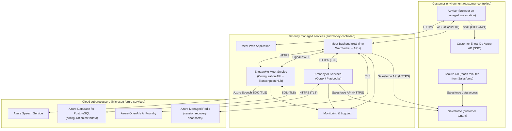

# Meet Security Documentation

## 0. Document metadata

| Field | Value |
|---|---|
| Document name | Meet Security Documentation |
| Audience | External customers / security assessors |
| Scope | Meet web app, transcription/AI services, and CRM (Salesforce) integration boundaries |
| Last updated | 2026-03-17 |
| Owner | &money |

## 1. Solution Technical Information (Solution Description)

### 1.1 Solution architecture

```mermaid
flowchart TB
  %% Trust boundaries: Customer vs &money vs Cloud subprocessors
  subgraph Customer["Customer environment (customer-controlled)"]
    Advisor["Advisor (browser on managed workstation)"]
    SF["Salesforce (customer tenant)"]
    IdP["Customer Entra ID / Azure AD (SSO)"]
    Scoutz["Scoutz360 (reads minutes from Salesforce)"]
  end

  subgraph Money["&money managed services (andmoney-controlled)"]
    MeetUI["Meet Web Application"]
    MeetBE["Meet Backend (real-time WebSocket + APIs)"]
    MeetSvc["EngageMe Meet Service\n(Configuration API + Transcription Hub)"]
    Corax["&money AI Services (Corax / Playbooks)"]
    Obs["Monitoring & Logging"]
  end

  subgraph Cloud["Cloud subprocessors (Microsoft Azure services)"]
    AzureSpeech["Azure Speech Service"]
    AzureOpenAI["Azure OpenAI / AI Foundry"]
    AzureRedis["Azure Managed Redis\n(session recovery snapshots)"]
    AzurePostgres["Azure Database for PostgreSQL\n(configuration metadata)"]
  end

  Advisor <-->|"HTTPS"| MeetUI
  Advisor <-->|"WSS (Socket.IO)"| MeetBE
  Advisor -->|"SSO (OIDC/JWT)"| IdP

  MeetBE <-->|"HTTPS"| MeetSvc
  MeetBE <-->|"SignalR/WSS"| MeetSvc
  MeetSvc -->|"Azure Speech SDK (TLS)"| AzureSpeech

  MeetBE <-->|"HTTPS (TLS)"| Corax
  Corax <-->|"HTTPS (TLS)"| AzureOpenAI

  MeetBE <-->|"TLS"| AzureRedis
  MeetSvc --> Obs
  MeetBE --> Obs
  Corax --> Obs

  MeetSvc <-->|"SQL (TLS)"| AzurePostgres

  Corax -->|"Salesforce API (HTTPS)"| SF
  MeetBE -->|"Salesforce API (HTTPS)"| SF
  Scoutz <-->|"Salesforce data access"| SF
```

**Data flow (high level):**
1. Advisor runs Meet in a browser embedded in Salesforce (or accessed directly depending on deployment).
2. Browser streams audio to Meet backend over an encrypted WebSocket connection.
3. Meet backend forwards audio to the transcription hub, which uses Azure Speech to produce live transcript events (including diarization signals).
4. Transcript text is processed by &money AI services (Corax/Playbooks) to generate insights and meeting minutes.
5. Final minutes are written via &money backend services to a customer-configured Salesforce storage location (an object/record field on a meeting-related record), where Scoutz360 can read them.

### 1.2 Integrations to existing systems and components

| From / To | Data exchanged | Protocol | AuthN method | AuthZ model | Encryption in transit | Notes |
|---|---|---|---|---|---|---|
| Advisor browser ↔ Meet Web Application | UI content, session initialization | HTTPS | SSO via Entra ID / Azure AD (OIDC/JWT) | User identity-based access | TLS | No customer end-user login is provided in the standard deployment model (see Users section). |
| Advisor browser ↔ Meet Backend | Audio chunks, real-time transcript/insight events, session control | WSS (Socket.IO) | SSO token with signed session context | Session scoped to authenticated user | TLS | Designed for real-time streaming; audio is processed in-session. |
| Meet backend ↔ Vendor configuration service | Feature/variant configuration (no meeting content) | HTTPS | Forwarded user JWT (SSO/OIDC) | Tenant/bank claim scoping | TLS | Called by backend service. |
| Meet application ↔ Vendor transcription service | PCM audio stream; transcription/diarization events | Encrypted WebSocket/HTTPS | Service-to-service authentication (vendor-managed) | Service-level authorization | TLS | Audio is streamed for transcription. |
| Vendor transcription service ↔ Azure Speech | Audio stream; recognized text + diarization | Azure SDK | Azure-managed credentials | Azure resource access controls | TLS | Azure Speech performs speech-to-text and diarization. |
| Meet backend ↔ Vendor AI services (Corax / Playbooks) | Transcript context; insights; minutes/summary | HTTPS | Service-to-service credentials (API key/managed credential) | Tenant/bank claim scoping | TLS | Backend-mediated call pattern. |
| Vendor AI services ↔ Azure OpenAI / AI Foundry | Prompted text/embeddings; model outputs | HTTPS | Azure-managed credentials | Azure resource access controls | TLS | Used for AI capabilities including embeddings. |
| Meet Backend / AI Services ↔ Salesforce | Meeting metadata reads; minutes written to object/field storage | HTTPS (Salesforce API) | OAuth (delegated user token) | Salesforce object/FLS/sharing model | TLS | Salesforce calls are made via &money backend APIs/services. |
| Meet services ↔ Redis | Session recovery snapshot read/write | TLS | Service identity authentication | Service identity scoped to Redis instance | TLS | Short-lived snapshots used for session recovery only. |
| Meet services ↔ Monitoring/logging | Metrics, logs, traces | HTTPS/OTLP | Service credentials (platform-managed) | RBAC-controlled access | TLS | Deployment uses a centralized monitoring and observability stack. |

### 1.3 Users of the solution

**Primary users**
- **Advisors**: Run meetings, view transcript/insights, review and finalize minutes.

**Customer administrators**
- **Salesforce administrators**: Configure Trusted URLs/CSP/Permissions Policy and Salesforce access controls (object permissions, FLS, record sharing).
- **Identity administrators**: Configure Entra ID / Azure AD application access and conditional access (as applicable).

**&money operations (restricted)**
- Operations personnel with least-privilege access for incident response, monitoring, and platform maintenance.

**System/service identities**
- Service principals / managed identities for service-to-service access including monitoring, Redis, and Azure services.

**End-customer access**
- **Not provided**: Meet is designed for internal advisor usage; customer end-users do not log in to Meet directly in the standard deployment model.

### 1.4 Data processing

**Data categories processed**
- **Audio stream (in-session)**: Captured from the advisor’s microphone and streamed for real-time transcription.
- **Transcript text (in-session)**: Derived from audio; can contain personal data depending on meeting content.
- **AI insights (derived)**: Derived from transcript context; can contain personal data depending on transcript.
- **Minutes / summary (stored)**: Final meeting minutes stored in a customer-configured CRM storage location (for example, an object/record field on a meeting-related record).
- **Technical telemetry**: Timestamps, correlation IDs, session state, error codes, performance metrics.

**PII boundaries**
- Meet **processes** audio and transcript text in real time to generate insights and minutes.
- The **primary long-term system of record** for minutes is the customer's **CRM** (customer-controlled access and retention).
- Meet does **not store raw audio recordings**; audio is streamed for transcription and handled in-session.
- **Session recovery snapshots** temporarily contain personal data (transcript text and session context) and are governed by a short TTL (see retention controls below). **Logs and telemetry do not contain transcript text or meeting content**; they contain only operational metadata such as connection identifiers, error codes, and numeric performance counters.

**In-session data lifecycle**
- During an active meeting, transcript text is processed **primarily in application memory** and is released when the session ends (client disconnect or meeting conclusion). The only temporary persistence used for meeting content is the short-lived **session recovery snapshot** described below; outside that recovery mechanism, transcript text is not written to persistent storage or the application database.
- **Session recovery snapshots** are written to Redis with a default **TTL of 30 minutes**; they may temporarily contain recent transcript text and session context to support recovery after transient connectivity interruptions. Snapshots expire automatically and are not accessible after expiry.
- At meeting conclusion, transcript and summary data may pass through an **internal transient processing queue** for downstream processing (minutes generation and CRM write). Queue payloads are **non-persistent**, exist only for the short period required for asynchronous processing, are **not used as a storage layer**, and are **not included in long-term backups**.
- The Meet database may store a **content hash** for idempotency control of transcript submissions; the transcript text itself is never written to the database.
- After minutes are written to the customer's CRM, &money services do **not** persist a separate copy of the minutes in &money-managed databases after the CRM write is complete; however, &money retains **integration-level read/write access** to the customer's CRM environment where required to complete configured product features, CRM synchronization, or customer-authorized workflows.
- Logs and telemetry produced during a session contain **only operational metadata** (connection identifiers, error codes, numeric counters, performance metrics). Transcript text and meeting content are not included in logs or telemetry (see section 2.5 for details).

### 1.5 Storage locations (explicit field-based storage)

| Data type | Where stored | Default retention | Encryption at rest | Access control |
|---|---|---|---|---|
| Meeting minutes (AI summary) | **CRM object/record field** on a meeting-related record (customer-configured) | Customer-controlled | CRM/platform-managed encryption at rest | Customer CRM permissions and record-level access controls |
| Minutes classification/metadata (optional) | CRM object/record field(s) used to label or classify the minutes (customer-configured) | Customer-controlled | CRM/platform-managed encryption at rest | Customer CRM permissions and record-level access controls |
| Minutes format + limit | Customer-configured; stored as **HTML**. Field size limits depend on the customer's CRM field configuration and content can truncate when limits are exceeded. | Customer-controlled | CRM/platform-managed encryption at rest | Customer CRM permissions and record-level access controls |
| Post-meeting file artifact (lite/full variants) | CRM document/file storage linked to the meeting/event, including `CustomerEmail.json` where supported by the deployment | Customer-controlled | CRM/platform-managed encryption at rest | Customer CRM permissions and record-level access controls |
| Customer overview document (input) | CRM document/file storage linked to the customer account, including `CustomerOverview.md` where supported by the deployment | Customer-controlled | CRM/platform-managed encryption at rest | Customer CRM permissions and record-level access controls |
| In-session processing data (audio, transcript, insights) | **Application memory only** | Session duration (released on disconnect) | In-memory; not persisted to disk | Session-scoped; no external access |
| Session recovery snapshots | Redis (session snapshot keys) | **30-minute TTL** (auto-expire) | Azure-managed encryption for managed services | Service identity only (no end-user access) |
| Internal message queue payloads (meeting events) | Internal transient processing queue | Transient (non-persistent payloads; retained only for short-lived asynchronous processing and not included in long-term backups) | Platform-managed encryption in transit | Service identity only |
| Transcript submission metadata | Meet database (PostgreSQL) | Platform-managed | Azure-managed encryption for managed services | Service identity + RBAC |
| Configuration metadata | Configuration DB (PostgreSQL) | Platform-managed | Azure-managed encryption for managed services | Service identity + RBAC |
| Operational logs/metrics/traces | Monitoring/logging stack | 365 days (logs/traces); 24 months (metrics) | Platform-managed encryption at rest | RBAC-restricted access |

### 1.6 Access control assumptions (who can see the field)

- Visibility of the CRM minutes field(s) (and any related metadata fields) is governed by the customer’s **CRM security model**:
  - Object permissions (CRUD), where supported
  - Field-level permissions, where supported
  - Record-level access controls
  - Profiles, permission sets, roles, or equivalent CRM authorization constructs
- &money does not override customer CRM permissions; CRM reads/writes occur under a configured integration model and are subject to the permissions granted to the configured integration user and, where applicable, the authenticated user's access level as resolved in the customer's CRM.

### 1.7 Customer risk assessment inputs (BIA / impact for data subject)

Many enterprise customers perform a Business Impact Analysis (BIA) and assess impact for data subjects when a solution processes personal data. &money can describe how Meet works and what data is processed/stored, but the **final risk classification** depends on customer context and controls including the customer's CRM permission model, conditional access, and internal policies.

**Typical inputs for customer BIA**
- **Confidentiality**: Meeting content can include personal data; review who can access the minutes field in the customer's CRM and which additional controls (DLP, conditional access, auditing) are required.
- **Integrity**: Minutes are drafts intended for advisor review before use; customers define review/approval workflows before downstream sharing.
- **Availability**: Meet is designed for real-time operation and includes best-effort recovery mechanisms including short-lived session recovery snapshots to reduce impact from transient connectivity issues. If transcription/AI is unavailable, advisors continue the meeting and use fallback documentation workflows.

**Impact for data subjects**
- The primary long-term storage location for minutes is the customer's CRM. Customers assess personal-data content and DPIA requirements under their policies and regulatory obligations.

## 2. Control Implementation (Security Controls)

### 2.0 Scope, exceptions, and mitigating controls

This section is intended to help security reviewers quickly understand where controls apply, where they do not, and what mitigations are expected.

**In scope**
- Meet web application and backend services operated by &money.
- Transcription and AI processing components operated by &money (including managed cloud services used for those components).
- Data flows into/out of the customer's CRM required to store minutes.

**Customer-controlled components (out of scope for &money controls)**
- Customer endpoint security (managed workstations, browser hardening, device compliance).
- Customer identity configuration (Entra ID / Azure AD conditional access and identity lifecycle).
- Customer CRM security configuration (profiles/permission sets or equivalent authorization controls, field/object permissions, record sharing, auditing configuration).
- Scoutz360 or other downstream system access patterns to CRM data (as configured by the customer or the downstream system owner).

**Common “controls not in effect” cases**
- If the customer’s CRM configuration allows broad access to the minutes field, confidentiality controls will be weakened by design.
- If endpoints are unmanaged or microphone permissions are granted in an unmanaged context, endpoint risk increases.

**Common circumvention paths (by design or by customer configuration)**
- Any user who is legitimately granted access to the relevant CRM record/field can view or export the minutes.
- Minutes copied from the customer's CRM into other systems are governed by the customer’s downstream controls, not Meet.

**Recommended mitigating controls (customer-side)**
- Restrict access to minutes fields using least-privilege CRM access controls (for example, roles, permission sets, field/object permissions, and record sharing where supported).
- Enable CRM auditing features including field history/change tracking where appropriate.
- Apply endpoint controls (managed browsers, device compliance, DLP, conditional access).

### 2.1 Operations

- **Documented operating procedures**: Change-controlled releases with defined operational support processes (incident triage, mitigation, and customer communication).
- **Configuration management**: Environment-based configuration with validation at startup; sensitive values are not stored in source control.
- **Change management**: Code review and automated checks in CI/CD prior to deployment; controlled rollout practices.
- **Management of technical vulnerabilities**: Regular dependency updates and security patching; security fixes prioritized based on severity and exposure.
- **Information security during disruption**: Designed to degrade safely, including operation without recovery features if session recovery storage is unavailable.

### 2.2 Data backup and retention

- **Backups**
  - Customer data stored in the customer's **CRM** is backed up according to the customer’s CRM policies and tooling.
  - &money-hosted configuration storage (PostgreSQL) is backed up using cloud-managed automatic backup with **point-in-time restore (PITR)** within a **7-day retention window**.
  - Observability data (logs, traces) is stored on zone-redundant cloud blob storage with retention governed by the monitoring stack (see section 2.5 for specific retention periods).
- **Backup content boundaries**
  - PostgreSQL backups contain **configuration metadata and operational data** (service configuration, scheduling rules, CRM field mappings, submission tracking metadata). They do **not** contain transcript text or meeting content; the database may store a content hash for idempotency, never the text itself.
  - Redis uses append-only file (AOF) persistence for durability. Session snapshot keys are governed by **TTL (default 30 minutes)** and auto-expire from the active dataset; however, previously written values may remain in persistence artifacts until AOF rewrite/compaction and backup lifecycle expiration.

  | Data category | In PostgreSQL backups? | In Redis (AOF, TTL-governed)? | In observability backups? |
  |---|---|---|---|
  | **Session metadata** (meeting ID, timestamps, submission status) | Yes | Yes (expires within 30 min) | Yes (in session lifecycle log events) |
  | **Transcript / meeting content** | **No** (a content hash may be stored for idempotency, never text) | Yes, temporarily (expires within 30 min) | **No** (not written to logs or telemetry) |
  | **Personal data** (advisor identifiers, participant context) | Limited (tenant IDs, advisor references in operational tables) | Yes, temporarily (expires within 30 min) | Limited (tenant and correlation IDs in logs; no names or meeting content) |

- **Not backed up**
  - Redis session snapshots are **TTL-based** and are not a long-term backup mechanism; they exist to support session recovery only.
- **Disaster recovery**
  - Disaster recovery is provided as a managed capability through &money's infrastructure operations partner and covers failover, restore procedures, and continuity measures for the hosted platform.
  - Detailed disaster recovery procedures, recovery targets, backup verification, and test cadence are governed by the operating model and runbooks of &money's infrastructure operations partner.
- **Deletion pathways**
  - Deleting or updating minutes in the customer's CRM is **customer-controlled** (standard CRM operations).
  - Session recovery snapshots expire automatically by TTL.
  - Operational log retention expires based on configured monitoring retention (see section 2.5).

### 2.3 Data in transit, in-use and at rest

- **Encryption in transit**: TLS is used for browser↔service traffic and service↔service integrations.
- **Encryption at rest**: Managed services including Redis, PostgreSQL, and monitoring storage use cloud-provider encryption at rest; the customer's CRM platform provides encryption at rest for stored CRM data.
- **Key management**: Secrets/keys are stored in a secret management solution including Key Vault and accessed via managed identity patterns; keys are rotated as part of operational security procedures.
- **Endpoint devices**: Customer-managed endpoint and browser security controls apply. For managed devices, browser policies can be used to pre-approve microphone access for Meet trusted URLs to reduce friction. For end-user steps, see [Microphone Permissions]({{ site.baseurl }}/meet/microphone-permissions/).

### 2.4 Identity and Access Management (IAM)

- **Authentication**
  - Advisor authentication is performed via customer identity (Entra ID / Azure AD SSO, OIDC/JWT-based).
  - Backend services validate tokens and establish session context for real-time features.
- **Authorization**
  - Service-level authorization enforces tenant/bank claim scoping.
  - CRM access is governed by the customer’s CRM authorization model.
- **Privileged access**
  - Administrative access to &money-managed components is restricted and granted on a least-privilege basis.
- **Segregation of duties**
  - Separation between development, operations, and administrative activities is enforced through role-based access and change control processes.

### 2.5 Logging, monitoring, and response

- **Logging/auditing signals**
  - Session lifecycle: session start/stop, reconnect/recovery attempts, transcription service connectivity.
  - AI/minutes pipeline: summary generation events and CRM write attempts (success/failure) with correlation identifiers.
  - CRM-side auditing: the customer's CRM auditing features, including field history/change tracking where supported, provide additional visibility on minutes field updates.
- **Log content boundaries**
  - Logs and telemetry contain **operational metadata only**: connection identifiers, error codes, numeric counters (chunk counts, phrase counts, session durations), and performance metrics.
  - **Transcript text and meeting content are not written to logs or telemetry.** Metrics are strictly numeric (e.g. transcription error counts, audio byte throughput, active session gauges).
  - Logs may contain tenant identifiers, correlation IDs, and speaker identifiers (system-assigned labels, not personal names).
- **Log and telemetry retention**

  | Data type | Storage | Retention |
  |---|---|---|
  | Application logs (structured) | Centralized log aggregation (cloud-managed blob storage) | 365 days |
  | Distributed traces | Trace storage (cloud-managed blob storage) | 365 days |
  | Metrics | Metrics storage (persistent volume) | 24 months |
  | Database diagnostic logs | Cloud log analytics | 31 days |
  | Application-level event logs | Application database | 30 days (automated cleanup) |
  | Audit trail records | Application database | Retained with no automated cleanup |

- **Audit trail for administrative and configuration changes**
  - Administrative and configuration changes are captured automatically via a database-level audit interceptor. All create, update, and delete operations on auditable configuration entities are recorded with: the acting user, the tenant/organization, a UTC timestamp, the entity type, and the previous and new values.
  - Audited entity types include service configuration, meeting configuration, scheduling rules, portal settings, CRM field mappings, and access-related configuration (17+ entity types).
  - A centralized audit query API aggregates audit records from multiple services and is restricted to administrative users.
  - An administrative UI provides searchable and filterable access to the audit log.
- **Monitoring**
  - Health and performance metrics for transcription and AI processing, error rate monitoring, and alerting on elevated failure patterns.
- **Failure handling**
  - **WebSocket disconnect/reconnect**: client reconnect support to recover from transient network issues.
  - **Session recovery**: short-lived Redis snapshots can restore session context where available.
  - **Retries/circuit breakers**: external dependency calls are protected with retry/backoff and circuit breaker patterns where appropriate.
  - **Safe error responses**: client-facing error responses are designed to avoid leaking sensitive payloads; correlation IDs are used for support troubleshooting.
- **Incident response**
  - Incidents are handled via established support processes; see [Support & Hypercare]({{ site.baseurl }}/general/support-and-hypercare/) for SLA-oriented support handling.

### 2.6 Use of Third Parties

**Licensing and contractual ownership**
- All third-party agreements and service licenses used for Meet are held by **&money** (including Microsoft services).

**Microsoft Azure (hosting and managed services)**
- Used to host application components and managed services including monitoring, Redis, and databases.
- Application hosting (Kubernetes), databases (PostgreSQL), and caching (Redis) are deployed in **West Europe**.
- Processing of personal data for the data controller takes place in Microsoft EU datacenters within the Microsoft EU Data Boundary (EDB).
- Personal data is stored and processed within the EU under the configured Microsoft EU Data Boundary setup.
- Microsoft Customer Lockbox is enabled as a supplementary technical and organizational measure.
- Customer Lockbox requires prior documented approval from &money and the relevant customer before Microsoft personnel (including personnel outside the EU) can obtain human access to personal data.
- In practice, this access is not granted for Meet operations.

**Azure Speech**
- Receives in-session audio streams for speech-to-text and diarization.
- Deployed in **Sweden Central** and **North Europe** (both EU regions).
- Customer audio and transcript data is **not used by Microsoft to train, improve, or develop** speech models or any other Microsoft service. This applies under Microsoft's standard Azure Cognitive Services data processing terms.

**No sub-processor model training (general)**
- No sub-processor engaged by &money uses customer data for model training, service improvement, or any purpose beyond delivering the contracted service. This applies to all Azure services (Speech, OpenAI, infrastructure) as well as any other sub-processors involved in the Meet solution.

**Azure OpenAI / AI Foundry**
- Receives prompted text/embeddings for specific AI capabilities.
- Deployed in **Sweden Central** using the **DataZoneStandard** deployment type, which provides EU data zone processing guarantees.
- **No model training or service improvement**: Customer data processed through Azure OpenAI is **not used by Microsoft to train, retrain, or improve** foundation models or any other Microsoft service. This is a contractual guarantee under the Microsoft Azure OpenAI data processing terms. &money does not use customer data for model training or service improvement purposes.
- Abuse monitoring mode is configured as **modified** for the current deployment.
- With modified abuse monitoring, prompts and completions are **not stored** for abuse monitoring, and no human review of customer data takes place.
- Microsoft automated abuse detection and policy enforcement still apply in-line; severe or repeated abuse patterns can still trigger service-level enforcement actions.
- &money is evaluating additional **EU-region fallback** options for AI-dependent services to reduce regional dependency and improve resilience.
- Any future multi-region failover rollout for these services will remain within applicable EU data-boundary requirements.

**Salesforce**
- Customer system of record for minutes stored in customer-configured fields and related records.

**Scoutz**
- Reads the minutes from Salesforce (no direct &money→Scoutz data feed is required for this feature).

### 2.7 Physical security

- Meet relies on cloud provider physical security controls for data center access, surveillance, and hardware lifecycle management.
- Redundancy and availability are achieved through cloud-managed services and platform operational practices.

### 2.8 Environment separation and test data

- **Infrastructure isolation**: Development runs on a separate Kubernetes cluster. Test and production are logically separated within the shared platform using distinct namespaces, environment-specific configuration, and separate backing services where applicable.
- **No production data in test environments**: Production data is never copied, replicated, or restored into test environments. This is enforced architecturally through infrastructure separation rather than policy alone.
- **Test and evaluation data**: Test data is synthetic. Testing uses a mix of mocks, seeded fixture data, dedicated end-to-end test banks/tenants, and scenario-based datasets. AI-related testing and evaluations in &money's AI platform (Corax AI) use synthetic or otherwise non-production evaluation datasets rather than copied production meeting data.
- **Developer access controls**: Developer access to production is restricted; non-production access is granted on a least-privilege basis.

## 3. Capacity & Load Testing

- Known external quota dependencies: Azure Speech / Azure OpenAI quotas (deployment-specific).
- Regional resilience roadmap: additional EU-region fallback options for AI-dependent services are being evaluated.
- Monitoring guidance (capacity-related):
  - Alert on elevated transcription failure rates and latency
  - Alert on sustained resource saturation (CPU/memory) in Meet services
  - Alert on external dependency throttling/429 responses

## 4. Appendix

### A. Glossary

| Term | Meaning |
|---|---|
| Meet | &money real-time meeting assistant (transcription + AI insights + minutes) |
| Transcript | Text derived from in-session audio speech recognition |
| Diarization | Speaker separation/attribution in transcription output |
| Corax / Playbooks | &money AI services used to derive insights and generate minutes |
| PII | Personal data processed in meeting content (can appear in transcript/minutes) |
| Entra ID / Azure AD | Customer identity provider used for SSO |
| FLS | Salesforce Field-Level Security |
| TTL | Time-to-live; automatic expiry for short-lived data including session snapshots |
| PITR | Point-in-time restore; cloud-managed database recovery to a specific point within the backup retention window |
| DataZoneStandard | Azure OpenAI deployment type that guarantees data processing within a defined data zone (e.g. EU) |

### B. Control framework crosswalk (optional)

The table below provides an **indicative** mapping between this document’s control areas and common control catalogs including ISO/IEC 27002:2022. It is intended to accelerate security assessments and does not constitute a certification or attestation.

| Meet security documentation section | Related ISO/IEC 27002:2022 control areas (indicative) | Notes |
|---|---|---|
| 2.1 Operations | 5.29, 5.37, 8.8, 8.9, 8.32 | Operations, resilience, vulnerability/change/config management. |
| 2.2 Data backup and retention | 8.13 | Backup expectations and responsibilities. |
| 2.3 Data in transit, in-use and at rest | 5.14, 7.9, 7.10, 8.1, 8.24 | Transfer security, off-prem assets/media, endpoint devices, cryptography. |
| 2.4 Identity and Access Management (IAM) | 5.3, 5.15, 5.16, 5.17, 5.18, 8.2, 8.5 | Segregation of duties, access control, identity/authentication/access rights, privileged access. |
| 2.5 Logging, monitoring, and response | 8.15, 8.16 | Logging and monitoring activities. |
| 2.6 Use of Third Parties | 5.19, 5.20, 8.26, 8.30 | Supplier relationships, supplier agreements, application security requirements, outsourced development. |
| 2.7 Physical security | 8.14 | Redundancy and physical facilities considerations. |
