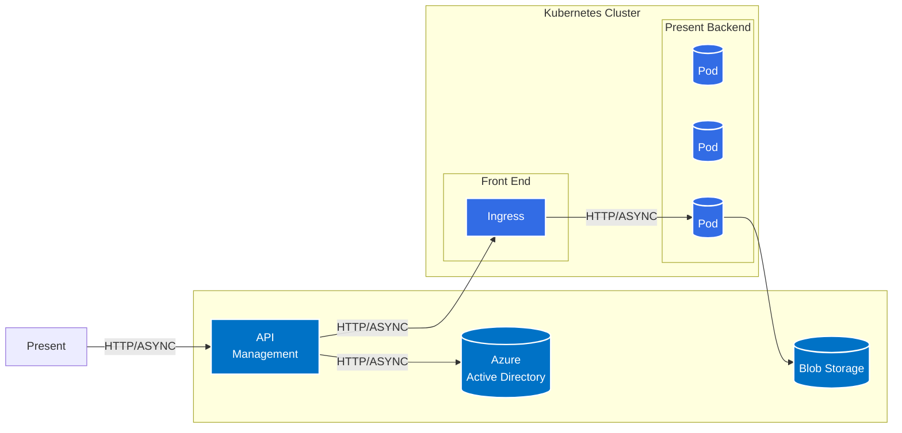
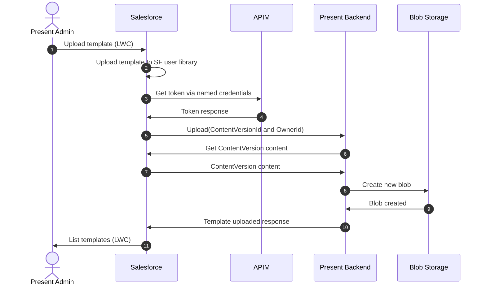

# Present Architecture

## Overall architecture



## Present Salesforce Objects


## Present Sequence Diagrams

### Upload Template Flow



### Generate Presentation Flow

```mermaid
sequenceDiagram
    autonumber
    actor A as Advisor
    participant S as Salesforce
    participant APIM as APIM
    participant P as Present Backend
    participant B as Blob Storage

    A ->> S: Generate presentation (LWC)
    S ->> APIM: Get token via named credentials
    APIM ->> S: Token response
    S ->> P: PPTX Generation request (Tag Mappings, Slides)
    P ->> B: Get templates
    B ->> P: Template content
    P ->> P: Generate presentation from template and tags
    P ->> S: Upload presentation to Salesforce
    S ->> A: Generation complete!
