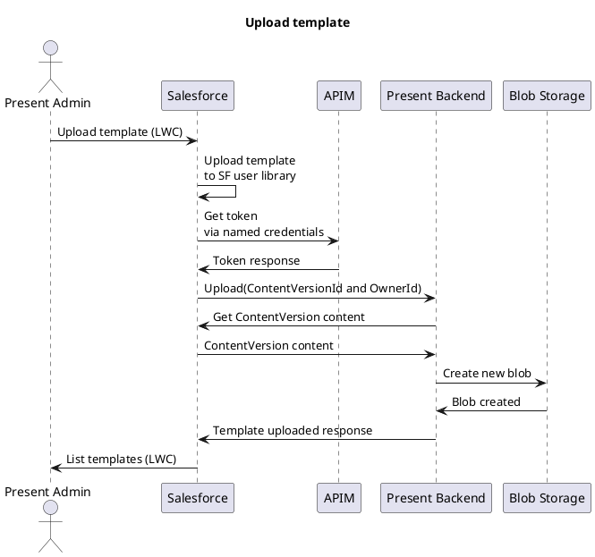

# Present Architecture

## Overall architecture
```plantuml
@startuml
footer Present cluster
scale max 670 width
skinparam linetype polyline
skinparam nodesep 10
skinparam ranksep 10

' Azure
!define AzurePuml https://raw.githubusercontent.com/RicardoNiepel/Azure-PlantUML/release/2-2/dist

!includeurl AzurePuml/AzureCommon.puml
!includeurl AzurePuml/AzureSimplified.puml

!includeurl AzurePuml/Compute/AzureAppService.puml
!includeurl AzurePuml/Compute/AzureBatch.puml
!includeurl AzurePuml/Containers/AzureContainerRegistry.puml
!includeurl AzurePuml/Containers/AzureKubernetesService.puml
!includeurl AzurePuml/Databases/AzureDatabaseForPostgreSQL.puml
!includeurl AzurePuml/Databases/AzureCosmosDb.puml
!includeurl AzurePuml/Databases/AzureSqlDatabase.puml
!includeurl AzurePuml/DevOps/AzurePipelines.puml
!includeurl AzurePuml/Identity/AzureActiveDirectory.puml
!includeurl AzurePuml/Networking/AzureLoadBalancer.puml
!includeurl AzurePuml/Security/AzureKeyVault.puml
!includeurl AzurePuml/Storage/AzureBlobStorage.puml
!includeurl AzurePuml/Storage/AzureStorage.puml
!includeurl AzurePuml/Web/AzureAPIManagement.puml

' Kubernetes
!define KubernetesPuml https://raw.githubusercontent.com/dcasati/kubernetes-PlantUML/master/dist

!includeurl KubernetesPuml/kubernetes_Context.puml
!includeurl KubernetesPuml/kubernetes_Simplified.puml

!includeurl KubernetesPuml/OSS/KubernetesApi.puml
!includeurl KubernetesPuml/OSS/KubernetesIng.puml
!includeurl KubernetesPuml/OSS/KubernetesPod.puml

collections "Present" as present

left to right direction

' Azure Components
AzureActiveDirectory(aad, "\nAzure\nActive Directory", "Global")
AzureBlobStorage(blob, "Blob", "Global")
AzureAPIManagement(api, "API\nManagement", "Global")

' Kubernetes Components
Cluster_Boundary(cluster, "Kubernetes Cluster") {
    Namespace_Boundary(nsBackEnd, "Present Backend") {
        KubernetesPod(KubernetesBE1, "", "")
        KubernetesPod(KubernetesBE2, "", "")
        KubernetesPod(KubernetesBE3, "", "")
    }
    
    Namespace_Boundary(nsFrontEnd, "Front End") {
        KubernetesIng(ingress, "Ingress", "")
    }
}

Rel(api, aad, "HTTP", "ASYNC")

Rel(present, api, "HTTP", "ASYNC")
Rel(api, nsFrontEnd, "HTTP", "ASYNC")
Rel(nsFrontEnd, KubernetesBE3, "HTTP", "ASYNC")

Rel(KubernetesBE3, blob, " ")
@enduml
```

## Present Salesforce Objects


## Present Sequence Diagrams

### Upload Template Flow


### Generate Presentation Flow
```plantuml
@startuml generate presentation
scale max 670 width
title Generate presentation
actor Advisor
participant "Salesforce" as S
participant "APIM" as APIM
participant "Present Backend" as P
participant "Blob Storage" as B

Advisor -> S: Generate presentation (LWC)
S -> APIM: Get token\nvia named credentials
APIM -> S: Token response
S -> P: PPTX Generation request\n(Tag Mappings, Slides)
P -> B: Get templates
B -> P: Template content
P -> P: Generate presentation\n from template and tags
P -> S: Upload presentation to Salesforce
S -> Advisor: Generation complete!
@enduml
