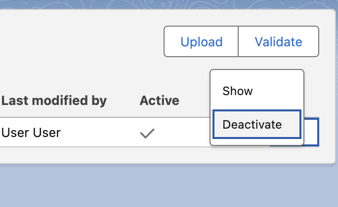

# Release Notes—Present

## Present - Version 1.24

This version of Present delivers important quality-of-life enhancements that improve consistency, usability, and clarity across the application.

### Release Date - 2025-03-01

> **Note**:
> - **Subscriber Package Version Id**: `04tP7000001HSSLIA4`
> - **Install link**: `https://[YOUR_DOMAIN].lightning.force.com/packagingSetupUI/ipLanding.app?apvId=04tP7000001HSSLIA4`
> - Remember to use your org's URL instead of [YOUR_DOMAIN].

### General Updates
- Multiple bug fixes to improve overall stability and performance

### Improvements
**Enhanced Error Messages and Permission checks**
- More detailed insights and clear instructions in error messages
- Improved permission checks for specific actions

### Bug Fixes
**Tag Name Case Sensitivity**
- Fixed to ensure tag comparisons are case-insensitive
- Prevents inconsistencies related to tag case sensitivity

## Present - Version 1.23

### Release Date - 2025-02-03

> **Note**:
> - **Subscriber Package Version Id**: `04tP7000000vNSwIAM`
> - **Install link**: `https://[YOUR_DOMAIN].lightning.force.com/packagingSetupUI/ipLanding.app?apvId=04tP7000000vNSwIAM`
> - Remember to use your org's URL instead of [YOUR_DOMAIN].

### New Features
**UI Enhancements and Additional Labels**
- New labels for improved navigation
- Refined UI elements
- Better interface clarity

### Improvements
- Tag names are now normalized to lowercase
- Enhanced error messaging for better troubleshooting
- Improved UI elements and labels

### Bug Fixes
- Fixed tag name case sensitivity issues

## Present - Version 1.21

### Release Date - 2024-11-15

### Major Features

1. **Present Validation Tool**
   - Validate templates before uploading
   - Identify issues proactively
   - Check for missing data in charts
   - Verify tags correctness

   
   
   

2. **Template Deactivation**
   - Support for deactivating/archiving templates
   - Preserve template metadata for reporting
   - Maintain historical data while removing from active use

   

3. **Enhanced Tag Mapping**
   - Support for custom and nested sObjects
   - Map fields from custom objects
   - Handle nested object relationships

   

### Additional Improvements

- **Multilingual Support**
  - Added translations for:
    - English
    - Norwegian
    - Swedish

- **Stability Improvements**
  - Fixed template upload issues with large slide counts
  - General performance optimizations

### Technical Details
- **Package Version**: `04tP7000000vNSwIAM`
- **Install URL**: `https://[YOUR_DOMAIN].lightning.force.com/packagingSetupUI/ipLanding.app?apvId=04tP7000000vNSwIAM`
