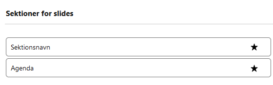
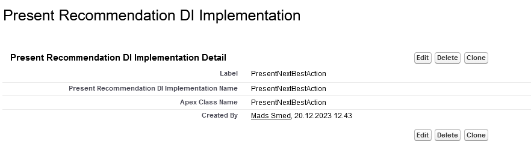

# Slide Recommendations

Slide recommendations are useful for highlighting specific sections of slides in a template that you want to encourage the user to include when creating their slide deck.

## Visual Presentation

When users select specific slides for their slide deck, they look through the available sections of slides. The recommended slide sections will have a **star** attached, and optionally, a tooltip when hovering on the **star** which describes the recommendation of that section.



> **Note**: Slide Recommendation Use Cases
> 
> Slide Recommendation can be used to recommend slides based on:
> - Next-Best actions
> - Salgspotentialer
> - Fokusgrupper
> 
> Or any other criteria relevant for your organization.

## Creating Slide Recommendations

Slide recommendations are created through apex code, using dependency injection with the `Callable` interface.

### Implementation Example

Here's how to implement the `Callable` interface for Present Slide Recommendation:

```java
global without sharing class PresentNextBestAction implements Callable {
  Map<Id, String> getRecommendations(Id recordId, List<String> sections) {
    Map<Id, String> recommendations = new Map<Id, String>();

    // Recommend 1 random section a master template
    Integer randomIndex = Integer.valueof((Math.random() * sections.size()));

    recommendations.put(
      sections[randomIndex],
      'Demo: This section is chosen at random' + recordId
    );

    return recommendations;
  }

  public Object call(String action, Map<String, Object> args) {
    switch on action {
      when 'getRecommendations' {
        Map<Id, String> result = this.getRecommendations(
          (Id) args.get('recordId'),
          (List<String>) args.get('sections')
        );
        return result;
      }
      when else {
        throw new NextBestActionMalformedCallException(
          'Called method is not implemented'
        );
      }
    }
  }

  public class NextBestActionMalformedCallException extends Exception {
  }
}
```

> **Warning**: RecordId Context
>
> The `recordId` given as input depends on which record page your Present Component is displayed. Typically, it is used on the Event record page. Then the `recordId` is the `Id` of the Event.

### Implementation Requirements

1. **Action Implementation**
   - The action `getRecommendations` must be implemented
   - Include it as a case in the `call` implementation
   - Returns a `Map<Id, String>` where:
     - Keys are Id's of `andmoney__Template_Section__c` records to recommend
     - Values are tooltips for the recommendations

2. **Section Handling**
   - `(List<String>) args.get('sections')` contains Id's of all `andmoney__Template_Section__c` records
   - Use these section Id's and the recordId to query specific sections for recommendations

### Configuring Your Implementation

To use your custom implementation for recommendations:

1. Create a record of the metadata type **Present Recommendation DI Implementation**
   

2. Set the following values:
   - `DeveloperName`: Should be `PresentNextBestAction`
   - `Apex Class Name`: The name of your implementation class

## Best Practices

1. Consider the context of the record page where recommendations will appear
2. Implement meaningful recommendation logic based on business rules
3. Provide clear, helpful tooltip messages
4. Test recommendations with various section configurations
5. Monitor recommendation effectiveness over time
