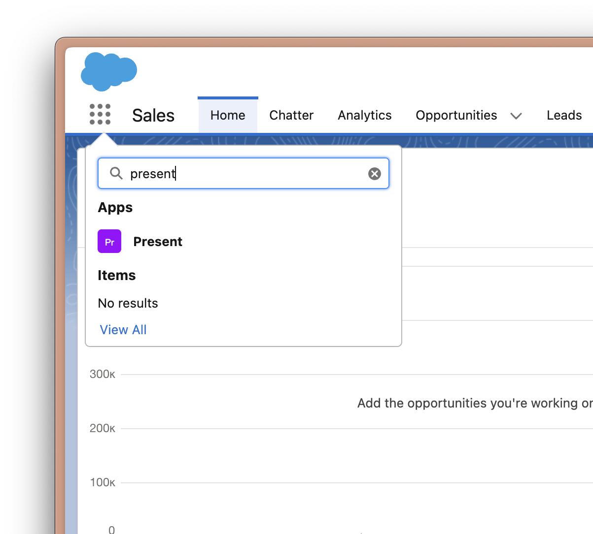
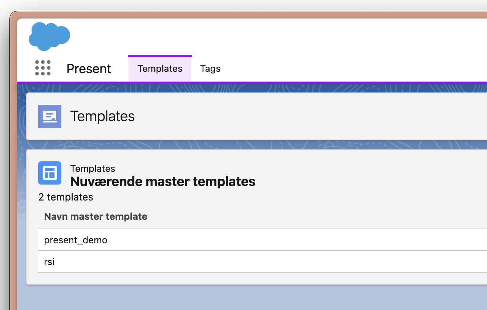
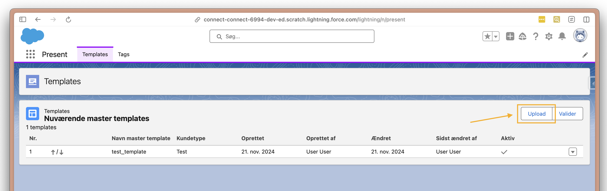
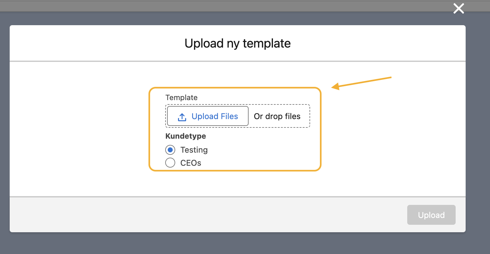
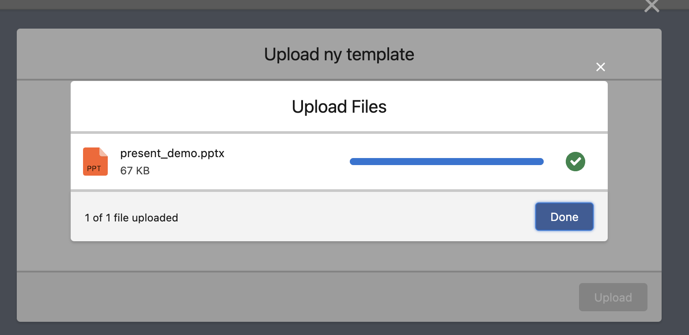
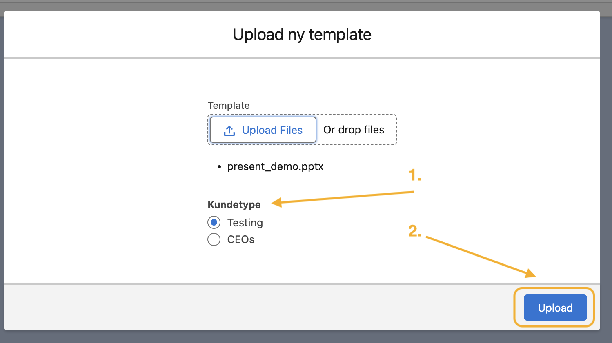
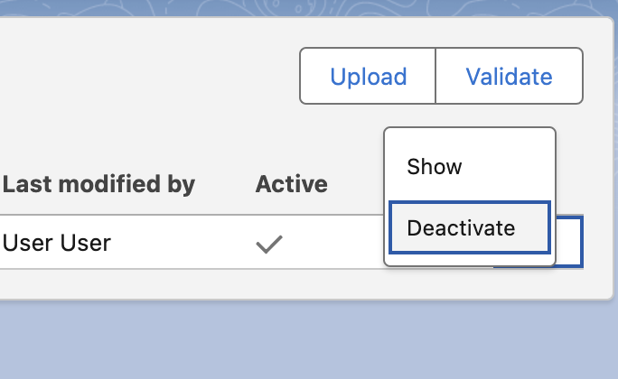

# Template Management

This guide shows you how to upload new templates and manage existing templates in Present.

## Prerequisites

Make sure that:
- The latest Present package is installed in your org
- All technical setup steps are completed

## Uploading a New Template

1. Go to the Present app in Salesforce.
   

2. Go to the 'Templates'-tab.
   

3. Click the upload button.
   

4. A dialog will prompt you to upload a new template.
   

5. When upload is finished click 'Done'.
   

6. Now select an appropriate customer type (Kundetype).
   
   1. Select customer type (Kundetype) and click upload.

> **Note**: Template Upload Progress
>
> Depending on the size of your template, it takes between 10 - 60 seconds to upload and process the template.
> If the processing takes more than 60 seconds, please contact your Present administrator.

## Deactivating Templates

You can deactivate/archive old templates in Present. This will keep your templates' metadata when deactivating templates used in reporting. This feature allows you to deactivate templates, but keep the metadata of a template but no longer want to use.

1. Go to the Present app in Salesforce.
   

2. Go to the 'Templates'-tab.
   

3. Click the arrow button next to the uploaded template.
   

4. Click "Deactivate", and the template will be deactivated.

## Template Management Best Practices

1. **Regular Review**
   - Periodically review templates for outdated content
   - Check usage statistics to identify unused templates

2. **Version Control**
   - Keep track of template versions
   - Document major changes in templates

3. **Metadata Management**
   - Maintain proper metadata for reporting purposes
   - Use consistent naming conventions
