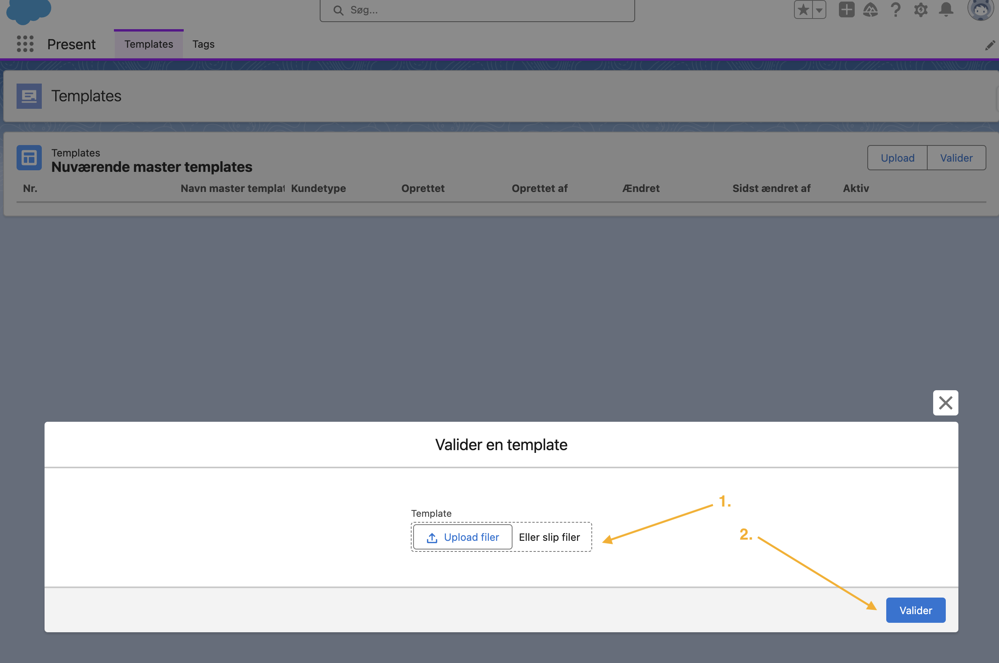
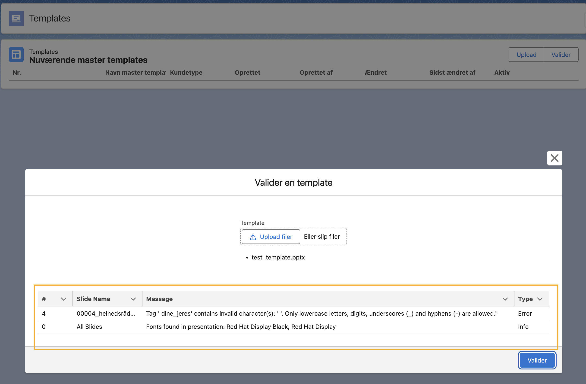

# Present Validation Tool

The Present validation tool allows you to test and validate your master templates before uploading them in Present. This proactive validation helps ensure your templates will work correctly when deployed.

## Purpose

The validation tool helps identify potential issues before templates are uploaded to Present:
- Missing data in charts
- Incorrect tag formats
- Template structure problems
- Other common template issues

## Using the Validation Tool

### 1. Access the Validation Tool

Find the validation button in the template management interface:

### 2. Template Validation Process

Upload your template for validation:

### 3. Review Results

The tool provides detailed feedback about your template:

## Validation Categories

The tool provides feedback in three categories:

1. **Information**
   - Non-critical observations
   - Suggestions for improvement
   - Best practice recommendations

2. **Warnings**
   - Potential issues that might affect functionality
   - Items that should be reviewed
   - Non-blocking but important considerations

3. **Errors**
   - Critical issues that must be fixed
   - Problems that will prevent proper template function
   - Required changes before template upload

## Best Practices

1. **Regular Validation**
   - Validate templates after any significant changes
   - Run validation before each upload attempt
   - Keep validation reports for reference

2. **Issue Resolution**
   - Address errors first
   - Review all warnings
   - Consider information messages for improvements

3. **Template Management**
   - Maintain a validation checklist
   - Document common issues and solutions
   - Track validation history for templates

## Benefits

- Prevents upload of problematic templates
- Reduces troubleshooting time
- Ensures consistent template quality
- Improves end-user experience
