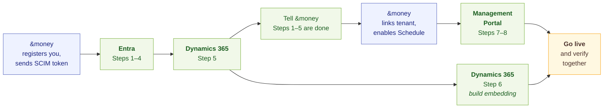

# Schedule on Dynamics 365

Configuring **Schedule** where your CRM is **Microsoft Dynamics 365**. Advisors book customer meetings
from a Dynamics account; the meeting lands in their Outlook calendar and as an appointment in Dynamics.

{: .important }
> Already onboarded to [Present on Dynamics 365]({{ site.baseurl }}/present/onboarding/present-on-dynamics/)?
> Steps 2, 3, 5a and 7 are already done. In Step 1, only AndMoney Graph Access is new.

## Who needs to be involved

| Section | Who | Steps |
|---|---|---|
| [Microsoft Entra](#microsoft-entra) | Microsoft Entra administrator: *Application Administrator*, and a *Privileged Role Administrator* to approve AndMoney Graph Access | 1–4 |
| [Dynamics 365](#dynamics-365) | Dynamics 365 / Power Platform administrator | 5 |
| | Dynamics customisation | 6 |
| [Engage Management Portal](#engage-management-portal) | An Engage `Admin` from your organisation, with access to the Dynamics environment | 7, 8 |

## Before you start

- Send your **tenant ID** to your &money contact. &money registers your organisation and sends you your
  **SCIM token**, which Step 4 needs.
- A Dynamics 365 environment on Dataverse Web API v9.2 — sandbox and production.
- Each advisor's Entra **user principal name** matches the **Primary Email** on their Dynamics user.
  Engage matches advisors to Dynamics users this way.
- **Every step is performed once per environment** — test and production are set up separately.

## The order things happen in



Tell your &money contact when Steps 1 to 5 are done.

---

## Microsoft Entra

For your **Microsoft Entra administrator**: the applications you approve, what they are permitted to do, and Steps 1 to 4.

### Applications and permissions

| Application | Used for | Permissions |
|---|---|---|
| **AndMoney UWC** | The sign-in your **advisors** use to reach Schedule | Microsoft Graph delegated: `openid`, `profile`, `User.Read`, `offline_access`<br>BookingPlatform Mgmt API: `access_as_user` *(our own scope)* |
| **BookingPlatform Mgmt UI** | The sign-in your **administrators** use to reach the Management Portal | Microsoft Graph delegated: `openid`, `profile`, `email`, `User.Read`, `offline_access`<br>BookingPlatform Mgmt API: `access_as_user` *(our own scope)* |
| **BookingPlatform Mgmt API** | The API behind both, carrying the app roles in Step 2 | **Granted when you approve it in Step 1** — Microsoft Graph delegated: `openid`, `profile`, `email`, `User.Read`<br>**Added by the script in Step 3** — Dataverse delegated: `user_impersonation` |
| **AndMoney Dynamics Access** | The application identity in Dataverse | Dataverse delegated: `user_impersonation` |
| **AndMoney Graph Access** | Calendars and Teams meetings | Microsoft Graph **application**: `Calendars.ReadWrite`, `OnlineMeetings.ReadWrite.All`, `OnlineMeetingTranscript.Read.All` |

**Why AndMoney Graph Access needs application permissions.** Its work runs without a signed-in user.
Schedule and Outlook are kept in step in the background, in both directions: bookings are written to the
calendars, and meetings moved or cancelled in Outlook flow back to Schedule. Every other permission in
the table is delegated and acts as the signed-in user, within that user's own access.

**Teams meetings and transcripts.** AndMoney Graph Access holds the permissions for the whole Engage
platform, so you approve them once. Schedule uses only `Calendars.ReadWrite`. The two Teams permissions
are for Assist, which summarises online meetings from their Teams
transcripts, and they do nothing until you allow it in Teams:

- **Online meetings** need a [Teams application access policy]({{ site.baseurl }}/general/m365-audit-guide/#31-teams-application-access-policy)
  that names AndMoney Graph Access, granted to the users whose meetings it may reach.
- **Transcripts** also need [Graph transcript access]({{ site.baseurl }}/foundation/m365/enable-graph-transcript-access/)
  enabled for your tenant. It is off by default.

You set these up when you onboard Assist.

**Outside the consent prompts.** The permission the Step 3 script adds is not part of any consent
prompt: it is recorded against the BookingPlatform Mgmt API service principal, tenant-wide, and can be
revoked on its own. And the Dataverse application user's access is not an Entra permission at all: it
comes from the security role in [Step 5b](#5b--create-and-assign-the-security-role).

The scripts in Steps 3 and 4 sign in through Microsoft's *Microsoft Graph Command Line Tools*
application, which asks for:

| Step | Microsoft Graph delegated |
|---|---|
| 3 | `Application.Read.All`, `DelegatedPermissionGrant.ReadWrite.All` |
| 4 | `Application.ReadWrite.All`, `Synchronization.ReadWrite.All` |

Microsoft resource IDs, for cross-checking against what you see in Entra:

| Resource | Application ID |
|---|---|
| Microsoft Graph | `00000003-0000-0000-c000-000000000000` |
| Dataverse (Dynamics CRM) | `00000007-0000-0000-c000-000000000000` |

### Step 1 — Approve the Engage applications

Each &money application is identified in Entra by its **application (client) ID**. The consent links
below use them:

<!-- TODO: fill in the AndMoney Graph Access client ids once the app is provisioned. -->

| Application | Client ID written as | Test | Production |
|---|---|---|---|
| AndMoney UWC | `{UwcAppClientId}` | `ea486ddc-1a1e-4837-967b-f975fdcf1ed7` | `cbac67da-6529-4411-821c-746888abee84` |
| BookingPlatform Mgmt UI | `{MgmtUiAppClientId}` | `8d9cb59c-e0cd-4630-9e6e-efeb3f7aea6b` | `261ae34b-4de9-4c4a-9d70-1df1c024c91e` |
| BookingPlatform Mgmt API | `{MgmtApiAppClientId}` | `f100d6c7-bbee-405b-9231-7e1c05c4b944` | `642f0f04-31f9-4641-a1cb-793f31496bd3` |
| AndMoney Dynamics Access | `{DynamicsAccessAppClientId}` | `de5dd77b-f082-4895-abe5-3f5f6020cba8` | `e9059d5a-7aeb-4f1a-a98d-7d8e1d4d23f3` |
| AndMoney Graph Access | `{GraphAccessAppClientId}` | *To be supplied* | *To be supplied* |

{: .note }
> **Now rolling out.** AndMoney Graph Access is the simpler way Engage connects to Microsoft 365:
> directly, with no Graph proxy to deploy and run in your own Azure, as earlier customers had to. Your
> &money contact supplies its client IDs and confirms its final setup before you approve it below.

Your tenant ID is written as `{YourTenantId}`.

Open each link as an administrator and press **Accept**, in this order:

```text
https://login.microsoftonline.com/{YourTenantId}/adminconsent?client_id={MgmtApiAppClientId}
https://login.microsoftonline.com/{YourTenantId}/adminconsent?client_id={MgmtUiAppClientId}
https://login.microsoftonline.com/{YourTenantId}/adminconsent?client_id={UwcAppClientId}
https://login.microsoftonline.com/{YourTenantId}/adminconsent?client_id={DynamicsAccessAppClientId}
https://login.microsoftonline.com/{YourTenantId}/adminconsent?client_id={GraphAccessAppClientId}
```

A "trouble signing you in" page afterwards is expected. Confirm all five appear under
**Enterprise applications**.

{: .important }
> **Approving AndMoney Graph Access needs a *Privileged Role Administrator*** (or Global Administrator),
> because it requests Microsoft Graph application permissions. The other four need only an *Application
> Administrator*.

{: .note }
> If your policy requires it, you can limit AndMoney Graph Access to specific mailboxes with
> [Exchange RBAC for Applications](https://learn.microsoft.com/exchange/permissions-exo/application-rbac).

### Step 2 — Assign people to roles

In **Enterprise applications → BookingPlatform Mgmt API → Users and groups**, assign:

| Role | Who |
|---|---|
| `Admin` | At least one person with access to the Dynamics environment — needed for Steps 7 and 8 |
| `Configurator` | Meeting configuration |
| `Manager` | Service and competence groups |
| `Employee` | Every advisor who books |

### Step 3 — Authorise Engage to act as your advisors in Dynamics

This lets Engage read and write Dynamics records as the signed-in advisor, limited by their own
Dynamics security roles.

Run [`add-delegated-grant-to-service-principal.ps1`]({{ site.baseurl }}/present/onboarding/present-on-dynamics/#add-delegated-grant-to-service-principalps1)
after installing [its modules]({{ site.baseurl }}/present/onboarding/present-on-dynamics/#before-you-run-any-of-them):

```powershell
./add-delegated-grant-to-service-principal.ps1 `
  -tenantId    {YourTenantId} `
  -clientAppId {MgmtApiAppClientId}
```

### Step 4 — Provision employees and rooms with SCIM

#### 4a — Create the SCIM applications

Get your **SCIM token** from your &money contact, then run
[`Enable-SCIM-Provisioning.ps1`](#enable-scim-provisioningps1):

```powershell
./Enable-SCIM-Provisioning.ps1 `
  -TenantId    {YourTenantId} `
  -Environment test `
  -ScimToken   {YourScimToken} `
  -SkipGraphAppRegistration
```

Use `-Environment prod` for production.

#### 4b — Map attributes and assign

For both the **Advisors** and **Rooms** applications, set the attribute mappings as described in
[SCIM Provisioning Setup]({{ site.baseurl }}/foundation/scim/scim-provisioning-setup/#application-configuration-and-attribute-mapping),
then assign your advisors to **Advisors** and your meeting rooms to **Rooms**.

---

## Dynamics 365

For your **Dynamics 365 / Power Platform administrator** (Step 5) and whoever customises your Dynamics forms (Step 6).

Each advisor's **Primary Email** in Dynamics must match their Entra user principal name — that is how
Engage finds their Dynamics user.

### Step 5 — Create the application user in Dataverse

#### 5a — Create the application user

**Power Platform admin centre → Environments → {your environment} → Settings → Users + permissions →
Application users → New app user.** Select the **AndMoney Dynamics Access** application and a business
unit:

| Environment | AndMoney Dynamics Access client ID |
|---|---|
| Test | `de5dd77b-f082-4895-abe5-3f5f6020cba8` |
| Production | `e9059d5a-7aeb-4f1a-a98d-7d8e1d4d23f3` |

#### 5b — Create and assign the security role

<!-- TODO: add the Schedule privilege set to the script and show the matching invocation here. -->

As a **System Administrator** of the environment, run
[`new-dataverse-role-for-app-user.ps1`]({{ site.baseurl }}/present/onboarding/present-on-dynamics/#new-dataverse-role-for-app-userps1):

```powershell
az login --tenant {YourTenantId}

./new-dataverse-role-for-app-user.ps1 `
  -environmentUrl https://yourorg.crm4.dynamics.com `
  -applicationId  {DynamicsAccessAppClientId}
```

`{DynamicsAccessAppClientId}` is the client ID from Step 5a, and `{YourTenantId}` your Entra tenant ID.

<!-- TODO: the record privileges are derived from the crm-integration code, not yet measured. Confirm
     them once attendee sync runs end to end on Dynamics, then revisit the note below. -->

{: .note }
> **Still being finalised.** The privileges below reflect what Schedule needs as it stands today, and
> may change before release. They cover Dynamics' standard tables for appointments, contacts and users;
> if your environment keeps meetings, customers or advisors in other tables, the role needs the same
> access on those instead. Your &money contact confirms the final list with you before you go live.

The role ends up with these privileges, all at **Organization** level:

| Privilege | For |
|---|---|
| `prvReadEntity`, `prvReadAttribute`, `prvReadRelationship` | Reading your schema |
| `prvReadOrganization` | Connecting |
| `prvReadUser` | Matching advisors to their Dynamics users |
| `prvReadActivity` | Finding a booking's appointment |
| `prvReadContact` | Resolving customer attendees |
| `prvWriteActivity`, `prvAppendActivity`, `prvAppendToContact`, `prvAppendToUser` | Adding attendees to the appointment |

With server-based SharePoint document management, four `SharePoint` privileges are added by Dataverse
as well.

### Step 6 — Embed Schedule in Dynamics

Add a **web resource or PCF component** to the **account** form that opens Schedule with these
parameters:

<!-- TODO: confirm the contract and URL once the advisor route accepts Dynamics parameters. -->

| Parameter | Value |
|---|---|
| `id` | The account record GUID |
| `typename` | `account` |
| `user_email` | The signed-in advisor's email — the login hint |
| `type`, `orgname`, `userlcid`, `orglcid` | Standard Dynamics values (optional) |

A standard IFRAME control cannot pass `user_email`, and advisors then get a sign-in pop-up every time.
A component built for Present's appointment form can be reused.

**Test the embedding** against the identity endpoint, which reports each parameter as pass or fail:

| Environment | Identity endpoint |
|---|---|
| Test | `https://engage.test-env.andmoney.dk/identity` |
| Production | `https://engage.andmoney.dk/identity` |

---

## Engage Management Portal

For an Engage `Admin` from your organisation, with access to the Dynamics environment.

{: .important }
> Steps 7 and 8 need &money to have linked your Entra tenant and enabled Schedule first. Your account
> needs the `Admin` role on the **BookingPlatform Mgmt API** enterprise application, assigned by your
> Entra administrator in Step 2.

| Environment | Management Portal |
|---|---|
| Test | `https://management.test-env.andmoney.dk` |
| Production | `https://management.andmoney.dk` |

### Step 7 — Connect your Dynamics environment

In the Management Portal, go to **Admin → CRM Settings**.

1. Select **Dynamics 365** and press **Continue**.

   

2. Choose the environment: your Dynamics sandbox in the test Management Portal, your production
   environment in the production portal.

   

3. Press **Test**. It should turn green. If it doesn't:
   - Check that the application user from Step 5a exists, is enabled, and uses this environment's
     AndMoney Dynamics Access client ID.
   - If your environment isn't in the list, your account has no access to it in Dynamics.
   - If it still fails, send the error to your &money contact.

### Step 8 — Configure Schedule

<!-- TODO: confirm the Management Portal screens once direct Graph access and the Dynamics schedule
     playbooks ship; add screenshots. -->

1. **Admin → Microsoft:** press **Test connection** with an advisor's address.
2. Set up meeting themes, customer types and advisors, as described in the super-user guides for
   [meeting setup]({{ site.baseurl }}/business-implementation/schedule/en/superbrugerguide-moedeopsaetning/),
   [employees]({{ site.baseurl }}/business-implementation/schedule/en/superbrugerguide-medarbejdere/) and
   [service groups]({{ site.baseurl }}/business-implementation/schedule/en/superbrugerguide-servicegrupper/).

---

## What &money does

- Registers your organisation and sends your SCIM token (before Step 1).
- Links your Entra tenant and enables Schedule (before Step 7).

## Verifying it works

<!-- TODO: add screenshots once the Dynamics booking flow ships, and a test that a change made in
     Outlook reaches the appointment once calendar-to-appointment sync exists. -->

Use an advisor who has completed SCIM provisioning and has the `Employee` role.

1. **Point the embedding from Step 6 at Schedule:**

   | Environment | Schedule |
   |---|---|
   | Test | `https://engage.test-env.andmoney.dk/advisor` |
   | Production | `https://engage.andmoney.dk/advisor` |

2. **Book an online meeting.** Open an account in Dynamics, open Schedule, and book. Check that the
   meeting is in the advisor's Outlook calendar with a Teams link, and that Dynamics has an appointment
   with the account under **Regarding**.
3. **Book a physical meeting with a room.** Check that the room's calendar shows it.

| If | Check |
|---|---|
| The advisor or room is missing in Schedule | Step 4 |
| The meeting is in Outlook but not in Dynamics | Step 3, and the advisor's Dynamics role |
| Schedule does not open from the account form | Step 6, against the identity endpoint |

## Scripts

`add-delegated-grant-to-service-principal.ps1` and `new-dataverse-role-for-app-user.ps1` are listed in
[Present on Dynamics 365 and SharePoint]({{ site.baseurl }}/present/onboarding/present-on-dynamics/#scripts).

### Enable-SCIM-Provisioning.ps1

Used in [Step 4](#step-4--provision-employees-and-rooms-with-scim). Save the following as
`Enable-SCIM-Provisioning.ps1`:

```powershell
param (
  [string] $ApplicationName, # The name of the application to create. Choose a name that are easily distinguishable from other applications (Default: andmoney-scim)
  [string] $TenantId, # The tenant ID to use - this should be the bank's tenant ID (required)
  [string] $Environment, # The environment to use (dev, test, prod, Default: Test)
  [string] $ScimToken, # The SCIM token from &money. This is a secret token that is used to authenticate the SCIM requests and is specific to the TenantId (required)
  [string] $ConnectionType = "User", # If set to "ManagedIdentity", the script will connect using a managed identity.
  [switch] $SkipGraphAppRegistration # Skip the app registration the Graph proxy uses for calendar and meeting access. Only the SCIM provisioning apps are created.
)

$ErrorActionPreference = "Stop"
$DeploymentScriptOutputs = @{}

if (Get-Module -ListAvailable -Name Microsoft.Graph.Applications && Get-Module -ListAvailable -Name Microsoft.Graph.Authentication)
{
  Write-Host "Modules for Microsoft.Graph.Applications and Microsoft.Graph.Authentication are imported"
} else
{
  Install-Module Microsoft.Graph.Applications -Force
  Install-Module Microsoft.Graph.Authentication -Force
  Import-Module Microsoft.Graph.Applications
  Import-Module Microsoft.Graph.Authentication
}

function New-AppRegistration
{
  param (
    [string] $ApplicationName = "andmoney-bookme",
    [string] $Environment,
    [string] $TenantId
  )

  $CalendarsReadWriteScope = Find-MgGraphPermission -SearchString Calendars.ReadWrite -PermissionType Application -ExactMatch -ErrorAction Stop
  $OnlineMeetingsReadWriteScope = Find-MgGraphPermission -SearchString OnlineMeetings.ReadWrite.All -PermissionType Application -ExactMatch -ErrorAction Stop
  $OnlineMeetingTranscriptReadScope = Find-MgGraphPermission -SearchString OnlineMeetingTranscript.Read.All -PermissionType Application -ExactMatch -ErrorAction Stop

  Write-Host "Creating AppRegistraiton with the following permissions:"
  Write-Host $CalendarsReadWriteScope
  Write-Host $OnlineMeetingsReadWriteScope
  Write-Host $OnlineMeetingTranscriptReadScope

  $CreateAppParams = @{
    DisplayName            = "$($ApplicationName) - $($Environment)"
    RequiredResourceAccess = @{
      ResourceAppId  = "00000003-0000-0000-c000-000000000000"
      ResourceAccess = @(
        @{
          Id   = $CalendarsReadWriteScope.Id
          Type = "Role"
        },
        @{
          Id   = $OnlineMeetingsReadWriteScope.Id
          Type = "Role"
        },
        @{
          Id   = $OnlineMeetingTranscriptReadScope.Id
          Type = "Role"
        }
      )
    }
  }

  $appRegistration = New-MgApplication @CreateAppParams -ErrorAction Stop

  $clientSecret = Add-MgApplicationPassword -ApplicationId $appRegistration.Id `
    -PasswordCredential @{ DisplayName = "Automated" } -ErrorAction Stop

  Write-Host
  Write-Host -ForegroundColor Gray "Created App registration '$($CreateAppParams.DisplayName)' >>"
  Write-Host -ForegroundColor Cyan -NoNewline "Application ID: "
  Write-Host -ForegroundColor Yellow $appRegistration.AppId

  Write-Host -ForegroundColor Cyan -NoNewline "Client ID: "
  Write-Host -ForegroundColor Yellow $appRegistration.AppId

  if ($null -ne $clientSecret)
  {
    Write-Host -ForegroundColor Cyan -NoNewline "Client secret: "
    Write-Host -ForegroundColor Yellow $clientSecret.SecretText " (Expires: $($clientSecret.EndDateTime))"
  }

  Write-Host -ForegroundColor Green "SUCCESS >> App registration '$($CreateAppParams.DisplayName)' created <<"
  Write-Host

  # Set the outputs for the deployment script to be used in Bicep
  $DeploymentScriptOutputs['clientId'] = $appRegistration.AppId
  $DeploymentScriptOutputs['clientSecret'] = $clientSecret.SecretText
}

function Add-ScimServicePrincipal
{
  param (
    [string] $ApplicationName,
    [string] $Environment,
    [string] $TenantId,
    [string] $ScimUrl,
    [string] $ScimToken
  )

  # A uniqiue identifier for the application template
  $applicationTemplateId = "8adf8e6e-67b2-4cf2-a259-e3dc5476c621"

  $params = @{
    displayName = "$($ApplicationName) - $(Get-Date)"
  }

  $servicePrincipal = Invoke-MgInstantiateApplicationTemplate -ApplicationTemplateId $applicationTemplateId -BodyParameter $params

  Write-Host -ForegroundColor Cyan "Service principal for SCIM Provisioning Jobs created $($servicePrincipal.ServicePrincipal.Id)"
  Write-Host
    
  $timeout = 120 # Timeout in seconds
  $interval = 5 # Interval to check in seconds
  $startTime = Get-Date
  $extraDelay = 60 # Extra delay in seconds

  Write-Host -ForegroundColor Gray "Waiting for the service principal and its permissions to fully propagate..."
    
  while ($true)
  {
    $spExists = Get-MgServicePrincipal -Filter "id eq '$($servicePrincipal.ServicePrincipal.Id)'" -ErrorAction SilentlyContinue
    if ($spExists)
    {
      Write-Host -ForegroundColor Cyan "Service principal is now available."
      break
    }
    
    if ((Get-Date) -gt $startTime.AddSeconds($timeout))
    {
      Write-Error "Timed out waiting for the service principal to propagate."
      Exit
    }
    
    Start-Sleep -Seconds $interval
  }

  $jobParams = @{
    templateId = "scim"
  }

  Write-Host -ForegroundColor Gray "Waiting an additional $extraDelay seconds for full propagation before creating SynchronizationJob"
  Write-Host
  Start-Sleep -Seconds $extraDelay
    
  $syncJob = New-MgServicePrincipalSynchronizationJob -ServicePrincipalId $servicePrincipal.ServicePrincipal.Id -BodyParameter $jobParams
    
  $params = @{
    value = @(
      @{
        key   = "BaseAddress"
        value = $ScimUrl
      }
      @{
        key   = "SecretToken"
        value = $ScimToken
      }
      @{
        key   = "SyncNotificationSettings"
        value = '{"Enabled":false,"DeleteThresholdEnabled":false}'
      }
      @{
        key   = "SyncAll"
        value = "false"
      }
    )
  }

  Set-MgServicePrincipalSynchronizationSecret -ServicePrincipalId $servicePrincipal.ServicePrincipal.Id -BodyParameter $params

  Write-Host -ForegroundColor Gray "SynchronizationJob created: $($syncJob.Id)"
  Write-Host -ForegroundColor Gray "Waiting $extraDelay seconds for full propagation of SynchronizationJob"
  Start-Sleep -Seconds $extraDelay

  Write-Host -ForegroundColor Gray "Starting SynchronizationJob..."
  Start-MgServicePrincipalSynchronizationJob -ServicePrincipalId $servicePrincipal.ServicePrincipal.Id -SynchronizationJobId $syncJob.Id
}

function Enable-SCIM-Provisioning
{
  param (
    [string] $ApplicationName = "andmoney-scim",
    [string] $Environment = "Test",
    [string] $TenantId,
    [string] $ScimToken
  )

  if ($ApplicationName -eq "")
  {
    $ApplicationName = "andmoney-scim"
  }

  $envName = $Environment.ToLowerInvariant()
  $scimAdvisorUrl = "https://api.dev-env.booking.andmoney.dk/advisors/scim"
  $scimRoomUrl = "https://api.dev-env.booking.andmoney.dk/rooms/scim"

  if ($envName -eq 'dev')
  {
    $scimAdvisorUrl = "https://api.dev-env.booking.andmoney.dk/advisors/scim"
    $scimRoomUrl = "https://api.dev-env.booking.andmoney.dk/rooms/scim"
  } elseif ($envName -eq 'test')
  {
    $scimAdvisorUrl = "https://api.test-env.booking.andmoney.dk/advisors/scim"
    $scimRoomUrl = "https://api.test-env.booking.andmoney.dk/rooms/scim"
  } elseif ($envName -eq 'prod')
  {
    $scimAdvisorUrl = "https://api.booking.andmoney.dk/advisors/scim"
    $scimRoomUrl = "https://api.booking.andmoney.dk/rooms/scim"
  } else
  {
    Write-Host -ForegroundColor Red "Invalid environment name: $envName"
    exit 1
  }

  if ($ConnectionType -eq "ManagedIdentity") {
    Write-Host -ForegroundColor Yellow "Connecting with Managed Identity"
    Connect-MgGraph -Identity
  } else {
    Write-Host -ForegroundColor Yellow "Connecting with Tenant ID: $TenantId"
    Connect-MgGraph -Scopes "Application.ReadWrite.All,Synchronization.ReadWrite.All" -TenantId $TenantId -NoWelcome
  }

  # The app registration and its client secret exist for the Graph proxy. Without a proxy
  # they have no consumer, so they are not created.
  if ($SkipGraphAppRegistration)
  {
    Write-Host -ForegroundColor Yellow "Skipping the Graph app registration - only the SCIM provisioning apps are created"
  } else
  {
    New-AppRegistration -ApplicationName "andmoney-bookme" -Environment $Environment -TenantId $TenantId
  }

  Add-ScimServicePrincipal -Environment $Environment -TenantId $TenantId -ApplicationName "$($ApplicationName) - Advisors" -ScimUrl $scimAdvisorUrl -ScimToken $ScimToken
  Add-ScimServicePrincipal -Environment $Environment -TenantId $TenantId -ApplicationName "$($ApplicationName) - Rooms" -ScimUrl $scimRoomUrl -ScimToken $ScimToken
}

Enable-SCIM-Provisioning -ApplicationName $ApplicationName -Environment $Environment -TenantId $TenantId -ScimToken $ScimToken

Write-Host -ForegroundColor Green "Done!"
```

## Related

- [Present on Dynamics 365 and SharePoint]({{ site.baseurl }}/present/onboarding/present-on-dynamics/)
- [Integration Onboarding Guide]({{ site.baseurl }}/foundation/integration-onboarding/#5-dynamics-365-crm-integration)
- [SCIM Provisioning]({{ site.baseurl }}/foundation/scim/)
